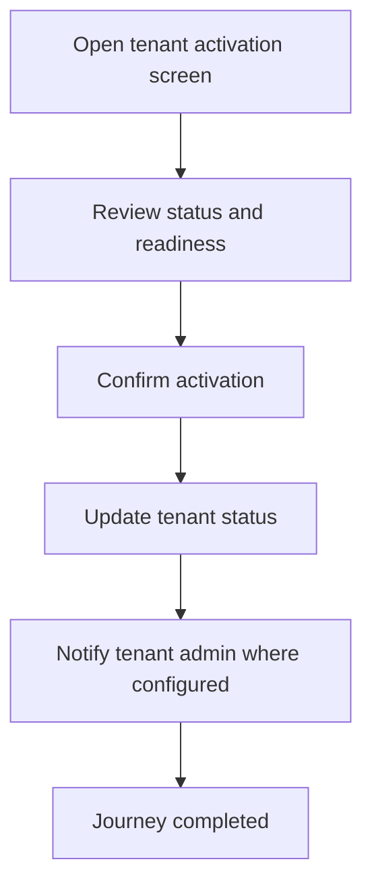

<!-- title: Tenant Activation Flow -->
<!-- status: Active -->
<!-- system: SCS-TIX EPOS Release 1 -->
<!-- last_updated: 2026-06-08 -->

# Tenant Activation Flow

## Purpose

Defines how Platform Admin activates a tenant after setup and billing decisions are satisfied.

## Source Basis

This journey is based on the uploaded SCS-TIX Release 1 user journey files, UI
screens, backend architecture, database design, and confirmed project decisions.

It must not be expanded into e-commerce, offline sync, supplier, delivery, kiosk,
coupon, AI, or accounting scope.

## Actors

| Actor | Responsibility |
|---|---|
| Platform Admin | Reviews tenant readiness and activates tenant |
| Tenant Admin | Can proceed after activation |
| Backend | Updates tenant/subscription state and audit log |

## Preconditions

- Tenant exists.
- Tenant admin account exists.
- Billing decision is complete or waived/trial/demo.
- Required feature entitlements are assigned.

## Main Flow

| Step | User/System Action | Expected Result |
|---:|---|---|
| 1 | Open tenant activation screen | Tenant setup checklist is shown |
| 2 | Review status and readiness | Missing items are visible |
| 3 | Confirm activation | Backend validates activation conditions |
| 4 | Update tenant status | Tenant becomes active when valid |
| 5 | Notify tenant admin where configured | Tenant can log in and operate |

## Journey Diagram

## Business Rules

- Tenant activation must be auditable.
- Tenant cannot operate if suspended/inactive.
- Activation must not enable excluded Release 2 features.
- Tenant access after activation remains permission-based.

## Access-Control Rules

| Control | Required Rule |
|---|---|
| Authentication | Platform admin required |
| Permission | Tenant activation permission required |
| Tenant context | Explicit tenant |
| Audit | Required |

## Data and API References

| Area | References |
|---|---|
| API groups | `/api/v1/tenants`, `/api/v1/subscriptions` |
| Tables | `tenants`, `tenant_subscriptions`, `tenant_subscription_history`, `audit_logs` |

## Edge Cases

- Payment pending tenant cannot be activated unless waived/trial/demo decision allows it.
- Suspended tenant blocks tenant users.
- Missing admin setup blocks normal tenant usage.

## Out of Scope

- E-commerce activation is excluded.
- Delivery activation is excluded.
- AI setup activation is excluded.

## Completion Criteria

- The user reaches the expected final state without bypassing access control.
- Tenant-owned data remains inside the resolved tenant context.
- Sensitive actions write audit records where required.
- UI state and backend state stay consistent after completion.

## Related Files

- [[../01_RELEASE_SCOPE/Release_1_Scope]]
- [[../02_ACCESS_CONTROL/Access_Control_Overview]]
- [[../05_BACKEND_ARCHITECTURE/API_Standards]]
