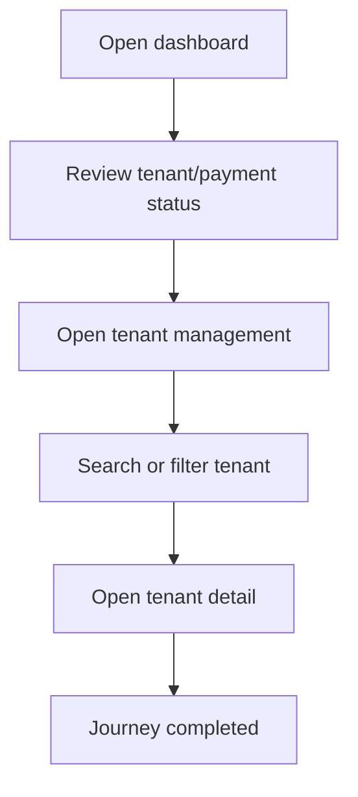

<!-- title: Platform Dashboard And Tenant Management Flow -->
<!-- status: Active -->
<!-- system: SCS-TIX EPOS Release 1 -->
<!-- last_updated: 2026-06-08 -->

# Platform Dashboard And Tenant Management Flow

## Purpose

Captures the uploaded dashboard and tenant-management journey not listed in the initial folder request.

## Source Basis

This journey is based on the uploaded SCS-TIX Release 1 user journey files, UI
screens, backend architecture, database design, and confirmed project decisions.

It must not be expanded into e-commerce, offline sync, supplier, delivery, kiosk,
coupon, AI, or accounting scope.

## Actors

| Actor | Responsibility |
|---|---|
| Platform Admin | Views platform metrics and tenant list |
| Backend | Returns tenant and billing summary data |

## Preconditions

- Platform Admin is authenticated.
- Platform dashboard permission is available.
- Tenant data exists or empty state is handled.

## Main Flow

| Step | User/System Action | Expected Result |
|---:|---|---|
| 1 | Open dashboard | Platform summary cards are displayed |
| 2 | Review tenant/payment status | Pending, trial, active, suspended states are visible |
| 3 | Open tenant management | Tenant list appears |
| 4 | Search or filter tenant | Matching tenants are shown |
| 5 | Open tenant detail | Tenant setup/status details appear |

## Journey Diagram

## Business Rules

- Dashboard data must not expose tenant-owned operational records beyond platform scope.
- Tenant list actions require platform permission.
- Audit is required for changes, not simple viewing unless policy requires.

## Access-Control Rules

| Control | Required Rule |
|---|---|
| Authentication | Required |
| Platform permission | Required |
| Tenant context | Explicit only when opening tenant |
| Audit | Required for mutations |

## Data and API References

| Area | References |
|---|---|
| API groups | `/api/v1/platform`, `/api/v1/tenants` |
| Tables | `tenants`, `tenant_subscriptions`, `subscription_invoices`, `audit_logs` |

## Edge Cases

- No tenants shows empty state.
- Payment pending tenants must remain identifiable.
- Suspended tenants must not be shown as active.

## Out of Scope

- Tenant POS operations are not performed from platform dashboard.
- E-commerce dashboard is excluded.

## Completion Criteria

- The user reaches the expected final state without bypassing access control.
- Tenant-owned data remains inside the resolved tenant context.
- Sensitive actions write audit records where required.
- UI state and backend state stay consistent after completion.

## Related Files

- [[../01_RELEASE_SCOPE/Release_1_Scope]]
- [[../02_ACCESS_CONTROL/Access_Control_Overview]]
- [[../05_BACKEND_ARCHITECTURE/API_Standards]]
