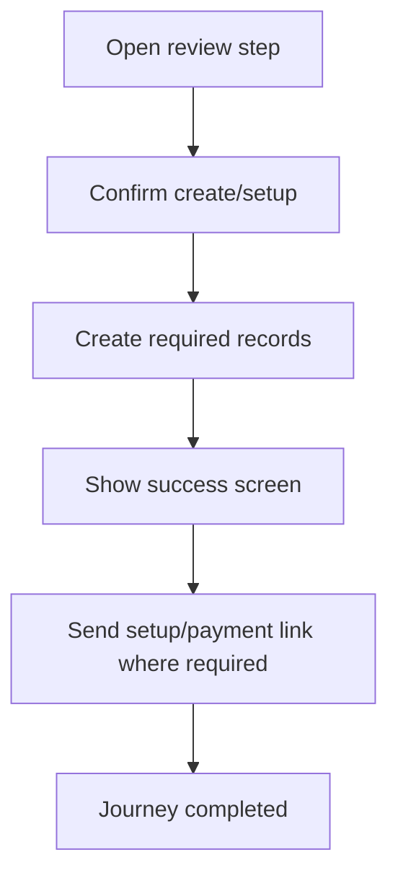

<!-- title: Billing Review And Success Flow -->
<!-- status: Active -->
<!-- system: SCS-TIX EPOS Release 1 -->
<!-- last_updated: 2026-06-08 -->

# Billing Review And Success Flow

## Purpose

Captures review/confirmation/success screens from the uploaded Platform Admin tenant wizard.

## Source Basis

This journey is based on the uploaded SCS-TIX Release 1 user journey files, UI
screens, backend architecture, database design, and confirmed project decisions.

It must not be expanded into e-commerce, offline sync, supplier, delivery, kiosk,
coupon, AI, or accounting scope.

## Actors

| Actor | Responsibility |
|---|---|
| Platform Admin | Reviews setup before creation/activation |
| Backend | Validates tenant setup data |
| Tenant Admin | Receives resulting setup/payment path |

## Preconditions

- Tenant wizard data has been entered.
- Plan/features/admin account decision exists.
- Platform Admin has permission to finalize setup.

## Main Flow

| Step | User/System Action | Expected Result |
|---:|---|---|
| 1 | Open review step | Business, plan, features, admin, and setup summary is shown |
| 2 | Confirm create/setup | Backend validates all wizard data |
| 3 | Create required records | Tenant setup records are saved |
| 4 | Show success screen | Result and next action are displayed |
| 5 | Send setup/payment link where required | Tenant admin next step begins |

## Journey Diagram

## Business Rules

- Review screen must not add unconfirmed scope.
- Success state must match tenant/payment status.
- Setup/payment link must use hashed tokens.
- Finalization must be audited.

## Access-Control Rules

| Control | Required Rule |
|---|---|
| Authentication | Required |
| Platform permission | Required |
| Tenant context | Created/resolved by backend |
| Audit | Required |

## Data and API References

| Area | References |
|---|---|
| API groups | `/api/v1/tenants`, `/api/v1/subscriptions`, `/api/v1/features` |
| Tables | `tenants`, `users`, `user_setup_tokens`, `subscription_payment_links`, `audit_logs` |

## Edge Cases

- Validation failure returns user to related step.
- Payment-required tenant remains pending payment.
- Trial/demo tenant follows setup link path.

## Out of Scope

- E-commerce setup step is future/deferred unless explicitly excluded from R1 wizard handling.

## Completion Criteria

- The user reaches the expected final state without bypassing access control.
- Tenant-owned data remains inside the resolved tenant context.
- Sensitive actions write audit records where required.
- UI state and backend state stay consistent after completion.

## Related Files

- [[../01_RELEASE_SCOPE/Release_1_Scope]]
- [[../02_ACCESS_CONTROL/Access_Control_Overview]]
- [[../05_BACKEND_ARCHITECTURE/API_Standards]]
