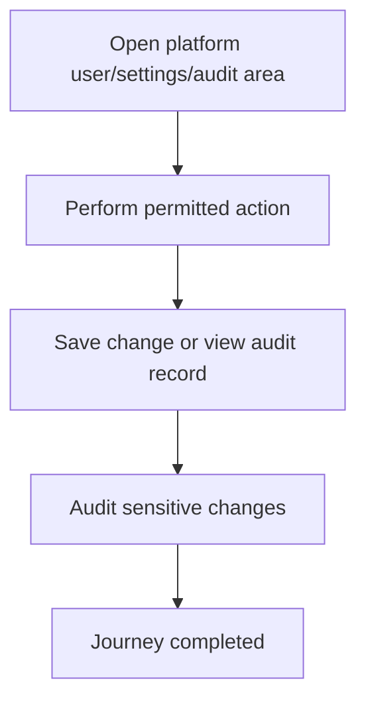

<!-- title: Platform User Audit Settings Flow -->
<!-- status: Active -->
<!-- system: SCS-TIX EPOS Release 1 -->
<!-- last_updated: 2026-06-08 -->

# Platform User Audit Settings Flow

## Purpose

Captures uploaded Platform Admin UI areas for platform users, audit logs, and system settings.

## Source Basis

This journey is based on the uploaded SCS-TIX Release 1 user journey files, UI
screens, backend architecture, database design, and confirmed project decisions.

It must not be expanded into e-commerce, offline sync, supplier, delivery, kiosk,
coupon, AI, or accounting scope.

## Actors

| Actor | Responsibility |
|---|---|
| Platform Admin | Manages platform users/settings and reviews audit logs |
| Backend | Applies platform permission and records changes |

## Preconditions

- Platform Admin is authenticated.
- Relevant platform permission exists.
- Settings are limited to Release 1 needs.

## Main Flow

| Step | User/System Action | Expected Result |
|---:|---|---|
| 1 | Open platform user/settings/audit area | Allowed screens are visible |
| 2 | Perform permitted action | Backend checks platform permission |
| 3 | Save change or view audit record | Result is returned |
| 4 | Audit sensitive changes | Audit row is written where required |

## Journey Diagram

## Business Rules

- Platform settings must not store raw secrets.
- Audit logs are append-only.
- Platform user management does not create tenant-user access.
- Only Release 1 settings should be active.

## Access-Control Rules

| Control | Required Rule |
|---|---|
| Authentication | Required |
| Platform permission | Required |
| Tenant context | Not required except tenant-specific audit filter |
| Audit | Required for changes |

## Data and API References

| Area | References |
|---|---|
| API groups | `/api/v1/platform` |
| Tables | `platform_users`, `platform_roles`, `platform_permissions`, `platform_settings`, `audit_logs` |

## Edge Cases

- User without permission receives 403.
- Secret values must use references/placeholders.
- Audit search must respect allowed scope.

## Out of Scope

- Release 2 settings must not be enabled as active Release 1 behavior.

## Completion Criteria

- The user reaches the expected final state without bypassing access control.
- Tenant-owned data remains inside the resolved tenant context.
- Sensitive actions write audit records where required.
- UI state and backend state stay consistent after completion.

## Related Files

- [[../01_RELEASE_SCOPE/Release_1_Scope]]
- [[../02_ACCESS_CONTROL/Access_Control_Overview]]
- [[../05_BACKEND_ARCHITECTURE/API_Standards]]
