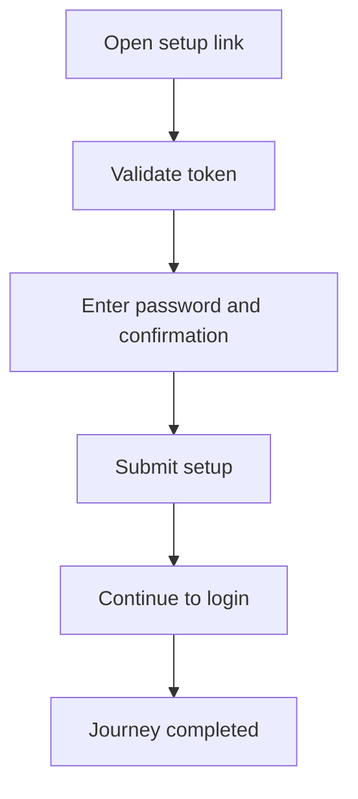

<!-- title: Setup Link And Password Flow -->
<!-- status: Active -->
<!-- system: SCS-TIX EPOS Release 1 -->
<!-- last_updated: 2026-06-08 -->

# Setup Link And Password Flow

## Purpose

Defines how Tenant Admin opens setup link, sets password, and prepares for first login.

## Source Basis

This journey is based on the uploaded SCS-TIX Release 1 user journey files, UI
screens, backend architecture, database design, and confirmed project decisions.

It must not be expanded into e-commerce, offline sync, supplier, delivery, kiosk,
coupon, AI, or accounting scope.

## Actors

| Actor | Responsibility |
|---|---|
| Tenant Admin | Uses setup link and creates password |
| Backend | Validates setup token and activates credentials |

## Preconditions

- Tenant admin user was created.
- Setup token exists and is active.
- Tenant status allows setup.

## Main Flow

| Step | User/System Action | Expected Result |
|---:|---|---|
| 1 | Open setup link | Setup screen is displayed |
| 2 | Validate token | Backend confirms active token |
| 3 | Enter password and confirmation | Password is validated |
| 4 | Submit setup | Password hash is saved |
| 5 | Continue to login | Tenant Admin can sign in |

## Journey Diagram

## Business Rules

- Setup token must be stored as hash.
- Used or expired token cannot be reused.
- Password must not be logged.
- Tenant Admin uses tenant `users` identity.

## Access-Control Rules

| Control | Required Rule |
|---|---|
| Authentication | Not before setup |
| Token validation | Required |
| Tenant status | Required |
| Audit | Recommended |

## Data and API References

| Area | References |
|---|---|
| API groups | `/api/v1/auth` |
| Tables | `users`, `user_setup_tokens`, `auth_sessions` |

## Edge Cases

- Expired token shows safe error.
- Password mismatch returns validation error.
- Suspended tenant blocks operational login.

## Out of Scope

- Platform Admin login is separate.
- E-commerce customer setup is excluded.

## Completion Criteria

- The user reaches the expected final state without bypassing access control.
- Tenant-owned data remains inside the resolved tenant context.
- Sensitive actions write audit records where required.
- UI state and backend state stay consistent after completion.

## Related Files

- [[../01_RELEASE_SCOPE/Release_1_Scope]]
- [[../02_ACCESS_CONTROL/Access_Control_Overview]]
- [[../05_BACKEND_ARCHITECTURE/API_Standards]]
