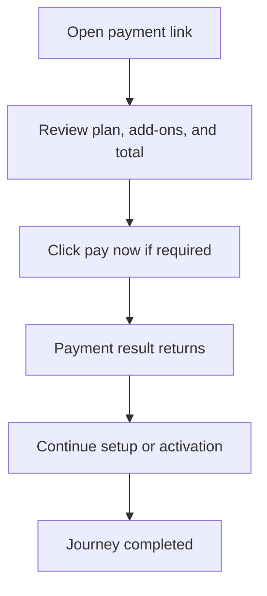

<!-- title: Subscription Billing Summary Flow -->
<!-- status: Active -->
<!-- system: SCS-TIX EPOS Release 1 -->
<!-- last_updated: 2026-06-08 -->

# Subscription Billing Summary Flow

## Purpose

Defines Tenant Admin billing summary when a payment link is used before setup or activation.

## Source Basis

This journey is based on the uploaded SCS-TIX Release 1 user journey files, UI
screens, backend architecture, database design, and confirmed project decisions.

It must not be expanded into e-commerce, offline sync, supplier, delivery, kiosk,
coupon, AI, or accounting scope.

## Actors

| Actor | Responsibility |
|---|---|
| Tenant Admin | Reviews billing summary and pays when required |
| Backend | Validates payment link and invoice |
| Payment Provider | Processes subscription payment where configured |

## Preconditions

- Payment link exists.
- Invoice exists.
- Tenant is payment-required unless trial/demo/waived.

## Main Flow

| Step | User/System Action | Expected Result |
|---:|---|---|
| 1 | Open payment link | Billing summary screen appears |
| 2 | Review plan, add-ons, and total | Invoice details are displayed |
| 3 | Click pay now if required | Provider/internal payment flow begins |
| 4 | Payment result returns | Transaction is recorded |
| 5 | Continue setup or activation | Tenant moves to next allowed state |

## Journey Diagram

## Business Rules

- Payment token must be hashed.
- Trial/demo tenant may skip payment.
- Provider configuration is TBD/configurable.
- Payment status change must be auditable.

## Access-Control Rules

| Control | Required Rule |
|---|---|
| Authentication | Token based before login |
| Payment link validation | Required |
| Tenant status | Required |
| Audit | Required for payment status |

## Data and API References

| Area | References |
|---|---|
| API groups | `/api/v1/subscriptions` |
| Tables | `subscription_invoices`, `subscription_invoice_lines`, `subscription_payment_links`, `subscription_payment_transactions`, `tenants` |

## Edge Cases

- Expired payment link cannot continue.
- Failed payment keeps tenant pending.
- Duplicate transaction must not double activate.

## Out of Scope

- Online e-commerce payment is excluded.
- Full accounting is excluded.

## Completion Criteria

- The user reaches the expected final state without bypassing access control.
- Tenant-owned data remains inside the resolved tenant context.
- Sensitive actions write audit records where required.
- UI state and backend state stay consistent after completion.

## Related Files

- [[../01_RELEASE_SCOPE/Release_1_Scope]]
- [[../02_ACCESS_CONTROL/Access_Control_Overview]]
- [[../05_BACKEND_ARCHITECTURE/API_Standards]]
