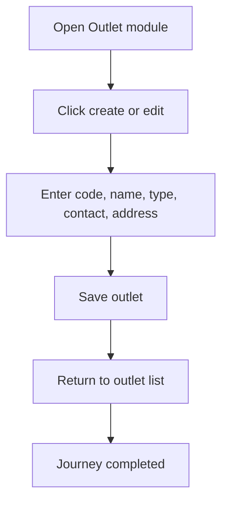

<!-- title: Outlet Management Flow -->
<!-- status: Active -->
<!-- system: SCS-TIX EPOS Release 1 -->
<!-- last_updated: 2026-06-08 -->

# Outlet Management Flow

## Purpose

Defines Tenant Admin outlet creation and management inside the POS app layout.

## Source Basis

This journey is based on the uploaded SCS-TIX Release 1 user journey files, UI
screens, backend architecture, database design, and confirmed project decisions.

It must not be expanded into e-commerce, offline sync, supplier, delivery, kiosk,
coupon, AI, or accounting scope.

## Actors

| Actor | Responsibility |
|---|---|
| Tenant Admin | Creates or updates outlets |
| Backend | Stores outlet details under tenant |

## Preconditions

- Tenant Admin is authenticated.
- Tenant is active or setup allows operation.
- Outlet feature/permission is enabled.

## Main Flow

| Step | User/System Action | Expected Result |
|---:|---|---|
| 1 | Open Outlet module | Outlet list is displayed |
| 2 | Click create or edit | Outlet form opens |
| 3 | Enter code, name, type, contact, address | Data is validated |
| 4 | Save outlet | Outlet record is stored |
| 5 | Return to outlet list | Updated outlet is visible |

## Journey Diagram

## Business Rules

- Outlet code is tenant-unique.
- Outlet data must include tenant ID.
- Inactive outlets cannot be used for POS checkout.
- Outlet access is permission controlled.

## Access-Control Rules

| Control | Required Rule |
|---|---|
| Authentication | Required |
| Feature entitlement | Outlet/setup enabled |
| Permission | Outlet manage permission |
| Tenant context | Required |

## Data and API References

| Area | References |
|---|---|
| API groups | `/api/v1/outlets` |
| Tables | `outlets`, `outlet_addresses`, `audit_logs` |

## Edge Cases

- Duplicate code returns conflict.
- Missing address returns validation error.
- No permission hides screen and backend returns 403.

## Out of Scope

- Delivery outlet flow is excluded.
- Stock transfer between outlets is excluded.

## Completion Criteria

- The user reaches the expected final state without bypassing access control.
- Tenant-owned data remains inside the resolved tenant context.
- Sensitive actions write audit records where required.
- UI state and backend state stay consistent after completion.

## Related Files

- [[../01_RELEASE_SCOPE/Release_1_Scope]]
- [[../02_ACCESS_CONTROL/Access_Control_Overview]]
- [[../05_BACKEND_ARCHITECTURE/API_Standards]]
