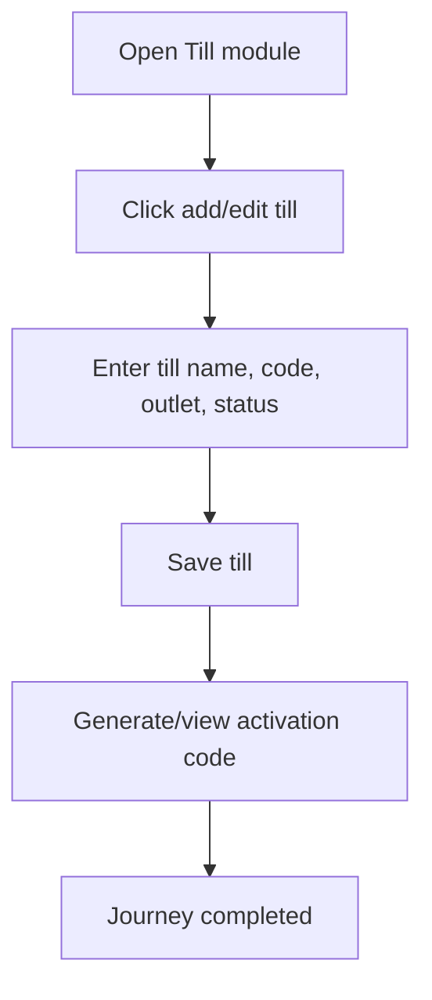

<!-- title: Till Management Flow -->
<!-- status: Active -->
<!-- system: SCS-TIX EPOS Release 1 -->
<!-- last_updated: 2026-06-08 -->

# Till Management Flow

## Purpose

Defines Tenant Admin till management and activation code flow.

## Source Basis

This journey is based on the uploaded SCS-TIX Release 1 user journey files, UI
screens, backend architecture, database design, and confirmed project decisions.

It must not be expanded into e-commerce, offline sync, supplier, delivery, kiosk,
coupon, AI, or accounting scope.

## Actors

| Actor | Responsibility |
|---|---|
| Tenant Admin | Creates tills and views/generates activation code |
| Backend | Stores till and activation code hash |
| Cashier Device | Uses code during activation |

## Preconditions

- Outlet exists.
- Tenant Admin has till permission.
- Till feature is enabled.

## Main Flow

| Step | User/System Action | Expected Result |
|---:|---|---|
| 1 | Open Till module | Till list is displayed |
| 2 | Click add/edit till | Till form opens |
| 3 | Enter till name, code, outlet, status | Details are validated |
| 4 | Save till | Till record is stored |
| 5 | Generate/view activation code | Short-lived activation code is shown to admin |

## Journey Diagram

## Business Rules

- Till code is unique per tenant/outlet.
- Activation code is generated after till creation.
- Activation code hash is stored, not raw code.
- Inactive till cannot be used.

## Access-Control Rules

| Control | Required Rule |
|---|---|
| Authentication | Required |
| Feature entitlement | Till/setup enabled |
| Permission | Till manage permission |
| Tenant/outlet context | Required |

## Data and API References

| Area | References |
|---|---|
| API groups | `/api/v1/tills`, `/api/v1/devices` |
| Tables | `tills`, `till_activation_codes`, `pos_devices`, `hardware_profiles`, `hardware_devices` |

## Edge Cases

- Expired activation code must be regenerated.
- Wrong outlet selection returns validation/403.
- Duplicate till code returns conflict.

## Out of Scope

- Kiosk device setup is excluded.
- Offline till sync is excluded.

## Completion Criteria

- The user reaches the expected final state without bypassing access control.
- Tenant-owned data remains inside the resolved tenant context.
- Sensitive actions write audit records where required.
- UI state and backend state stay consistent after completion.

## Related Files

- [[../01_RELEASE_SCOPE/Release_1_Scope]]
- [[../02_ACCESS_CONTROL/Access_Control_Overview]]
- [[../05_BACKEND_ARCHITECTURE/API_Standards]]
