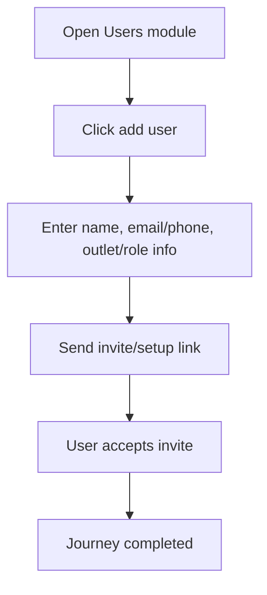

<!-- title: User Management Flow -->
<!-- status: Active -->
<!-- system: SCS-TIX EPOS Release 1 -->
<!-- last_updated: 2026-06-08 -->

# User Management Flow

## Purpose

Defines Tenant Admin staff/user management inside the Flutter POS app.

## Source Basis

This journey is based on the uploaded SCS-TIX Release 1 user journey files, UI
screens, backend architecture, database design, and confirmed project decisions.

It must not be expanded into e-commerce, offline sync, supplier, delivery, kiosk,
coupon, AI, or accounting scope.

## Actors

| Actor | Responsibility |
|---|---|
| Tenant Admin | Creates/invites tenant users |
| Backend | Stores user and setup/invite token |
| Staff User | Accepts invite and sets password |

## Preconditions

- Tenant Admin is authenticated.
- User management feature is enabled.
- Tenant Admin has user management permission.

## Main Flow

| Step | User/System Action | Expected Result |
|---:|---|---|
| 1 | Open Users module | User list appears |
| 2 | Click add user | User form opens |
| 3 | Enter name, email/phone, outlet/role info | Data is validated |
| 4 | Send invite/setup link | Invite/setup token is stored as hash |
| 5 | User accepts invite | User can set password and login |

## Journey Diagram

## Business Rules

- User email/phone uniqueness is tenant-scoped.
- Invite/setup tokens must be hashed.
- Inactive users cannot access protected APIs.
- Role/outlet assignment controls later access.

## Access-Control Rules

| Control | Required Rule |
|---|---|
| Authentication | Required |
| Feature entitlement | User management enabled |
| Permission | User manage permission |
| Tenant context | Required |

## Data and API References

| Area | References |
|---|---|
| API groups | `/api/v1/users`, `/api/v1/auth` |
| Tables | `users`, `user_invites`, `user_setup_tokens`, `tenant_user_roles`, `outlet_user_roles` |

## Edge Cases

- Duplicate email/phone returns conflict.
- Expired invite cannot be accepted.
- User without outlet cannot use outlet-scoped POS flow.

## Out of Scope

- Platform user management is separate.
- Customer profile management is separate.

## Completion Criteria

- The user reaches the expected final state without bypassing access control.
- Tenant-owned data remains inside the resolved tenant context.
- Sensitive actions write audit records where required.
- UI state and backend state stay consistent after completion.

## Related Files

- [[../01_RELEASE_SCOPE/Release_1_Scope]]
- [[../02_ACCESS_CONTROL/Access_Control_Overview]]
- [[../05_BACKEND_ARCHITECTURE/API_Standards]]
