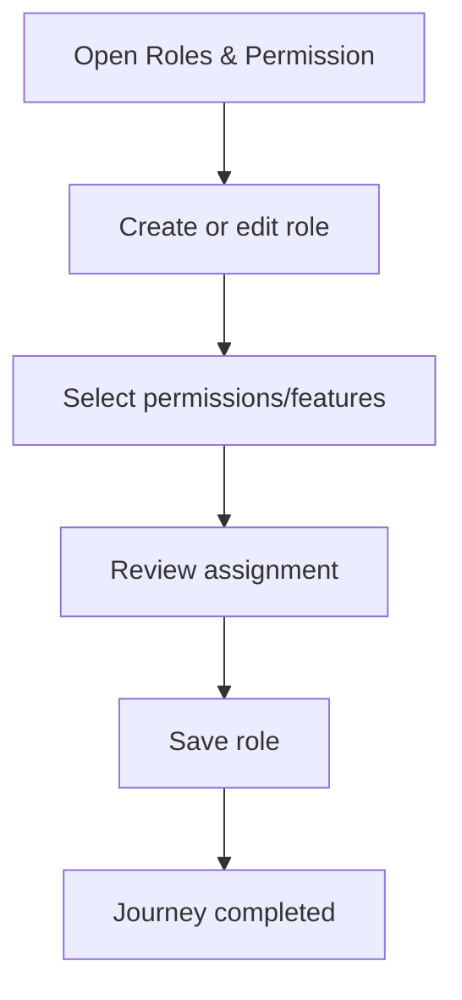

<!-- title: Role Permission Flow -->
<!-- status: Active -->
<!-- system: SCS-TIX EPOS Release 1 -->
<!-- last_updated: 2026-06-08 -->

# Role Permission Flow

## Purpose

Defines Tenant Admin role, permission, and feature assignment flow.

## Source Basis

This journey is based on the uploaded SCS-TIX Release 1 user journey files, UI
screens, backend architecture, database design, and confirmed project decisions.

It must not be expanded into e-commerce, offline sync, supplier, delivery, kiosk,
coupon, AI, or accounting scope.

## Actors

| Actor | Responsibility |
|---|---|
| Tenant Admin | Creates roles and assigns permissions |
| Backend | Stores role permissions and feature assignments |
| Tenant User | Receives access after login/refresh |

## Preconditions

- Tenant Admin is authenticated.
- Role/permission feature is enabled.
- Permission catalog is seeded.

## Main Flow

| Step | User/System Action | Expected Result |
|---:|---|---|
| 1 | Open Roles & Permission | Role list and permission matrix appear |
| 2 | Create or edit role | Role details are entered |
| 3 | Select permissions/features | Allowed actions are chosen |
| 4 | Review assignment | Changes are confirmed |
| 5 | Save role | Role permissions are stored |

## Journey Diagram

## Business Rules

- Role code is tenant-unique.
- Permission catalog is platform-owned/seeded.
- Feature entitlement must exist before assigning feature access.
- Permission changes should be audited.

## Access-Control Rules

| Control | Required Rule |
|---|---|
| Authentication | Required |
| Feature entitlement | Role/permission enabled |
| Permission | Role/permission manage permission |
| Audit | Required |

## Data and API References

| Area | References |
|---|---|
| API groups | `/api/v1/roles`, `/api/v1/permissions`, `/api/v1/features` |
| Tables | `roles`, `permissions`, `role_permissions`, `role_feature_assignments`, `tenant_user_roles` |

## Edge Cases

- Assigning disabled feature must fail.
- Removing permission hides UI and backend blocks API.
- System role protection must be respected where used.

## Out of Scope

- Fixed hardcoded access is excluded.
- Platform permission management is separate.

## Completion Criteria

- The user reaches the expected final state without bypassing access control.
- Tenant-owned data remains inside the resolved tenant context.
- Sensitive actions write audit records where required.
- UI state and backend state stay consistent after completion.

## Related Files

- [[../01_RELEASE_SCOPE/Release_1_Scope]]
- [[../02_ACCESS_CONTROL/Access_Control_Overview]]
- [[../05_BACKEND_ARCHITECTURE/API_Standards]]
