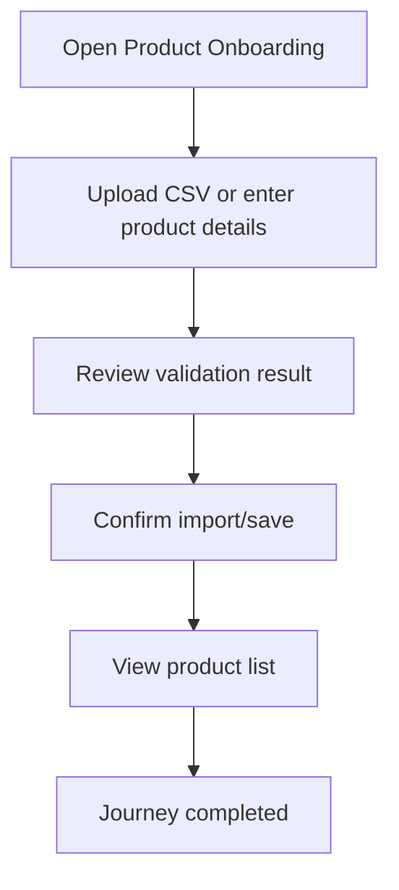

<!-- title: Product Onboarding Flow -->
<!-- status: Active -->
<!-- system: SCS-TIX EPOS Release 1 -->
<!-- last_updated: 2026-06-08 -->

# Product Onboarding Flow

## Purpose

Defines tenant product onboarding and CSV product import flow.

## Source Basis

This journey is based on the uploaded SCS-TIX Release 1 user journey files, UI
screens, backend architecture, database design, and confirmed project decisions.

It must not be expanded into e-commerce, offline sync, supplier, delivery, kiosk,
coupon, AI, or accounting scope.

## Actors

| Actor | Responsibility |
|---|---|
| Tenant Admin | Imports or creates products |
| Backend | Validates products, variants, price, and import rows |

## Preconditions

- Catalog/product feature is enabled.
- Tenant Admin has product/import permission.
- Categories/return policy/tax setup exists where required.

## Main Flow

| Step | User/System Action | Expected Result |
|---:|---|---|
| 1 | Open Product Onboarding | Import/create options are visible |
| 2 | Upload CSV or enter product details | Rows/details are validated |
| 3 | Review validation result | Errors and valid rows are shown |
| 4 | Confirm import/save | Products and variants are stored |
| 5 | View product list | Imported products appear |

## Journey Diagram

## Business Rules

- Product code and SKU are tenant-unique.
- Barcode is tenant-unique when provided.
- Import rows keep validation result.
- No hardcoded product data.

## Access-Control Rules

| Control | Required Rule |
|---|---|
| Authentication | Required |
| Feature entitlement | Catalog/product enabled |
| Permission | Product create/import permission |
| Tenant context | Required |

## Data and API References

| Area | References |
|---|---|
| API groups | `/api/v1/products`, `/api/v1/categories`, `/api/v1/files` |
| Tables | `products`, `product_variants`, `product_images`, `price_list_items`, `product_import_batches`, `product_import_rows` |

## Edge Cases

- Duplicate SKU/barcode returns row error.
- Invalid CSV row remains failed/skipped.
- No permission returns 403.

## Out of Scope

- AI onboarding is excluded.
- Supplier purchase import is excluded.
- E-commerce product publishing is excluded.

## Completion Criteria

- The user reaches the expected final state without bypassing access control.
- Tenant-owned data remains inside the resolved tenant context.
- Sensitive actions write audit records where required.
- UI state and backend state stay consistent after completion.

## Related Files

- [[../01_RELEASE_SCOPE/Release_1_Scope]]
- [[../02_ACCESS_CONTROL/Access_Control_Overview]]
- [[../05_BACKEND_ARCHITECTURE/API_Standards]]
