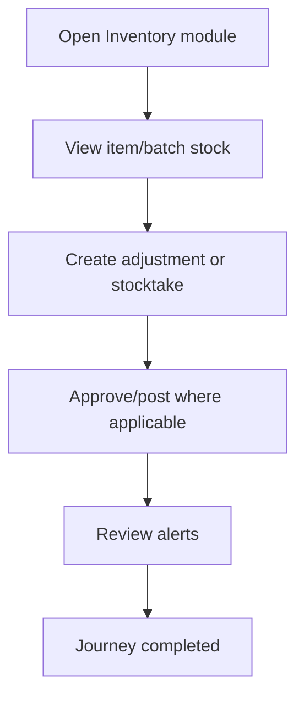

<!-- title: Inventory Flow -->
<!-- status: Active -->
<!-- system: SCS-TIX EPOS Release 1 -->
<!-- last_updated: 2026-06-08 -->

# Inventory Flow

## Purpose

Defines Tenant Admin basic inventory, stock adjustment, stocktake, batch, and expiry flow.

## Source Basis

This journey is based on the uploaded SCS-TIX Release 1 user journey files, UI
screens, backend architecture, database design, and confirmed project decisions.

It must not be expanded into e-commerce, offline sync, supplier, delivery, kiosk,
coupon, AI, or accounting scope.

## Actors

| Actor | Responsibility |
|---|---|
| Tenant Admin | Views and adjusts inventory |
| Backend | Stores stock movements and projections |

## Preconditions

- Inventory feature is enabled.
- Products/variants exist.
- Tenant Admin has inventory permission.

## Main Flow

| Step | User/System Action | Expected Result |
|---:|---|---|
| 1 | Open Inventory module | Stock list and alerts are visible |
| 2 | View item/batch stock | Product batch and expiry data appears |
| 3 | Create adjustment or stocktake | Quantities and reasons are entered |
| 4 | Approve/post where applicable | Stock movement ledger is written |
| 5 | Review alerts | Low stock/expiry alerts are visible |

## Journey Diagram

## Business Rules

- Stock movements are append-only.
- Quantity movement uses positive quantity and direction type.
- Expiry uses product batches and inventory alerts.
- Supplier and transfer workflows are not part of this flow.

## Access-Control Rules

| Control | Required Rule |
|---|---|
| Authentication | Required |
| Feature entitlement | Inventory/expiry enabled |
| Permission | Inventory view/adjust permission |
| Tenant/outlet context | Required |

## Data and API References

| Area | References |
|---|---|
| API groups | `/api/v1/inventory` |
| Tables | `inventory_balances`, `stock_movements`, `stock_adjustments`, `stocktake_lines`, `product_batches`, `inventory_alerts` |

## Edge Cases

- Insufficient permission returns 403.
- Invalid quantity returns validation error.
- Expired/near-expiry batches should be visible where tracking applies.

## Out of Scope

- Supplier receiving is excluded.
- Stock transfer is excluded.
- Offline stock sync is excluded.

## Completion Criteria

- The user reaches the expected final state without bypassing access control.
- Tenant-owned data remains inside the resolved tenant context.
- Sensitive actions write audit records where required.
- UI state and backend state stay consistent after completion.

## Related Files

- [[../01_RELEASE_SCOPE/Release_1_Scope]]
- [[../02_ACCESS_CONTROL/Access_Control_Overview]]
- [[../05_BACKEND_ARCHITECTURE/API_Standards]]
