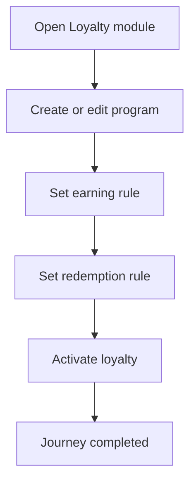

<!-- title: Loyalty Setup Flow -->
<!-- status: Active -->
<!-- system: SCS-TIX EPOS Release 1 -->
<!-- last_updated: 2026-06-08 -->

# Loyalty Setup Flow

## Purpose

Defines Tenant Admin basic loyalty setup for POS earn/redeem behavior.

## Source Basis

This journey is based on the uploaded SCS-TIX Release 1 user journey files, UI
screens, backend architecture, database design, and confirmed project decisions.

It must not be expanded into e-commerce, offline sync, supplier, delivery, kiosk,
coupon, AI, or accounting scope.

## Actors

| Actor | Responsibility |
|---|---|
| Tenant Admin | Configures basic loyalty |
| Backend | Stores program and rules |
| Cashier | Uses loyalty during sale |

## Preconditions

- Loyalty feature is enabled.
- Tenant Admin has loyalty permission.
- Customer/loyalty tables are available.

## Main Flow

| Step | User/System Action | Expected Result |
|---:|---|---|
| 1 | Open Loyalty module | Program/rule screen is displayed |
| 2 | Create or edit program | Program details are entered |
| 3 | Set earning rule | Spend-to-points rule is configured |
| 4 | Set redemption rule | Points-to-discount rule is configured |
| 5 | Activate loyalty | Cashier can use earn/redeem if permitted |

## Journey Diagram

## Business Rules

- Basic loyalty only is Release 1.
- Earn and redeem rules must be tenant-owned.
- Redemption requires customer membership validation.
- Loyalty transactions are append-only ledger entries.

## Access-Control Rules

| Control | Required Rule |
|---|---|
| Authentication | Required |
| Feature entitlement | Loyalty enabled |
| Permission | Loyalty manage permission |
| Tenant context | Required |

## Data and API References

| Area | References |
|---|---|
| API groups | `/api/v1/loyalty`, `/api/v1/customers` |
| Tables | `loyalty_programs`, `loyalty_earning_rules`, `loyalty_redemption_rules`, `customer_memberships`, `loyalty_transactions` |

## Edge Cases

- Inactive loyalty program cannot be used.
- Invalid rule values return validation error.
- Cashier without permission cannot redeem.

## Out of Scope

- Advanced loyalty tiers/campaigns are not included unless already supported by R1 tables.
- E-commerce loyalty flow is excluded.

## Completion Criteria

- The user reaches the expected final state without bypassing access control.
- Tenant-owned data remains inside the resolved tenant context.
- Sensitive actions write audit records where required.
- UI state and backend state stay consistent after completion.

## Related Files

- [[../01_RELEASE_SCOPE/Release_1_Scope]]
- [[../02_ACCESS_CONTROL/Access_Control_Overview]]
- [[../05_BACKEND_ARCHITECTURE/API_Standards]]
