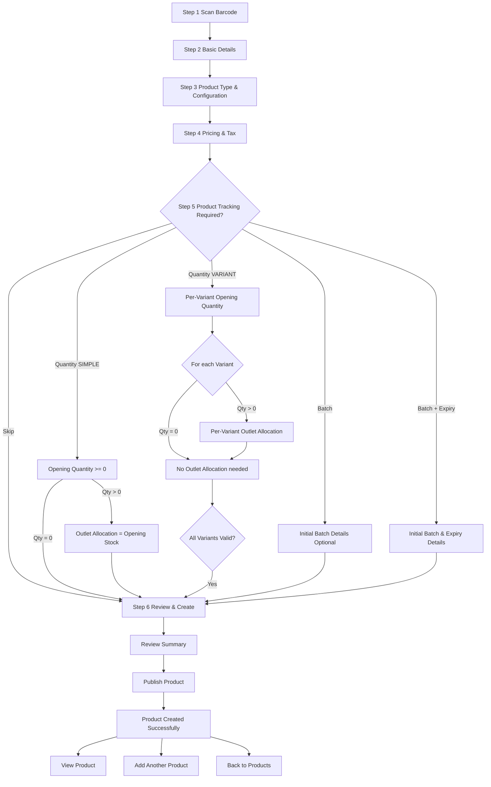

<!-- title: Tenant Admin Product Management Flow -->
<!-- status: Active -->
<!-- system: OneVerz POS MVP -->
<!-- last_updated: 2026-09-24 -->
<!-- supersedes: old_step_order_basic_details_first_barcode_sku_standalone -->
<!-- extended: 2026-09-24 — VARIANT Quantity opening stock & outlet allocation documented -->

# Tenant Admin Product Management Flow

## Canonical Authority

**6-Step Product Setup Wizard (CURRENT — 2026-09-20):**

See [[../../04_MODULE_KNOWLEDGE/10_Product_Core/06_Tenant_Admin_Add_Product_6_Step_Contract.md]] for primary authority.

Specifications:
- [[../../04_MODULE_KNOWLEDGE/10_Product_Core/Tenant_Admin_Step3_Product_Type_Configuration_Specification.md]]
- [[../../04_MODULE_KNOWLEDGE/10_Product_Core/Tenant_Admin_Add_Product_Step5_Product_Tracking_Specification.md]]

## Purpose

Defines the manual product management flows for the Tenant Admin, including the
canonical 6-step wizard (scanner-first), optional Step 5 Product Tracking,
draft saving, details overview, editing, duplicating, archiving, and manual
popular product curation. Product import workflows are removed from this active interface scope.

## Source Basis

Confirmed 6-step Product Setup contract, product-type-specific configuration
(Step 3), optional product tracking (Step 5), and canonical decision [[../../13_DECISIONS_AND_CHANGES/PRODUCT_SETUP_6_STEP_RESTRUCTURING_DECISION_2026-09-20.md]].

## Actors

| Actor | Responsibility |
|---|---|
| Tenant Admin | Creates and manages tenant products through the wizard |
| System | Validates, persists draft, reconciles tracking, publishes identity |

## Trigger

Tenant Admin opens product management navigation menu.

## Preconditions

- Tenant Admin has product management permissions (`catalog.products.view`, `catalog.products.create`, `catalog.products.update`, `catalog.variants.manage`).
- Categories and brands are seeded and available.

---

## Main Flow: Canonical 6-Step Product Creation Wizard

| Step | Wizard Step Name | System & User Behavior |
|---:|---|---|
| 1 | **Step 1 — Scan Barcode** | Pre-draft acquisition: scan/type barcode, validate format/checksum, tenant duplicate discovery, optional external product-data lookup, or no-barcode bootstrap. Does **not** create a product row for every random scan. On creation-path transition, create/restore DRAFT, persist scan context, enter Step 2. Canonical: [[../../04_MODULE_KNOWLEDGE/10_Product_Core/Tenant_Admin_Product_Setup_Scan_Barcode_Specification]]. |
| 2 | **Step 2 — Basic Details** | User inputs Product Name (mandatory), Category (mandatory), Brand (optional), Short Name / Internal Code, Short Description, Long Description, Product Images, and Channel Visibility (POS, Online). Prefill may come from scan context. Do **not** collect tracking details here. |
| 3 | **Step 3 — Product Type & Configuration** | User selects Product Type (`SIMPLE` or `VARIANT`). **SIMPLE:** Base Unit selection → Optional Packs/Cases configuration → SKU configuration (reuse Step 1 barcode). **VARIANT:** Attribute selection → Attribute Values → Generate Combinations → Include/Exclude variants → Assign SKU/Barcode per variant. Do **not** show tracking toggles or tracking details. See [[../../04_MODULE_KNOWLEDGE/10_Product_Core/Tenant_Admin_Step3_Product_Type_Configuration_Specification]]. |
| 4 | **Step 4 — Pricing & Tax** | **SIMPLE:** one sellable identity → Standard Selling Price + Tax Class + Inclusive/Exclusive (+ Tax Preview). **VARIANT:** independent Selling Price per included variant (**Set Same Price for All Variants** / Apply to All = bulk helper only) + common Product Tax Assignment. Cost is product-level architecture (not SIMPLE UI; not VARIANT matrix R1). Persist via existing price list / tax assignment. |
| 5 | **Step 5 — Product Tracking** | **OPTIONAL step.** User selects a tracking method or skips. **Tracking Methods:** `Quantity` / `Batch / Lot` / `Batch + Expiry`. **Optional Step Action:** `Skip Product Tracking` (not a tracking method — navigates directly to Step 6). See [[../../04_MODULE_KNOWLEDGE/10_Product_Core/Tenant_Admin_Add_Product_Step5_Product_Tracking_Specification]]. **Quantity (SIMPLE):** Opening Stock (>= 0; zero bypasses Outlet Allocation). If > 0: Outlet Allocation (sum must equal opening stock). **Quantity (VARIANT):** Per-Variant Opening Stock table (Variant name & SKU read-only; quantity editable per Variant; >= 0). For each Variant with OpeningQty > 0: per-Variant Outlet Allocation (exact reconciliation); for OpeningQty = 0: no allocation needed. Product-total is informational only. Same Outlet across Variants is valid; duplicate Outlet within same Variant is invalid. **Batch:** Initial Batch Details (optional). **Batch + Expiry:** Initial Batch & Expiry Details (both required if entered). No stock creation in any path except Quantity. |
| 6 | **Step 6 — Review & Create** | Displays full review summary across all preceding sections using persisted draft data, including Scan Barcode context (when present) and applicable tracking details. User clicks Create Product to complete server validation, publish the product, and persist applicable initial Batch/Expiry/Serial identity without inventing stock quantity. On success the wizard shows the **Product Created Successfully** screen (not a toast). **View Product** opens product detail; **Add Another Product** starts a fresh wizard at Step 1 Scan Barcode; **Back to Products** opens Product List. |

---

## Detailed Step 1 User Journey: Manual Barcode Entry

```text
Enter Barcode Manually
        ↓
Validate Barcode
        ↓
Is Barcode Structurally Valid?
   ├── NO → Invalid Barcode
   └── YES
          ↓
Search Tenant Catalogue
          ↓
Product Exists?
   ├── YES → Existing Product Found
   └── NO
        ↓
External Product Lookup
        ↓
Product Found?
   ├── YES → External Product Found
   └── NO
        ↓
Product Not Found
        ↓
Continue with this barcode and create manually
        ↓
Retain Barcode
        ↓
Basic Details
        ↓
Continue canonical 6-step Product Setup
```

---

## Detailed Step 3 User Journey: Product Type & Configuration

### SIMPLE Product Configuration

**Entry & Applicability:**
- User selects **SIMPLE Product** type.

**User Journey:**
1. Select Base Unit from UOM Master
2. Configure Optional Packs/Cases:
   - This product has packs/cases? [OFF / ON]
   - If ON: Add Pack Type, Pack Name, Contains, + Add Another Pack
   - If OFF: Base Unit only
3. SKU Configuration:
   - Reuse Step 1 Primary Barcode (do NOT re-scan or re-type)
   - Display: "Primary Barcode [BC001] Verified/Acquired [Step 1]"
4. Continue to Step 4 Pricing & Tax

### VARIANT Product Configuration

**Entry & Applicability:**
- User selects **VARIANT Product** type.

**User Journey:**
1. User defines attributes by selecting attribute name (e.g. Size, Colour) and picking active values (e.g. S, M, L / Red, Blue).
2. **Estimated Variant Count** updates live in Flutter as values are added/removed (e.g. Colour 3 × Size 2 = 6). No Save or backend call is required for the estimate to refresh.
3. User clicks `Generate Variants` / `Apply`. Flutter and backend compute the actual Cartesian product (3 × 2 = 6 combinations).
4. Configuration summary card updates: `6 Variants Generated`, `2 Attributes Defined`, `6 Included`.
5. Generated Variants table displays `Variant` (e.g. `Red / S`), and actions (`Edit`, `Delete`).

**Edit Variant Right-Side Drawer:**
1. Clicking `Edit` opens right-side drawer.
2. User views read-only combination label and attribute badges.
3. User edits `Display Label` (e.g. `Home Jersey - Red / S`).
4. User toggles **`Include Variant`** (ON/OFF). (NEVER labeled Availability).
5. User manages variant image (uploads custom image, applies colour-group image, or removes override).
6. Clicking `Save Changes` applies edits to wizard state.

**Delete Variant Confirmation Modal:**
1. Clicking `Delete` opens centered confirmation modal.
2. User confirms deletion. Combination is archived as tombstone (`status = 'ARCHIVED'`).
3. Table and summary card update. Success toast is displayed.

**Variant SKU & Barcode Assignment:**
- Each included variant owns its own barcode/SKU.
- If Step 1 scanned variant-specific barcode (e.g. Almond soap): Reuse it for that variant; do NOT re-scan.
- Other variants: Assign own barcode if available.
- Preserve existing tenant-wide uniqueness rules.

**Continue to Step 4 Pricing & Tax**

---

## Access and Security Rules

- Strict server-side enforcement of tenant-isolation contexts.
- Permission enforcement: `catalog.products.create` / `catalog.products.update` + `catalog.variants.manage`.
- Feature entitlement enforcement: `product_catalog` (Module: `product_management`).

---

## Product Tracking Journey (Step 5)

```text
Tenant Admin
    ↓
Add Product
    ↓
Steps 1–4 (Scan → Basic → Type & Config → Pricing)
    ↓
Step 5 Product Tracking (OPTIONAL)
    ↓
Tracking Required?
   ├── NO → Skip Step 5 → Step 6 Review & Create
   └── YES
        ↓
   Select Tracking Method:
   ├── Quantity → Opening Stock → Outlet Allocation → Step 6
   ├── Batch → Initial Batch Details (optional) → Step 6
   └── Batch + Expiry → Initial Batch & Expiry Details → Step 6
        ↓
   Review & Create
        ↓
   Publish Product + Persist Tracking Identity
        ↓
   Product Created Successfully
```



## Business Rules

- Product Tracking (Step 5) is OPTIONAL. If not required, user can skip to Step 6 Review & Create.
- Quantity tracking is the ONLY path that creates initial stock in Product Setup.
- **SIMPLE:** Opening Quantity >= 0; zero is valid and bypasses Outlet Allocation.
- **SIMPLE:** If Opening Quantity > 0, Outlet Allocation sum must equal Opening Stock.
- **VARIANT:** Per-Variant Opening Quantity >= 0; zero is valid for any Variant (no Outlet Allocation for that Variant).
- **VARIANT:** If Variant OpeningQuantity > 0, SUM(allocations for that Variant) must equal that Variant's OpeningQuantity (per-Variant exact reconciliation).
- **VARIANT:** Product-total validation is informational only; per-Variant validation is the canonical rule.
- **VARIANT:** Same Outlet may appear in multiple Variants (valid); duplicate Outlet within same Variant is invalid.
- **VARIANT:** Tracking policy is product-level; mixed tracking per-Variant is not allowed.
- **VARIANT:** Opening Stock reuses existing ProductVariants from Step 3; no new Variants created at stock time.
- Batch tracking: Initial Batch Details are optional.
- Batch + Expiry tracking: Both Batch Number and Expiry Date are required if details are entered.
- VARIANT SKU/Barcode assigned at Step 3 per variant (not Step 6/7).
- Future stock operations belong to Inventory Module, not Product Setup.

## Access Control

| Control | Required |
|---|---|
| Authentication | Yes |
| Feature entitlement | Yes — runtime `product_catalog`; `product_management` is module grouping only and is **NOT** a runtime entitlement |
| Permission | Yes — `catalog.products.create` / `update` / `publish` |
| Outlet access | No for Product master setup |
| Trusted device | No |
| Open till session | No |

## Data / API References

| Area | Reference |
|---|---|
| API group | `/api/v1/tenant-admin/products` draft, setup, publish |
| Scan resolve | `POST .../barcodes/resolve` |
| External lookup | `POST .../barcodes/external-lookup` |
| AUTO SKU base | `POST .../sku-candidates/generate`: selected `categoryId` → backend Category Code + atomic tenant sequence; e.g. `TSH-000125` |
| Step 3 Config | `Tenant_Admin_Step3_Product_Type_Configuration_Specification.md` — Base Unit, Packs, SKU, Variant Matrix |
| Step 5 Tracking | `Tenant_Admin_Add_Product_Step5_Product_Tracking_Specification.md` — Quantity, Batch, Batch+Expiry |
| Product Tracking | `product_tracking_methods` (if exists); tracking identity stored in `product_batches`, `serial_numbers` |
| Quantity Stock | Quantity opening stock created during Step 5 publish via inventory-module API or direct mutation (VERIFY DURING BACKEND AUDIT) |
| Scan context | `product_setup_scan_context` — persists barcode/external lookup metadata for draft reuse |
| Draft state | Current step tracking: `current_setup_step` (1-6 enumeration) |

**UOM/Pack Architecture:** Reuse existing product-specific UOM conversion tables. Step 3 SIMPLE configures product-specific pack conversions; do not globally define pack multiples.

## Edge Cases

- Step 5 can be skipped entirely (Product Tracking not required).
- Quantity without Opening Stock blocks finalization.
- Outlet Allocation not summing to Opening Stock blocks finalization.
- Batch + Expiry with only Batch (no Expiry) blocks finalization.
- Empty Batch Details on Batch tracking is valid (skip option available).
- VARIANT with Step 1 barcode: Reuse for matched variant; do not re-scan.

## Out Of Scope

- Inventing Opening Stock quantity from Batch/Expiry/Serial.
- Capturing later lots/serials inside Product Setup (those remain inventory receiving).
- Product master columns for batch/expiry/serial.

## Related Files

**Primary 6-Step Authorities:**
- [[../../04_MODULE_KNOWLEDGE/10_Product_Core/06_Tenant_Admin_Add_Product_6_Step_Contract.md]]
- [[../../04_MODULE_KNOWLEDGE/10_Product_Core/Tenant_Admin_Step3_Product_Type_Configuration_Specification.md]]
- [[../../04_MODULE_KNOWLEDGE/10_Product_Core/Tenant_Admin_Add_Product_Step5_Product_Tracking_Specification.md]]
- [[../../04_MODULE_KNOWLEDGE/10_Product_Core/Tenant_Admin_Add_Product_SIMPLE_Quantity_Opening_Stock_Outlet_Allocation_Specification.md]] (Part A: SIMPLE Quantity; Part B: VARIANT Quantity — canonical)
- [[../../02_ACCESS_CONTROL/Tenant_Admin_Add_Product_6_Step_Permission_Matrix.md]]

**Supporting Specifications:**
- [[../../04_MODULE_KNOWLEDGE/10_Product_Core/Tenant_Admin_Product_Setup_Scan_Barcode_Specification]]
- [[../../04_MODULE_KNOWLEDGE/10_Product_Core/Tenant_Admin_Product_Identifier_SKU_Barcode_Specification]]
- [[../../04_MODULE_KNOWLEDGE/10_Product_Core/Tenant_Admin_Product_Units_Pack_Conversion_Specification.md]]

**Decisions:**
- [[../../13_DECISIONS_AND_CHANGES/PRODUCT_SETUP_6_STEP_RESTRUCTURING_DECISION_2026-09-20.md]]
- [[../../13_DECISIONS_AND_CHANGES/PRODUCT_SETUP_SCANNER_FIRST_STEP1_DECISION_2026-09-11]]

**Legacy (Superseded):**
- [[../../04_MODULE_KNOWLEDGE/10_Product_Core/05_Tenant_Admin_Add_Product_7_Step_Contract]] (SUPERSEDED)

### LEGACY: Bundle / Kit Flow

Bundle is marked LEGACY/DEFERRED and is **not exposed** in the current 6-step Product Setup UI.

**Historical reference only:**

Old flow (NOT current):
```text
Step 1 — Scan Barcode
Step 2 — Basic Details
Step 3 — Product Type & Tracking
Step 4 — NOT_APPLICABLE (Unit & Pack)
Step 5 — Product Configuration (Bundle Composition)
Step 6 — Pricing & Tax
Step 7 — Review & Create
```

Backend capability is preserved. If Bundle must re-enter the UI, a separate decision and implementation is required.

**Current active product types:** SIMPLE and VARIANT only.

---

## Required Canonical Rule (Step 3 Variant Configuration)

> In Tenant Admin Add Product Step 3 Product Type & Configuration, clicking Add Attribute opens Attribute Name and Values inputs. After entering one or more attributes and their values, clicking Generate Variants sends the configuration to the backend. The backend validates, persists the attributes and values, generates/reconciles canonical product variants, persists those variants in the database, and returns the persisted variant result to Flutter. Flutter immediately displays the returned variants on the same Step 3 page in a Generated Variants table containing only Variant and Action columns. Generated variants must survive reload/resume and must not be frontend-only temporary records. Final SKU/Barcode assignment is completed in the Step 3 identifier section (not a separate global Barcode & SKU step).

## Required Canonical Rule (Save Draft vs Auto-Save)

- **Auto-save**: Preserves work in the background without user interaction. It prevents work loss but does NOT make the product visible as a draft in the Product List. **Not applicable during pure Step 1 pre-draft scans** (no product row yet).
- **Save Draft (Footer Button)**: This is an explicit user action. When a user clicks "Save Draft" from any step in the wizard **after a draft exists**:
  1. All data up to the current step (basic details, tracking, variants, pricing, etc.) is sent to the backend.
  2. The backend persists/updates the record on the same Product ID.
  3. The product's lifecycle status is officially marked as `DRAFT`.
  4. The exact wizard step (e.g., `currentStep = 5`) is saved.
  5. Upon success, the backend returns the canonical Draft response, and Flutter updates its state.
  6. A success message "Product saved as draft" is shown.
  7. **The product becomes visible in the Product List with a `DRAFT` status.**
  8. If the user reopens this draft from the Product List later, the Add Product wizard reopens and restores all saved values, taking them exactly to the step they saved at (with legacy step remapping per scanner-first decision when needed).
