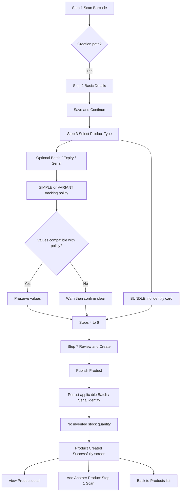

<!-- title: Tenant Admin Product Management Flow -->
<!-- status: Active -->
<!-- system: OneVerz POS MVP -->
<!-- last_updated: 2026-09-11 -->
<!-- supersedes: old_step_order_basic_details_first_barcode_sku_standalone -->

# Tenant Admin Product Management Flow

> **SUPERSEDED numbering (do not treat as current):**  
> Old: 1 Basic Details → 2 Product Type & Tracking → 3 Units & Pack → 4 Product Configuration → 5 Barcode & SKU → 6 Pricing & Tax → 7 Review & Create.  
> **Canonical (LOCKED 2026-09-11):** see table below. Decision: [[../../13_DECISIONS_AND_CHANGES/PRODUCT_SETUP_SCANNER_FIRST_STEP1_DECISION_2026-09-11]].  
> Scan Barcode: [[../../04_MODULE_KNOWLEDGE/10_Product_Core/Tenant_Admin_Product_Setup_Scan_Barcode_Specification]].

## Purpose

Defines the manual product management flows for the Tenant Admin, including the
canonical 7-Step wizard (scanner-first), optional Step 3 Initial
Tracking Details after Product Type is selected, draft saving, details overview, editing, duplicating,
archiving, and manual popular product curation. Product import workflows are
removed from this active interface scope.

## Source Basis

Confirmed 7-step Product Setup contract, tracking-policy specification,
2026-08-24 Initial Tracking identity decision, 2026-09-01 collection-surface
move onto Product Type & Tracking, and 2026-09-11 scanner-first Step 1 remumber.

## Actors

| Actor | Responsibility |
|---|---|
| Tenant Admin | Creates and manages tenant products through the wizard |
| System | Validates, persists draft, reconciles tracking, publishes identity |

## Trigger

Tenant Admin opens product management navigation menu.

## Preconditions

- Tenant Admin has product management permissions (`catalog.products.view`, `catalog.products.create`, `catalog.products.update`, `catalog.variants.manage`).
- Categories and brands are seeded and available.

---

## Main Flow: Fixed 7-Step Product Creation Wizard

| Step | Wizard Step Name | System & User Behavior |
|---:|---|---|
| 1 | **Step 1 — Scan Barcode** | Pre-draft acquisition: scan/type barcode, validate format/checksum, tenant duplicate discovery, optional external product-data lookup, or no-barcode bootstrap. Does **not** create a product row for every random scan. On creation-path transition, create/restore DRAFT, persist scan context, enter Step 2. Canonical: [[../../04_MODULE_KNOWLEDGE/10_Product_Core/Tenant_Admin_Product_Setup_Scan_Barcode_Specification]]. |
| 2 | **Step 2 — Basic Details** | User inputs Product Name (mandatory), Category (mandatory), Brand (optional), Short Name / Internal Code, Short Description, Long Description, Product Images, and Channel Visibility (POS, Online). Prefill may come from scan context. Initial Tracking Details are **not** collected here. |
| 3 | **Step 3 — Product Type & Tracking** | User selects Product Type (`SIMPLE`, `VARIANT`, `BUNDLE`). After type is selected, SIMPLE / VARIANT first collect optional Initial Tracking Details (Batch Number, Expiry Date, Serial Number), then Tracking & Stock Rules. Bundle does not show the identity card. Compatible identity values are preserved; TARGET warns and confirms before clearing incompatible values. |
| 4 | **Step 4 — Unit & Pack Conversion** | Applicable when Track Inventory = ON. Configures Single Unit Only or Multiple Units & Pack Conversion. Auto-bypassed when Track Inventory = OFF. After Step 4 (or when bypassed), **SIMPLE and VARIANT/BUNDLE proceed to Step 5** for Product Configuration. BUNDLE products strictly skip Step 4 (`NOT_APPLICABLE`). |
| 5 | **Step 5 — Product Configuration** | **SIMPLE:** variant/bundle matrix `NOT_APPLICABLE`; **identifier section is required** for final SKU/barcode (do not skip Step 5 entirely). **VARIANT:** Variant Matrix, Options, Values, Display Labels, Include Variant toggles, Image Overrides, **and** final SKU/barcode identifier assignment. **BUNDLE:** Component candidate search and assembly plus parent identifiers. Standalone global **Barcode & SKU** step is superseded. |
| 6 | **Step 6 — Pricing & Tax** | **SIMPLE:** one sellable identity → Standard Selling Price + Tax Class + Inclusive/Exclusive (+ Tax Preview). **VARIANT:** independent Selling Price per included `ProductVariant` (**Set Same Price for All Variants** / Apply to All = bulk helper only) + common Product Tax Assignment. Cost is product-level architecture (not SIMPLE UI; not VARIANT matrix R1). Persist via existing price list / tax assignment — see 7-Step contract §6.1–6.5. |
| 7 | **Step 7 — Review & Create** | Displays full review summary across all preceding sections using persisted draft data, including Scan Barcode context (when present) and applicable Initial Tracking Details. User clicks Create Product to complete server validation, publish the product, and persist applicable initial Batch/Serial identity without inventing stock quantity. On success the wizard shows the **Product Created Successfully** screen (not a toast). **View Product** opens product detail; **Add Another Product** starts a fresh wizard at Step 1 Scan Barcode; **Back to Products** opens Product List. |

---

## Detailed Step 1 User Journey: Manual Barcode Entry

```text
Enter Barcode Manually
        ↓
Validate Barcode
        ↓
Is Barcode Structurally Valid?
   ├── NO → Invalid Barcode
   └── YES
          ↓
Search Tenant Catalogue
          ↓
Product Exists?
   ├── YES → Existing Product Found
   └── NO
        ↓
External Product Lookup
        ↓
Product Found?
   ├── YES → External Product Found
   └── NO
        ↓
Product Not Found
        ↓
Continue with this barcode and create manually
        ↓
Retain Barcode
        ↓
Basic Details
        ↓
Continue normal 7-step Product Setup
```

---

## Detailed Step 5 User Journey: Variant Configuration

### Entry & Applicability
- **VARIANT Product**: Enters Step 5 from Step 4 (if Track Inventory ON) or Step 3 (if Track Inventory OFF).
- **SIMPLE Product**: Variant/bundle matrix auto-bypassed; user still enters Step 5 **identifier section** (SKU/barcode) before Pricing.
- **BUNDLE Product**: Renders Kit Component Assembly (+ identifiers).

### Main Screen Actions & Matrix Generation
1. User defines attributes by selecting attribute name (e.g. Size, Colour) and picking active values (e.g. S, M, L / Red, Blue).
2. **Estimated Variant Count** updates live in Flutter as values are added/removed (e.g. Colour 3 × Capacity 2 = 6). No Save or backend call is required for the estimate to refresh.
3. User clicks `Generate Variants` / `Apply`. Flutter and backend compute the actual Cartesian product ($3 \times 2 = 6$ combinations).
4. Configuration summary card updates: `6 Variants Generated`, `2 Attributes Defined`, `6 Included`.
5. Generated Variants table displays `Variant` (e.g. `Red / S`), and actions (`Edit`, `Delete`).
6. Selling Price, Cost Price, Tax, and Channel Visibility are NOT displayed in the variant-matrix portion of Step 5. Final SKU/Barcode assignment belongs to the Step 5 **identifier section** (not a separate global step).

### Edit Variant Right-Side Drawer
1. Clicking `Edit` opens right-side drawer.
2. User views read-only combination label and attribute badges.
3. User edits `Display Label` (e.g. `Home Jersey - Red / S`).
4. User toggles **`Include Variant`** (ON/OFF). (NEVER labeled Availability).
5. User manages variant image (uploads custom image, applies colour-group image, or removes override).
6. Clicking `Save Changes` applies edits to wizard state.

### Delete Variant Confirmation Modal
1. Clicking `Delete` opens centered confirmation modal.
2. User confirms deletion. Combination is archived as tombstone (`status = 'ARCHIVED'`).
3. Table and summary card update. Success toast is displayed.

---

## Access and Security Rules

- Strict server-side enforcement of tenant-isolation contexts.
- Permission enforcement: `catalog.products.create` / `catalog.products.update` + `catalog.variants.manage`.
- Feature entitlement enforcement: `product_catalog` (Module: `product_management`).

---

## Initial Tracking Details Journey

```text
Tenant Admin
    ↓
Add Product
    ↓
Step 1 Scan Barcode (pre-draft acquire / validate / discover)
    ↓
Creation path → DRAFT + scan context
    ↓
Step 2 Basic Details
    ↓
Enter Product Information
    ↓
Save & Continue
    ↓
Step 3 Product Type & Tracking
    ↓
Select Product Structure
    ↓
Optional Initial Batch / Expiry / Serial (SIMPLE / VARIANT only)
    ↓
Select Tracking Policy
    ↓
Validate identity values against tracking policy
    ↓
Compatible?
   /        \
 Yes        No
 |           |
Preserve    Warn + Resolve/Clear
    \        /
     Continue Wizard
          ↓
     Review & Create
          ↓
Persist Product + applicable tracking identity
```



## Business Rules

- BR-TRACK-001 to BR-TRACK-015 in [[../../04_MODULE_KNOWLEDGE/10_Product_Core/Tenant_Admin_Add_Product_Step1_Initial_Tracking_Details_Specification]].
- Step 3 identity values never auto-enable tracking toggles.
- VARIANT identity assigns at Step 7 to an included Variant, never the parent Product.
- BUNDLE parent cannot receive physical tracking identities.

## Access Control

| Control | Required |
|---|---|
| Authentication | Yes |
| Feature entitlement | Yes — runtime `product_catalog`; `product_management` is module grouping only and is **NOT** a runtime entitlement |
| Permission | Yes — `catalog.products.create` / `update` / `publish` |
| Outlet access | No for Product master setup |
| Trusted device | No |
| Open till session | No |

## Data / API References

| Area | Reference |
|---|---|
| API group | `/api/v1/tenant-admin/products` draft, setup, publish |
| Scan resolve | **IMPLEMENTED** `POST .../barcodes/resolve` (B4) |
| External lookup | **IMPLEMENTED B7** `POST .../barcodes/external-lookup` (no tenant duplicate checking; zero providers → NO_MATCH) |
| AUTO SKU base | `POST .../sku-candidates/generate`: selected `categoryId` → backend Category Code + atomic tenant sequence; e.g. `TSH-000125` |
| Policy table | `product_inventory_settings` |
| Draft identity (EXISTING) | `product_setup_initial_tracking` — CURRENT Step 3; migration `20260824095742_AddProductSetupInitialTracking`; **not** scanner-first B1 |
| Scan context | **IMPLEMENTED IN SOURCE** `product_setup_scan_context` — migration `20260912085454_AddProductSetupScannerIdentifierContext`; local Postgres test DB applied; **production/shared apply not claimed**. Draft-bootstrap write path **IMPLEMENTED B8**; GET `/setup` hydration/remap **B9 IMPLEMENTED — PURE READ**; scanner-first composite Step 5 final SKU/barcode **IMPLEMENTED B10**; publish revalidation **IMPLEMENTED B11**; backend closure **B12**. **Steps 2–4 & 6 BACKEND IMPLEMENTED**; Step 5 VARIANT/SIMPLE+IDs **IMPLEMENTED**; **BUNDLE component graph PARTIAL** ([[../../15_IMPLEMENTATION_TRACKING/99_AUDITS/PRODUCT_SETUP_STEP2_TO_STEP6_BACKEND_REALITY_AUDIT_2026-09-13]]). Flutter Step 1 **PARTIAL / PENDING** |
| Final identity | `product_batches`, `serial_numbers` |

AUTO SKU lifecycle (approved 2026-09-14): Step 1 no-barcode flow allocates and
displays the stable Product base. Draft bootstrap persists it in scan context.
Step 3 SIMPLE reuses it unchanged; Step 5 VARIANT extends the same base with
ordered stable Variant Value codes. Flutter does not compose SKUs. Category
change before finalization requires explicit regeneration. Decision:
[[../../13_DECISIONS_AND_CHANGES/PRODUCT_SKU_AUTO_GENERATION_CANONICAL_DECISION_2026-09-14]].

## Edge Cases

- Empty Initial Tracking Details is valid.
- Track Inventory OFF with entered values requires confirmation then clear.
- Expiry Tracking ON without Batch Number blocks finalization.
- Back after confirmed clear shows normalized Step 3 values.

## Out Of Scope

- Inventing Opening Stock quantity from Batch/Expiry/Serial.
- Capturing later lots/serials inside Product Setup (those remain inventory receiving).
- Product master columns for batch/expiry/serial.

## Related Files

- [[../../04_MODULE_KNOWLEDGE/10_Product_Core/Tenant_Admin_Product_Setup_Scan_Barcode_Specification]]
- [[../../04_MODULE_KNOWLEDGE/10_Product_Core/Tenant_Admin_Product_Identifier_SKU_Barcode_Specification]]
- [[../../04_MODULE_KNOWLEDGE/12_Product_Option_Variant_Configuration/Tenant_Admin_Product_Variant_Configuration_Specification]]
- [[../../04_MODULE_KNOWLEDGE/10_Product_Core/05_Tenant_Admin_Add_Product_7_Step_Contract]]
- [[../../04_MODULE_KNOWLEDGE/10_Product_Core/Tenant_Admin_Add_Product_Step1_Initial_Tracking_Details_Specification]]
- [[../../13_DECISIONS_AND_CHANGES/PRODUCT_SETUP_SCANNER_FIRST_STEP1_DECISION_2026-09-11]]
- [[../../13_DECISIONS_AND_CHANGES/PRODUCT_SETUP_INITIAL_TRACKING_DETAILS_STEP1_DECISION_2026-08-24]]
- [[../../13_DECISIONS_AND_CHANGES/PRODUCT_SETUP_INITIAL_TRACKING_DETAILS_STEP2_COLLECTION_DECISION_2026-09-01]]

### Bundle / Kit Flow

The final canonical Bundle flow completely skips Step 4 (Unit & Pack). The exact user journey is:

```text
Step 1 — Scan Barcode
        ↓
Step 2 — Basic Details
        ↓
Step 3 — Product Type & Tracking
        ↓
Select Bundle / Kit
        ↓
Bundle parent inventory tracking forced OFF
        ↓
Step 4 — NOT_APPLICABLE (Unit & Pack)
        ↓
DIRECT
Step 5 — Product Configuration
        ↓
Bundle / Kit Composition (+ identifiers)
        ↓
Step 6 — Pricing & Tax
        ↓
Step 7 — Review & Create
```

**Navigation Rules**:
- BUNDLE: Step 3 → Step 5.
- Step 4 is never rendered. It is fully `NOT_APPLICABLE`.
- Back navigation from Step 5 returns to Step 3 for BUNDLE products.

---

## Required Canonical Rule (Step 5 Variant Configuration)

> In Tenant Admin Add Product Step 5 Variant Configuration, clicking Add Attribute opens Attribute Name and Values inputs. After entering one or more attributes and their values, clicking Generate Variants sends the configuration to the backend. The backend validates, persists the attributes and values, generates/reconciles canonical product variants, persists those variants in the database, and returns the persisted variant result to Flutter. Flutter immediately displays the returned variants on the same Step 5 page in a Generated Variants table containing only Variant and Action columns. Generated variants must survive reload/resume and must not be frontend-only temporary records. Final SKU/Barcode assignment is completed in the Step 5 identifier section (not a separate global Barcode & SKU step).

## Required Canonical Rule (Save Draft vs Auto-Save)

- **Auto-save**: Preserves work in the background without user interaction. It prevents work loss but does NOT make the product visible as a draft in the Product List. **Not applicable during pure Step 1 pre-draft scans** (no product row yet).
- **Save Draft (Footer Button)**: This is an explicit user action. When a user clicks "Save Draft" from any step in the wizard **after a draft exists**:
  1. All data up to the current step (basic details, tracking, variants, pricing, etc.) is sent to the backend.
  2. The backend persists/updates the record on the same Product ID.
  3. The product's lifecycle status is officially marked as `DRAFT`.
  4. The exact wizard step (e.g., `currentStep = 5`) is saved.
  5. Upon success, the backend returns the canonical Draft response, and Flutter updates its state.
  6. A success message "Product saved as draft" is shown.
  7. **The product becomes visible in the Product List with a `DRAFT` status.**
  8. If the user reopens this draft from the Product List later, the Add Product wizard reopens and restores all saved values, taking them exactly to the step they saved at (with legacy step remapping per scanner-first decision when needed).
