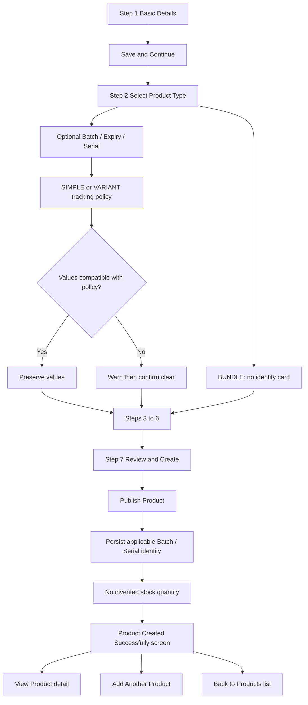

<!-- title: Tenant Admin Product Management Flow -->
<!-- status: Active -->
<!-- system: OneVerz POS MVP -->
<!-- last_updated: 2026-09-04 -->

# Tenant Admin Product Management Flow

## Purpose

Defines the manual product management flows for the Tenant Admin, including the
canonical 7-Step wizard (Reference UI 2 alignment), optional Step 2 Initial
Tracking Details after Product Type is selected, draft saving, details overview, editing, duplicating,
archiving, and manual popular product curation. Product import workflows are
removed from this active interface scope.

## Source Basis

Confirmed 7-step Product Setup contract, tracking-policy specification,
2026-08-24 Initial Tracking identity decision, and 2026-09-01 collection-surface
move to Step 2.

## Actors

| Actor | Responsibility |
|---|---|
| Tenant Admin | Creates and manages tenant products through the wizard |
| System | Validates, persists draft, reconciles tracking, publishes identity |

## Trigger

Tenant Admin opens product management navigation menu.

## Preconditions

- Tenant Admin has product management permissions (`catalog.products.view`, `catalog.products.create`, `catalog.products.update`, `catalog.variants.manage`).
- Categories and brands are seeded and available.

---

## Main Flow: Fixed 7-Step Product Creation Wizard

| Step | Wizard Step Name | System & User Behavior |
|---:|---|---|
| 1 | **Step 1 — Basic Details** | User inputs Product Name (mandatory), Category (mandatory), Brand (optional), Short Name / Internal Code, Short Description, Long Description, Product Images, and Channel Visibility (POS, Online). Initial Tracking Details are **not** collected here. |
| 2 | **Step 2 — Product Type & Tracking** | User selects Product Type (`SIMPLE`, `VARIANT`, `BUNDLE`). After type is selected, SIMPLE / VARIANT first collect optional Initial Tracking Details (Batch Number, Expiry Date, Serial Number), then Tracking & Stock Rules. Bundle does not show the identity card. Compatible identity values are preserved; TARGET warns and confirms before clearing incompatible values. |
| 3 | **Step 3 — Units & Pack Conversion** | Applicable when Track Inventory = ON. Configures Single Unit Only or Multiple Units & Pack Conversion. Auto-bypassed when Track Inventory = OFF. SIMPLE + Track Inventory ON navigates to Step 5; VARIANT navigates to Step 4. BUNDLE products strictly skip this step (`NOT_APPLICABLE`). |
| 4 | **Step 4 — Product Configuration** | Simple Product auto-skips (`NOT_APPLICABLE`). Variant Product renders Variant Matrix, Options, Values, Display Labels, Include Variant toggles, and Image Overrides. Bundle/Kit renders Component candidate search and assembly. |
| 5 | **Step 5 — Barcode & SKU** | Configures SKU and Barcodes (Global / UOM-specific). Enforces tenant-wide uniqueness. |
| 6 | **Step 6 — Pricing & Tax** | **SIMPLE:** one sellable identity → Standard Selling Price + Tax Class + Inclusive/Exclusive (+ Tax Preview). **VARIANT:** independent Selling Price per included `ProductVariant` (**Set Same Price for All Variants** / Apply to All = bulk helper only) + common Product Tax Assignment. Cost is product-level architecture (not SIMPLE UI; not VARIANT matrix R1). Persist via existing price list / tax assignment — see 7-Step contract §6.1–6.5. |
| 7 | **Step 7 — Review & Create** | Displays full review summary across all 6 preceding sections using persisted draft data, including applicable Initial Tracking Details. User clicks Create Product to complete server validation, publish the product, and persist applicable initial Batch/Serial identity without inventing stock quantity. On success the wizard shows the **Product Created Successfully** screen (not a toast). **View Product** opens product detail; **Add Another Product** starts a fresh wizard; **Back to Products** opens Product List. |

---

## Detailed Step 4 User Journey: Variant Configuration

### Entry & Applicability
- **VARIANT Product**: Enters Step 4 from Step 3 (if Track Inventory ON) or Step 2 (if Track Inventory OFF).
- **SIMPLE Product**: Auto-bypassed.
- **BUNDLE Product**: Renders Kit Component Assembly.

### Main Screen Actions & Matrix Generation
1. User defines attributes by selecting attribute name (e.g. Size, Colour) and picking active values (e.g. S, M, L / Red, Blue).
2. **Estimated Variant Count** updates live in Flutter as values are added/removed (e.g. Colour 3 × Capacity 2 = 6). No Save or backend call is required for the estimate to refresh.
3. User clicks `Generate Variants` / `Apply`. Flutter and backend compute the actual Cartesian product ($3 \times 2 = 6$ combinations).
4. Configuration summary card updates: `6 Variants Generated`, `2 Attributes Defined`, `6 Included`.
5. Generated Variants table displays `Variant` (e.g. `Red / S`), and actions (`Edit`, `Delete`).
6. SKU, Barcode, Selling Price, Cost Price, Tax, and Channel Visibility are NOT displayed in Step 4.

### Edit Variant Right-Side Drawer
1. Clicking `Edit` opens right-side drawer.
2. User views read-only combination label and attribute badges.
3. User edits `Display Label` (e.g. `Home Jersey - Red / S`).
4. User toggles **`Include Variant`** (ON/OFF). (NEVER labeled Availability).
5. User manages variant image (uploads custom image, applies colour-group image, or removes override).
6. Clicking `Save Changes` applies edits to wizard state.

### Delete Variant Confirmation Modal
1. Clicking `Delete` opens centered confirmation modal.
2. User confirms deletion. Combination is archived as tombstone (`status = 'ARCHIVED'`).
3. Table and summary card update. Success toast is displayed.

---

## Access and Security Rules

- Strict server-side enforcement of tenant-isolation contexts.
- Permission enforcement: `catalog.products.create` / `catalog.products.update` + `catalog.variants.manage`.
- Feature entitlement enforcement: `product_catalog` (Module: `product_management`).

---

## Initial Tracking Details Journey

```text
Tenant Admin
    ↓
Add Product
    ↓
Step 1 Basic Details
    ↓
Enter Product Information
    ↓
Save & Continue
    ↓
Step 2 Product Type & Tracking
    ↓
Select Product Structure
    ↓
Optional Initial Batch / Expiry / Serial (SIMPLE / VARIANT only)
    ↓
Select Tracking Policy
    ↓
Validate identity values against tracking policy
    ↓
Compatible?
   /        \
 Yes        No
 |           |
Preserve    Warn + Resolve/Clear
    \        /
     Continue Wizard
          ↓
     Review & Create
          ↓
Persist Product + applicable tracking identity
```



## Business Rules

- BR-TRACK-001 to BR-TRACK-015 in [[../../04_MODULE_KNOWLEDGE/10_Product_Core/Tenant_Admin_Add_Product_Step1_Initial_Tracking_Details_Specification]].
- Step 2 identity values never auto-enable tracking toggles.
- VARIANT identity assigns at Step 7 to an included Variant, never the parent Product.
- BUNDLE parent cannot receive physical tracking identities.

## Access Control

| Control | Required |
|---|---|
| Authentication | Yes |
| Feature entitlement | Yes — `product_catalog` / `product_management` |
| Permission | Yes — `catalog.products.create` / `update` / `publish` |
| Outlet access | No for Product master setup |
| Trusted device | No |
| Open till session | No |

## Data / API References

| Area | Reference |
|---|---|
| API group | `/api/v1/tenant-admin/products` draft, setup, publish |
| Policy table | `product_inventory_settings` |
| Draft identity TARGET | `product_setup_initial_tracking` |
| Final identity | `product_batches`, `serial_numbers` |

## Edge Cases

- Empty Initial Tracking Details is valid.
- Track Inventory OFF with entered values requires confirmation then clear.
- Expiry Tracking ON without Batch Number blocks finalization.
- Back after confirmed clear shows normalized Step 2 values.

## Out Of Scope

- Inventing Opening Stock quantity from Batch/Expiry/Serial.
- Capturing later lots/serials inside Product Setup (those remain inventory receiving).
- Product master columns for batch/expiry/serial.

## Related Files

- [[../../04_MODULE_KNOWLEDGE/12_Product_Option_Variant_Configuration/Tenant_Admin_Product_Variant_Configuration_Specification]]
- [[../../04_MODULE_KNOWLEDGE/10_Product_Core/05_Tenant_Admin_Add_Product_7_Step_Contract]]
- [[../../04_MODULE_KNOWLEDGE/10_Product_Core/Tenant_Admin_Add_Product_Step1_Initial_Tracking_Details_Specification]]
- [[../../13_DECISIONS_AND_CHANGES/PRODUCT_SETUP_INITIAL_TRACKING_DETAILS_STEP1_DECISION_2026-08-24]]
- [[../../13_DECISIONS_AND_CHANGES/PRODUCT_SETUP_INITIAL_TRACKING_DETAILS_STEP2_COLLECTION_DECISION_2026-09-01]]

### Bundle / Kit Flow

The final canonical Bundle flow completely skips Step 3. The exact user journey is:

```text
Step 1 — Basic Details
        ↓
Step 2 — Product Type & Tracking
        ↓
Select Bundle / Kit
        ↓
Bundle parent inventory tracking forced OFF
        ↓
Step 3 — NOT_APPLICABLE
        ↓
DIRECT
Step 4 — Product Configuration
        ↓
Bundle / Kit Composition
        ↓
Step 5 — Barcode & SKU
        ↓
Step 6 — Pricing & Tax
        ↓
Step 7 — Review & Create
```

**Navigation Rules**:
- BUNDLE: Step 2 → Step 4.
- Step 3 is never rendered. It is fully `NOT_APPLICABLE`.
- Back navigation from Step 4 returns to Step 2 for BUNDLE products.

---

## Required Canonical Rule (Step 4 Variant Configuration)

> In Tenant Admin Add Product Step 4 Variant Configuration, clicking Add Attribute opens Attribute Name and Values inputs. After entering one or more attributes and their values, clicking Generate Variants sends the configuration to the backend. The backend validates, persists the attributes and values, generates/reconciles canonical product variants, persists those variants in the database, and returns the persisted variant result to Flutter. Flutter immediately displays the returned variants on the same Step 4 page in a Generated Variants table containing only Variant and Action columns. Generated variants must survive reload/resume and must not be frontend-only temporary records.

## Required Canonical Rule (Save Draft vs Auto-Save)

- **Auto-save**: Preserves work in the background without user interaction. It prevents work loss but does NOT make the product visible as a draft in the Product List.
- **Save Draft (Footer Button)**: This is an explicit user action. When a user clicks "Save Draft" from any step in the wizard:
  1. All data up to the current step (basic details, tracking, variants, pricing, etc.) is sent to the backend.
  2. The backend persists/updates the record on the same Product ID.
  3. The product's lifecycle status is officially marked as `DRAFT`.
  4. The exact wizard step (e.g., `currentStep = 4`) is saved.
  5. Upon success, the backend returns the canonical Draft response, and Flutter updates its state.
  6. A success message "Product saved as draft" is shown.
  7. **The product becomes visible in the Product List with a `DRAFT` status.**
  8. If the user reopens this draft from the Product List later, the Add Product wizard reopens and restores all saved values, taking them exactly to the step they saved at.
