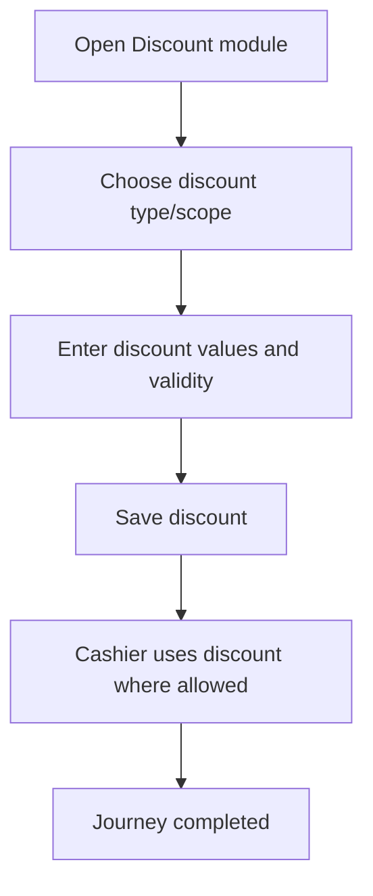

<!-- title: Discount Setup Flow -->
<!-- status: Active -->
<!-- system: SCS-TIX EPOS Release 1 -->
<!-- last_updated: 2026-06-08 -->

# Discount Setup Flow

## Purpose

Captures tenant discount setup that is required for product, variant, POS policy, and expiry discounts.

## Source Basis

This journey is based on the uploaded SCS-TIX Release 1 user journey files, UI
screens, backend architecture, database design, and confirmed project decisions.

It must not be expanded into e-commerce, offline sync, supplier, delivery, kiosk,
coupon, AI, or accounting scope.

## Actors

| Actor | Responsibility |
|---|---|
| Tenant Admin | Creates/configures allowed discounts |
| Backend | Stores discount rules and policies |
| Cashier | Applies permitted discounts in POS |

## Preconditions

- Discount feature is enabled.
- Products/variants exist for product discounts.
- Tenant Admin has discount permission.

## Main Flow

| Step | User/System Action | Expected Result |
|---:|---|---|
| 1 | Open Discount module | Discount list and policy settings appear |
| 2 | Choose discount type/scope | Product, variant, POS policy, or expiry rule is selected |
| 3 | Enter discount values and validity | Rule is validated |
| 4 | Save discount | Discount rule/policy is stored |
| 5 | Cashier uses discount where allowed | POS totals recalculate |

## Journey Diagram

## Business Rules

- Discount types include percentage, fixed amount, and price override where supported.
- Cashier limits are controlled by discount policies.
- Manager PIN approval is required when policy limit is exceeded.
- Expiry discounts use batch expiry rules.

## Access-Control Rules

| Control | Required Rule |
|---|---|
| Authentication | Required |
| Feature entitlement | Discount/expiry discount enabled |
| Permission | Discount manage permission |
| Tenant/outlet context | Required |

## Data and API References

| Area | References |
|---|---|
| API groups | `/api/v1/discounts` |
| Tables | `discount_policies`, `product_discounts`, `expiry_discount_rules`, `expiry_discount_applications`, `pos_discount_applications` |

## Edge Cases

- Invalid discount value returns validation error.
- Expired/inactive discount cannot apply.
- Feature disabled returns 403.

## Out of Scope

- Coupons and full promotions engine are excluded.

## Completion Criteria

- The user reaches the expected final state without bypassing access control.
- Tenant-owned data remains inside the resolved tenant context.
- Sensitive actions write audit records where required.
- UI state and backend state stay consistent after completion.

## Related Files

- [[../01_RELEASE_SCOPE/Release_1_Scope]]
- [[../02_ACCESS_CONTROL/Access_Control_Overview]]
- [[../05_BACKEND_ARCHITECTURE/API_Standards]]
