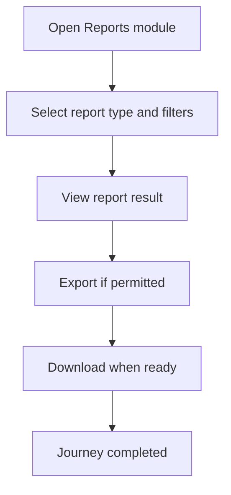

<!-- title: Tenant Reports Flow -->
<!-- status: Active -->
<!-- system: SCS-TIX EPOS Release 1 -->
<!-- last_updated: 2026-06-08 -->

# Tenant Reports Flow

## Purpose

Captures Tenant Admin report access journey for Release 1 reports.

## Source Basis

This journey is based on the uploaded SCS-TIX Release 1 user journey files, UI
screens, backend architecture, database design, and confirmed project decisions.

It must not be expanded into e-commerce, offline sync, supplier, delivery, kiosk,
coupon, AI, or accounting scope.

## Actors

| Actor | Responsibility |
|---|---|
| Tenant Admin | Views reports if permitted |
| Backend | Returns tenant/outlet scoped summaries and export jobs |

## Preconditions

- Reports feature is enabled.
- Tenant Admin has report permission.
- Summary data exists or empty state is handled.

## Main Flow

| Step | User/System Action | Expected Result |
|---:|---|---|
| 1 | Open Reports module | Report dashboard/list appears |
| 2 | Select report type and filters | Date/outlet/status filters are submitted |
| 3 | View report result | Tenant-scoped result is displayed |
| 4 | Export if permitted | Export job is created |
| 5 | Download when ready | File reference becomes available |

## Journey Diagram

## Business Rules

- Reports must respect tenant, outlet, and permission boundaries.
- Export jobs must be tenant-owned.
- Large reports should use projections or export jobs.
- Cashier may view reports only if permission is enabled.

## Access-Control Rules

| Control | Required Rule |
|---|---|
| Authentication | Required |
| Feature entitlement | Reports enabled |
| Permission | Report view/export permission |
| Tenant/outlet context | Required |

## Data and API References

| Area | References |
|---|---|
| API groups | `/api/v1/reports` |
| Tables | `daily_sales_summaries`, `daily_payment_summaries`, `daily_inventory_summaries`, `daily_discount_return_summaries`, `report_export_jobs` |

## Edge Cases

- No data shows empty state.
- No export permission hides export action and backend returns 403.
- Report not ready shows processing status.

## Out of Scope

- AI analytics is excluded.
- Full accounting reports are excluded.

## Completion Criteria

- The user reaches the expected final state without bypassing access control.
- Tenant-owned data remains inside the resolved tenant context.
- Sensitive actions write audit records where required.
- UI state and backend state stay consistent after completion.

## Related Files

- [[../01_RELEASE_SCOPE/Release_1_Scope]]
- [[../02_ACCESS_CONTROL/Access_Control_Overview]]
- [[../05_BACKEND_ARCHITECTURE/API_Standards]]
