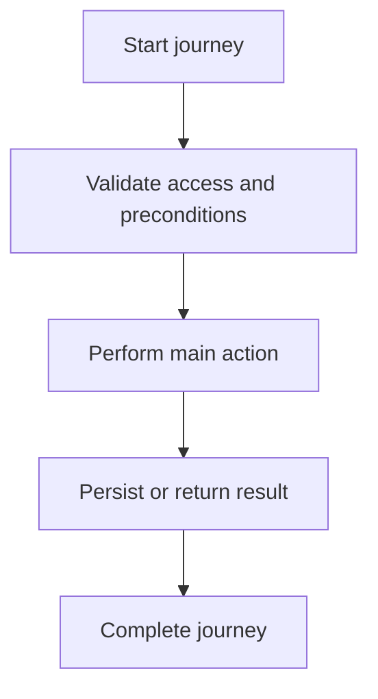

<!-- title: User Journey Template -->
<!-- status: Active -->
<!-- system: SCS-TIX EPOS Release 1 -->
<!-- last_updated: 2026-06-08 -->


# User Journey Template

## Purpose

Use this template for every SCS-TIX EPOS Release 1 user journey.

The goal is to keep journeys consistent for human developers, AI coding
assistants, UI designers, backend developers, and QA testers.

## Source Rule

A journey must be based only on confirmed SCS-TIX Release 1 source material.

Do not add Release 2 or future behavior unless it is clearly marked as excluded,
deferred, or future.

## File Naming Rule

Use this naming pattern:

```text
NN_Clear_Flow_Name.md
```

Example:

```text
04_Start_Sale_Flow.md
```

## Required Sections

Each journey file should include:

- Purpose.
- Source basis.
- Actors.
- Preconditions.
- Main flow.
- Business rules.
- Access-control rules.
- Data/API references.
- Edge cases.
- Out-of-scope notes.
- Related Second Brain files.

## Actor Table Format

| Actor | Responsibility |
|---|---|
| Primary actor | Main user performing the journey |
| Supporting actor | User/system supporting the journey |
| System | Backend, database, device, or external provider |

## Preconditions Format

List only conditions that must already be true before the journey starts.

Example:

- Tenant exists.
- User is invited.
- Feature entitlement is enabled.
- User has required permission.
- Device is trusted where POS context is required.

## Flow Format

Use ordered steps.

| Step | User/System Action | Expected Result |
|---:|---|---|
| 1 | User opens screen | Screen loads within allowed access |
| 2 | User submits details | Backend validates and stores data |

## Journey Diagram

Every journey file must include a Mermaid diagram under the main flow.



## Mermaid Flow Rule

Use Mermaid only when the journey has meaningful branching.

Do not add Mermaid just for decoration.

## Access-Control Format

Every journey must state the required controls.

| Control | Required |
|---|---|
| Authentication | Yes/No |
| Feature entitlement | Yes/No |
| Permission | Yes/No |
| Outlet access | Yes/No |
| Trusted device | Yes/No |
| Open till session | Yes/No |

## Data/API Reference Format

Use database tables and API groups confirmed by architecture/database design.

Avoid inventing endpoints.

Example:

| Area | Reference |
|---|---|
| API group | `/api/v1/pos/sales` |
| Tables | `sales`, `sale_lines`, `payments` |

## Out-of-Scope Format

Clearly mark excluded behavior.

Example:

- E-commerce checkout is not part of Release 1.
- Offline sync is not part of Release 1.
- Supplier flow is not part of Release 1.

## Related Files

Use wikilinks.

Example:

- [[../01_RELEASE_SCOPE/Release_1_Scope]]
- [[../02_ACCESS_CONTROL/API_Authorization_Rules]]
- [[../05_BACKEND_ARCHITECTURE/API_Standards]]
