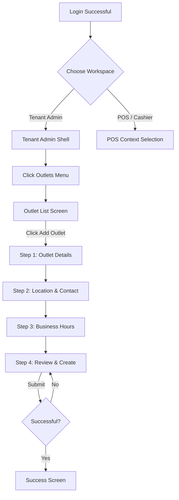

# 04 Create Outlet UI UX and User Journey

> Last Verified Date: 2026-08-06
> UI Reference: Approved Create Outlet UI Reference Image

## 1. Application Shell Boundaries

The Create Outlet interface operates exclusively inside the **Tenant Admin Workspace Shell**.

### 1.1 Shell Composition
- **Header (Black, Height: 70px)**: OneVerz logo, Help Icon, Notification Badge (showing Tenant Admin alerts), and User Profile selector displaying "Tenant Admin".
- **Sidebar (Light, Width: 260px)**: Left navigation highlighting the active "Outlets" selection.
- **Content Area**: Rounded white panel holding the 4-step stepper, input fields, side help panel, and navigation buttons.

### 1.2 POS Element Exclusions
- Cashier bottom navigation bar must be hidden.
- Active Till selector and open till session indicators are omitted.

---

## 2. Screen Specifications

### 2.1 Step 1: Outlet Details
- **Step Header**: Steps 1-4 indicator with horizontal connectors.
- **Left Columns**: Two-column layout containing inputs for Name, Type, Manager, Email, Timezone, Phone, and Status (segmented Active/Inactive control).
- **Toggles**: "Main / Central Outlet" and "Default for New Tills".
- **Right Guidance Panel**: Stacked help cards explaining concepts:
  - "What is an outlet?"
  - "Sales & reporting separation"
  - "Central outlet"
  - "Till assignment defaults"

### 2.2 Step 2: Location & Contact
- **Address Fields**: Inputs for Address Line 1, Address Line 2, City, State/Province, Postal Code, and Country.
- **Operational Contact Fields**: Inputs for Contact Person, Contact Phone, and Contact Email.
- **Outlet Image Control**: Banner-styled upload card supporting preview, replace, and removal of PNG/JPG assets under 2 MB.

### 2.3 Step 3: Business Hours
- **Timezone Banner**: "Business hours use the outlet timezone: {timezone label}"
- **Regular Hours Grid**: Monday to Sunday rows with Open/Closed/24h toggles, time pickers, and overnight span indicators.
- **Bulk Actions**: Buttons for "Copy Monday to Tue-Fri", "Set selected to Closed", "Set selected to 24 Hours".
- **Special Days Grid**: Sub-table allowing entries for Date, Holiday Name, Status, and Hours override.

### 2.4 Step 4: Review & Create
- **Visual Design**: Read-only, side-by-side card sections representing all data from Steps 1-3.
- **Edit Triggers**: Inline "Edit" buttons on each panel returning the user to the corresponding wizard step.
- **Guidance Text**: Confirms data scope and role-based access rules.

---

## 3. Responsive Adaptations

| Surface Area | Desktop (16:9) | Tablet (Landscape) | Mobile (Width < 768px) |
|---|---|---|---|
| **Right Help Panel** | Fixed on right side | Collapses into drawer | Hidden (available via info button) |
| **Form Layout** | Side-by-side (2 columns) | Single-column fields | Stacked inputs |
| **Wizard Stepper** | Horizontal | Horizontal | Horizontal scrolling or mini-step indicator |
| **Review Cards** | Side-by-side grid | Vertical list | Stacked sections |
