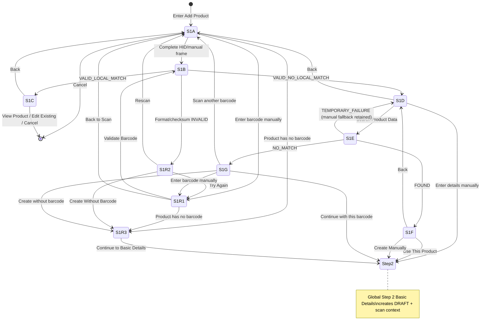

<!-- title: Tenant Admin Product Setup — Step 1 Scan Barcode Specification -->
<!-- status: Active -->
<!-- system: OneVerz POS MVP Unified Commerce Scope -->
<!-- last_updated: 2026-09-16 -->
<!-- supersedes_partial: standalone_step5_barcode_sku_acquisition; old_step1_basic_details_as_wizard_entry; barcode_type_gtin14_representation -->

# Tenant Admin Product Setup — Step 1 Scan Barcode Specification

## 1. Purpose & Authority

This document is the **canonical** specification for **Global Step 1 — Scan Barcode** of the Tenant Admin Add Product / Product Setup wizard.

| Aspect | Value |
|---|---|
| Wizard length | Exactly **7** global steps |
| This step | **1 — Scan Barcode** |
| Status | **Canonical contract ACTIVE** — Backend **B1–B12 IMPLEMENTED**; Backend scanner-first Product Setup **COMPLETE** (see [[../../00_START_HERE/Current_Source_Of_Truth]]); write-stage numbering **LOCKED** ([[../../13_DECISIONS_AND_CHANGES/PRODUCT_SETUP_SCANNER_FIRST_WRITE_STAGE_MAPPING_DECISION_2026-09-13]]); Flutter Step 1 remains **PENDING** / separate |
| Decision | [[../../13_DECISIONS_AND_CHANGES/PRODUCT_SETUP_SCANNER_FIRST_STEP1_DECISION_2026-09-11]] |
| Write-stage mapping | [[../../13_DECISIONS_AND_CHANGES/PRODUCT_SETUP_SCANNER_FIRST_WRITE_STAGE_MAPPING_DECISION_2026-09-13]] |
| Parent contract | [[05_Tenant_Admin_Add_Product_7_Step_Contract]] |
| Identifier domain (final assignment) | [[Tenant_Admin_Product_Identifier_SKU_Barcode_Specification]] |
| UI | [[../../07_UI_UX_KNOWLEDGE/Tenant_Admin_Add_Product_7_Step_UI_UX_Specification]] |
| Flutter | [[../../08_FLUTTER_POS_KNOWLEDGE/Tenant_Admin_Add_Product_7_Step_Flutter_Implementation_Specification]] |
| Permissions | [[../../02_ACCESS_CONTROL/Tenant_Admin_Add_Product_7_Step_Permission_Matrix]] |
| Scanner hardware | [[../../12_INTEGRATIONS/Barcode_Scanner_Integration]] (HID reuse; POS Cashier lookup is **not** the Tenant Admin contract) |

**Implementation status (2026-09-13):** Backend **B1–B12 IMPLEMENTED**; Backend scanner-first Product Setup **COMPLETE**; write-stage numbering LOCKED; Flutter Step 1 PENDING / separate. Zero configured external providers → public `NO_MATCH`. Local resolve and external lookup remain separate; Step 1 candidate ≠ final identifier ownership (Step 5 / publish). See [[../../00_START_HERE/Current_Source_Of_Truth]]. This file remains the canonical Step 1 **business/API contract**.

---

## 2. Canonical Global Wizard (LOCKED)

1. **Scan Barcode**
2. **Basic Details**
3. **Product Type & Tracking**
4. **Unit & Pack Conversion**
5. **Product Configuration**
6. **Pricing & Tax**
7. **Review & Create**

**Barcode & SKU is NOT a standalone global stepper item.**

Identifier ownership split:

| Concern | Owner |
|---|---|
| Acquisition, format/checksum validation, tenant duplicate discovery, optional external product-data discovery | **Step 1** |
| Final sellable-identity completion / SKU & barcode assignment reconciliation | **Step 5 Product Configuration** (identifier section) |
| Final authoritative revalidation and publish | **Step 7** |

All screens in §4 remain **inside** Global Step 1. They are **not** additional wizard steps. Older reference images showing a 10-step stepper are interaction-only; stepper semantics follow this 7-step contract.

---

## 3. Pre-Draft vs Draft Boundary

Step 1 scan/discovery is **pre-draft** until the user chooses a creation path.

| Event | Draft behaviour |
|---|---|
| Random barcode scans / validation / local lookup / external lookup | **Do not** create abandoned `products` rows |
| `USE_THIS_PRODUCT` | Create/restore Product **DRAFT**, enter Step 2, persist scan context (+ typed normalized prefill) |
| `CREATE_MANUALLY` (from no local match or external found) | Same draft boundary; retain candidate; discard external prefill for Step 2 |
| `CONTINUE_WITH_BARCODE` (external no match / validated candidate) | Same |
| `CONTINUE_TO_BASIC_DETAILS` from no-barcode bootstrap | Same; `acquisition_mode = NO_BARCODE`; no fake barcode |
| Fresh persisted draft after those transitions | **`current_setup_step = 2`** (Basic Details — scanner-first public semantics; never legacy processor `1`) |

Scan bootstrap context is persisted **when the draft is created** (see §16 / `product_setup_scan_context`). Write routing uses centralized write-stage mapping — not `currentStep±1`. Authority: [[../../13_DECISIONS_AND_CHANGES/PRODUCT_SETUP_SCANNER_FIRST_WRITE_STAGE_MAPPING_DECISION_2026-09-13]].

---

## 4. Step 1 Internal State Machine

### 4.1 Canonical states

| Code | Name | Persistence |
|---|---|---|
| S1-A | Scan Product Barcode (default) | Transient |
| S1-B | Barcode Detected / Validation | Transient |
| S1-C | Existing Product Found | Transient (+ safe conflict projection) |
| S1-D | No Local Match | Transient (retain validated barcode candidate) |
| S1-E | External Product Lookup | Transient |
| S1-F | Product Found / Confirm Details | Transient (normalized suggestion) |
| S1-G | External Lookup No Match | Transient |
| S1-R1 | Enter Barcode Manually | Transient |
| S1-R2 | Invalid Barcode | Transient |
| S1-R3 | Create Product Without Barcode | Transient → draft on continue |

Flutter presentation aliases (same machine): `scanReady`, `scanning`, `validating`, `localLookup`, `localMatch`, `noLocalMatch`, `externalLookup`, `externalFound`, `externalNoMatch`, `manualEntry`, `invalid`, `noBarcode`.

### 4.2 State-transition diagram



### 4.3 Transition table

| From | Trigger | To | Notes |
|---|---|---|---|
| — | Open Add Product | S1-A | Scanner listens automatically |
| S1-A | Completed scanner frame | S1-B | One frame → one resolve request |
| S1-A | Enter barcode manually | S1-R1 | Same validation pipeline |
| S1-A | Product has no barcode | S1-R3 | No GTIN candidate |
| S1-A | Cancel | Exit wizard | No draft unless already existed |
| S1-B | INVALID | S1-D | Route to No Local Match to allow manual creation override |
| S1-B | VALID_LOCAL_MATCH | S1-C | Tenant catalogue only |
| S1-B | VALID_NO_LOCAL_MATCH | S1-D | Retain validated candidate; **not** a reservation |
| S1-R1 | Validate Barcode | S1-B | Identical pipeline |
| S1-R2 | Try Again | S1-R1 | |
| S1-R2 | Rescan | S1-A | |
| S1-R2 | Create Without Barcode | S1-R3 | |
| S1-C | View Product | Product detail | Requires `catalog.products.view` |
| S1-C | Edit Existing Product | Edit flow | Requires `catalog.products.update` |
| S1-D | No Local Match | S1-E | Automatic (for both manual and scanned barcodes) |
| S1-D | Enter details manually | Step 2 | Draft + barcode candidate; no external prefill (fallback path) |
| S1-E | FOUND | S1-F | Normalized suggestion |
| S1-E | NO_MATCH | S1-G | Normal business outcome |
| S1-E | TEMPORARY_FAILURE | S1-D (+ retry) | Never dead-end |
| S1-F | Use This Product | Step 2 | Prefill editable suggestions |
| S1-F | Create Manually | Step 2 | Keep GTIN; ignore external fields |
| S1-G | Continue with this barcode | Step 2 | Keep GTIN |
| S1-G | Scan another barcode | S1-A | Clear prior candidate |
| S1-R3 | Continue | Step 2 | Persist no-barcode bootstrap |

---

## 5. Default Scanner-First Screen (S1-A)

**Title:** Scan Product Barcode

**Shell:** Existing Tenant Admin black shell / sidebar / header / footer. Do **not** invent another sidebar, top nav, or footer architecture.

**Normal behaviour:**
- Scanner listens automatically.
- USB HID / keyboard-wedge is the primary path (reuse approved HID framing from Barcode Scanner Integration).
- Preserve barcode as **STRING**; preserve leading zeroes.
- One completed scanner frame → one validation/resolve request.
- Trailing Enter / scanner suffix completes the scan.
- **No** per-keystroke API calls.

**Actions:** Enter barcode manually · Product has no barcode · Cancel  
**Footer:** Cancel · orange loading/status area: **Waiting for scan**

Design tokens, button sizing, typography, spacing, and **1024×768 tablet-first** rules remain owned by [[../../07_UI_UX_KNOWLEDGE/Design_System]] and the Add Product UI/UX specification. Screenshot colours/fonts/sizes are **not** authoritative.

---

## 6. Validation Pipeline (LOCKED)

Separate concerns explicitly:

| Concern | Answers | Does NOT answer |
|---|---|---|
| **A. Identifier / GTIN format validation** | Is this structurally/checksum valid? | Whether the product exists |
| **B. Tenant catalogue lookup** | Is this identifier already assigned in **this tenant’s** OneVerz catalogue? | Whether an external GS1/supplier source knows the product |

**GTIN check digit does not check catalogue existence.**

Canonical pipeline:

```text
scanner/manual input
  → preserve raw string
  → supported length/format validation
  → GTIN checksum validation where applicable
  → determine identifier format
  → authoritative tenant catalogue lookup
```

UI may show progress labels such as:
- Barcode format
- GTIN check digit
- Checking your catalogue...

The orange “Checking catalogue” surface is a **progress/loading state**, not a second user click.

Local tenant catalogue lookup begins **automatically** after successful format validation.  
External product lookup begins **automatically** if the local catalogue lookup returns no match.

**Authoritative duplicate check** = Tenant Admin backend catalogue. Do **not** treat a Flutter device-local DB as authoritative unless an approved versioned offline catalogue already exists (it does not for this Product Setup path).

Do **not** call POS Cashier `GET /api/v1/pos/products/by-barcode/{barcode}` from Tenant Admin (POS/device/outlet/till semantics).

---

## 7. Supported Manual GTIN Lengths

Manual-entry UI supports quick lengths: **8 / 12 / 13 / 14** digits.

| Identifier format | Digits | Checksum | Common symbology association (informational only) |
|---|---|---|---|
| GTIN-8 | 8 | Required | Often EAN-8 |
| GTIN-12 | 12 | Required | Often UPC-A |
| GTIN-13 | 13 | Required | Often EAN-13 |
| GTIN-14 | 14 | Required | Identifier; **not** automatically a barcode symbology |

### 7.1 Identifier standard vs barcode symbology (LOCKED 2026-09-12 — Option A)

Current persisted `product_barcodes.barcode_type` codes: `EAN8`, `EAN13`, `UPCA`, `CODE128`, `CODE39`. Those are **symbology/encoding** concepts.

**Problem:** GTIN-14 is an identifier standard/length, not a symbology. Storing it in the symbology column conflates two concepts.

> **CORRECTION:** the 2026-09-11 statement that allowed **`barcode_type = 'GTIN14'` is SUPERSEDED and must not be implemented.** Authority: [[../../13_DECISIONS_AND_CHANGES/PRODUCT_SETUP_SCANNER_FIRST_TECHNICAL_CONTRACT_DECISION_2026-09-12]] TD-2.

**TARGET representation (LOCKED — two separate concepts):**

| Concept | Field | Allowed values |
|---|---|---|
| Identifier standard | `identifierStandard` / **IMPLEMENTED IN SOURCE** `product_barcodes.identifier_standard` (nullable; local test DB applied; prod/shared not claimed) | `GTIN8`, `GTIN12`, `GTIN13`, `GTIN14`, `OTHER`, NULL = unclassified |
| Barcode symbology | `barcodeType` / EXISTING `product_barcodes.barcode_type` | `EAN13`, `EAN8`, `UPCA`, `CODE128`, `CODE39`, **IMPLEMENTED** `UNKNOWN` |

1. `identifier_standard` is **derived** from the validated digit string (length + GTIN checksum), never free text.
2. Symbology is persisted only when genuinely known (scanner/provider reported). A valid GTIN with no reported symbology persists **`barcode_type = 'UNKNOWN'`** — do **not** invent `CODE128`, `EAN13`, or `ITF14`.
3. When the scanner reports EAN8/EAN13/UPCA, persist that symbology **and** the matching identifier standard.
4. Non-GTIN codes keep `CODE128`/`CODE39` with `identifier_standard = 'OTHER'`.
5. `ITF14` is not introduced here; it may be added later only as a genuine reported symbology.

Invalid length / failed checksum previously blocked creation. This has been updated to unblock users: invalid barcodes now automatically transition to S1-D (No Local Match) so the user can continue and create the product manually anyway.

---

## 8. Existing Product Found (S1-C)

After valid identifier → query authoritative **tenant** catalogue. Barcode/GTIN remains **tenant-unique** (`UNIQUE(tenant_id, barcode)`).

Safe minimal conflict projection (available under Product Setup **create** authorization without requiring `catalog.products.view`):

- Product image if available
- Product Name
- Matched **Variant** label when the barcode belongs to a variant
- Brand
- Category
- Primary GTIN
- SKU of the **matched sellable identity** (not parent Internal Code mislabeled as SKU)
- Barcode / identifier format
- Selling Price (canonical OneVerz currency rules)
- Product/Variant Status

If the barcode belongs to a specific variant, **do not** present parent product SKU as the scanned identity.

**Actions:** View Product · Edit Existing Product · Create Duplicate · Back

**Layout Rules:**
- **View Product** & **Edit Existing Product**: Positioned at the top right of the card.
- **Create Duplicate**: Positioned at the bottom right.
- **Back**: Positioned at the bottom left (navigates back to the manual entry screen if the input mode was manual).

| Action | Permission |
|---|---|
| Detect duplicate / show safe projection | `catalog.products.create` + `product_catalog` |
| View Product | `catalog.products.view` |
| Edit Existing Product | `catalog.products.update` |
| Create Duplicate | `catalog.products.create` |

### 8.1 Duplicate rule (LOCKED)

Never silently create another product carrying the same tenant GTIN/barcode.

When the UI presents the **Create Duplicate** action:

- Copy non-identifier product data (from basic details up to the final pricing stepper) into a **NEW DRAFT** to ensure the new product is fully prefilled.
- **Clear** existing SKU assignments.
- **Re-apply the currently scanned candidate barcode** into the new draft so the user does not have to retype it.
- Require a new unique SKU before publication.

It is **not** “create two records with the same tenant barcode” and **not** an alias for Edit Existing Product.

---

## 9. No Local Match (S1-D)

This is a transient state. If the barcode is valid but not found locally, the system automatically transitions to **S1-E (External Product Lookup)**.
If the external lookup encounters a temporary failure, this state acts as a fallback to allow the user to manually retry or proceed:

**Fallback Actions (on Temporary Failure):**
- **Retry Search Product Data** → S1-E
- **Enter details manually** → Step 2; keep validated barcode; no external prefills
- **Back** → prior state / S1-A as UX defines without dropping validated candidate unless user rescans

---

## 10. External Product Lookup (S1-E) — Provider-Agnostic

The Second Brain does **not** currently define an implemented GS1/supplier provider for Tenant Admin.

**Architecture (TARGET):**

```text
Flutter
  → OneVerz Tenant Admin backend
  → ExternalProductLookupService (coordinator)
  → IExternalProductLookupProvider abstraction
  → configured trusted providers
```

Follow [[../../05_BACKEND_ARCHITECTURE/Backend_Reusable_Service_Logic_Governance]]. Reuse existing HTTP/provider infrastructure where applicable.

**Forbidden:**
- Scraping arbitrary web pages from Flutter
- Provider credentials in Flutter
- Claiming GS1/supplier integrations are implemented without evidence
- Treating external data as tenant master-data authority

UI labels such as “Searching GS1 product data”, “Searching supplier catalogue”, “Searching connected sources” are **conceptual status labels** until an approved provider + credential/licensing contract exists.

| Provider state | Meaning |
|---|---|
| `NOT_STARTED` | User has not requested lookup |
| `SEARCHING` | In flight |
| `FOUND` | Usable normalized match |
| `NO_MATCH` | Normal business outcome |
| `TEMPORARY_FAILURE` | Timeout/outage; allow retry + manual continue |

Required behaviour: provider outage never dead-ends Product Setup; user can always continue manually; retain validated GTIN; timeout/cancel safely; support retry; no partial provider exception/secret exposure.

---

## 11. External Product Found (S1-F) — Normalized Prefill

Normalized lookup result **may** contain when available:

Product Name, Short Name, Brand **text**, Category **text**, Unit/size/volume **text**, Country / country code, Short Description, Long Description, Product image candidate, Primary GTIN, identifier format / barcode type where safely known, external source identifier.

Rules:
- Prefill available fields only; all imported fields editable; user must review.
- Preserve scanned GTIN.
- External data = suggestion only.

**Brand / Category / UOM mapping:**
- External text is **not** automatically a tenant `brandId` / `categoryId` / UOM id.
- Auto-select only when canonical tenant-scoped matching positively resolves an **ACTIVE** master.
- Otherwise retain suggestion text; require user selection in Basic Details.
- **NEVER** auto-create Category, Brand, or UOM from external lookup.

**Actions:** Use This Product · Create Manually · Back

| Action | Behaviour |
|---|---|
| Use This Product | Step 2; create/restore DRAFT; prefill confirmed normalized values; editable |
| Create Manually | Step 2; retain validated barcode; ignore external suggestion fields |

---

## 12. Product Not Found (S1-G)

If:
1. Barcode is structurally valid
AND
2. No matching product exists in the tenant database
AND
3. External product lookup also returns NO_MATCH

then the final outcome is: **PRODUCT NOT FOUND**.

This does NOT mean the barcode is invalid. The UI must clearly communicate "Valid barcode" and separately "Product not found". The user must understand the barcode is valid, but no product information was found locally or externally.

**Actions:**
In the PRODUCT NOT FOUND state, provide exactly these two actions for this decision:
- **PRIMARY:** "Continue" (Continue with this barcode and create manually)
- **SECONDARY:** "Cancel"

Do NOT show the other barcode recovery options simultaneously in this state (e.g., Scan another barcode, Enter barcode manually, Create without barcode).

**Continue Behaviour:**
When the user selects "Continue", the system must retain the validated barcode as part of the current Product Setup draft/context. The user then proceeds to the normal Product Setup flow (starting with "Basic Details"). The barcode must NOT be lost, and the user should NOT have to enter the barcode again. The barcode will later participate in the normal Step 5 identifier configuration.
"Continue" means: VALID BARCODE → NO LOCAL MATCH → NO EXTERNAL MATCH → RETAIN BARCODE → MANUAL PRODUCT DETAILS → CONTINUE NORMAL PRODUCT SETUP.

**Cancel Behaviour:**
When the user selects "Cancel", do not create a product. Do not discard the barcode unexpectedly. Return the user to the appropriate previous barcode-entry/recovery state according to the existing scanner-first Product Setup navigation.

### 12.1 Manual Entry Recovery Sub-Flow (canonical path — LOCKED)

When the user arrives at S1-G via the **manual entry** path (S1-R1 → S1-B → S1-D → S1-E → S1-G), the behaviour of the **Continue** button is **identical** to the scanner path:

```text
S1-R1 (Enter Barcode Manually)
  → user types barcode + taps Validate Barcode
  → S1-B: backend resolve (POST .../barcodes/resolve)
      → VALID_NO_LOCAL_MATCH (or INVALID → S1-R2)
  → S1-D: automatic transition (no UI pause)
  → S1-E: backend external lookup (POST .../barcodes/external-lookup)
      → NO_MATCH
  → S1-G: Product Not Found screen
      → user taps Continue
  → Draft bootstrap (POST .../products/draft)
      acquisitionMode  = MANUAL
      creationAction   = CONTINUE_WITH_BARCODE
      externalLookupStatus = NO_MATCH
      candidateIdentifier  = <validated barcode>
  → current_setup_step = 2 (Basic Details)
```

**Rules (LOCKED):**

| Rule | Detail |
|---|---|
| `acquisitionMode` | `MANUAL` when the barcode was typed; `SCAN` when HID-scanned — never conflated |
| `creationAction` | Always `CONTINUE_WITH_BARCODE` for S1-G Continue (regardless of input mode) |
| Barcode retention | `candidate_identifier` persisted in `product_setup_scan_context`; user never re-types it |
| No prefill | `normalizedPrefill` is null; external suggestion discarded (no match anyway) |
| Step 2 continuation | Standard Basic Details step; same wizard flow from Step 2 onward |
| `productCode` | **Server-generated** by `EnsureUniqueProductCodeAsync` — never required from client at bootstrap |

**Known bug (FIXED 2026-09-16):** Backend `ValidateStep1Draft()` previously called `ValidateRequiredCode(fieldErrors, "productCode", ...)` which incorrectly required a client-supplied productCode on scanner-first draft creates. Since productCode is always server-generated, this caused every `CONTINUE_WITH_BARCODE` and `CREATE_MANUALLY` bootstrap call to fail with `400 product.validation_failed`. Fix: removed the `ValidateRequiredCode("productCode")` call from `ValidateStep1Draft` in `TenantAdminProductRequestValidator.cs`.

---

## 13. Enter Barcode Manually (S1-R1)

Inside Step 1.

Screen ID:
E01

Screen Name:
Enter Barcode Manually

Purpose:
Allow Tenant Admin to manually type a GTIN/barcode when scanner input cannot be used.
Recovery when scanner cannot read physical barcode.

Entry:
C01 → Enter Barcode Manually

Exit paths:
Valid → C02 Barcode Detected & Validating
Invalid → E04 Invalid Barcode
Back to Scan → C01
Product has no barcode → E02

UI Structure:
1. Main white card/container with header: "Enter barcode manually" and subtitle "Type or enter the product barcode (GTIN) using the keypad below."
2. Barcode input field: Large single-line input. Leading barcode icon, Trailing clear icon/X. Numeric digits only. Supports physical keyboard and on-screen keypad.
3. Barcode metadata/status row: Display context-aware status such as Barcode Type, Digit count, and Validation guidance (Must be 8, 12, 13 or 14 digits).
4. Numeric keypad: Touch-first 3-column keypad (1-9, empty, 0, Backspace).
5. Quick Entry panel: Right-side panel with "Quick entry" title and buttons for 8, 12, 13, and 14 digits to update expected length helper state.
6. Clear All action: Button underneath Quick Entry to clear barcode input, detected type, and validation state.
7. Bottom navigation/actions: Left "Back to Scan", Centre "Product has no barcode", Right Primary orange CTA "Validate Barcode".

Validation:
- numeric only
- GTIN-8 / GTIN-12 / GTIN-13 / GTIN-14
- valid check digit
- preserve existing tenant uniqueness workflow

Design principle:
Scanner-first. Manual entry is a recovery path, not the primary Product Setup entry.

Uses the **same** backend resolve pipeline as scanner input. Do not create a duplicate validation implementation. Do not auto-jump to Internet search.

---

## 14. Invalid Barcode (S1-R2)

Invalid format/check-digit: no local catalogue lookup; no external lookup.

Show: entered code, clear structured reason, Try Again, Rescan, Create Without Barcode. Do not expose raw provider/database exceptions.

---

## 15. Create Product Without Barcode (S1-R3)

Remains inside Step 1.

**Canonical reasons (LOCKED):** `OWN_MADE` | `SERVICE_FEE` | `UNLABELLED`

Display cards: Own-made product · Service / fee · Unlabelled product

Bootstrap fields: Product Name · No-barcode reason · Category · Auto-generate Internal SKU toggle / SKU candidate · generated candidate preview

**IMPORTANT:** Do **not** map Own-made / Service / Unlabelled onto `products.product_structure`. Step 3 still owns structure/type and tracking policy. Persist no-barcode reason on **scan/draft bootstrap context**, never by overloading `product_structure`.

- Barcode remains optional for this path.
- SKU remains required for final sellable identity per identifier rules.

### 15.1 Auto-generate Internal SKU (controlled exception)

Prior Barcode/SKU docs said manual SKU only. **Controlled exception LOCKED:**

**ONE contract (LOCKED 2026-09-12):** the generated value is a **non-reserved candidate**, not a reservation.

| Rule | Decision |
|---|---|
| Nature | Stable Product SKU base allocated by an atomic tenant-wide sequence; gaps are allowed |
| Authority | Server-side generation; Flutter may only request/preview via the backend contract |
| Finalization | Becomes a real SKU only when written to `product_variants.sku` (Step 5 / publish) |
| Collision | Atomic tenant sequence prevents allocator races; DB `UNIQUE (tenant_id, sku)` is final authority |
| Pre-draft acquisition | Flutter sends selected `categoryId` to `POST /api/v1/tenant-admin/products/sku-candidates/generate`; backend resolves `categories.category_code` and returns `{CATEGORY}-{SEQUENCE:000000}` |
| User edit | A user-edited SKU is **never** silently overwritten or regenerated |
| SIMPLE | One sellable identity → Product base becomes final SKU unchanged |
| VARIANT | Step 5 extends the same base with deterministic persisted Variant Value codes for every included variant |

Early reservation is explicitly **rejected**: no SKU reservation table exists in current standards, and reservation would create abandoned-number and race problems. Authority: [[../../13_DECISIONS_AND_CHANGES/PRODUCT_SETUP_SCANNER_FIRST_TECHNICAL_CONTRACT_DECISION_2026-09-12]] TD-6.

### 15.2 Draft bootstrap paths (all three use one persistence model)

| Path | Entry / `creationAction` | Draft creation |
|---|---|---|
| Scanned barcode (local match not used) | S1-D / S1-G → `CREATE_MANUALLY` or `CONTINUE_WITH_BARCODE` | DRAFT + scan context, `acquisition_mode = SCAN` (or `MANUAL`); retain candidate; discard external prefill on `CREATE_MANUALLY` |
| External-lookup confirmed | S1-F → `USE_THIS_PRODUCT` | DRAFT + scan context + confirmed normalized prefill, `acquisition_mode = SCAN`; suggestions remain non-authoritative for tenant master IDs |
| No barcode | S1-R3 → `CONTINUE_TO_BASIC_DETAILS` | DRAFT + scan context with `no_barcode_reason`, `acquisition_mode = NO_BARCODE`; **no** fake barcode; persist allocated AUTO SKU base |

Manual-entry (S1-R1) resolves through the same pipeline and records `acquisition_mode = MANUAL`. All paths land on **`current_setup_step = 2`** (scanner-first public Basic Details — **never** persist legacy processor `1`) and use the **existing unified draft persistence pipeline** with a centralized write-stage mapper (API step → legacy `ProductWizardStage`) — no scanner-only parallel persistence, no step-specific repository save methods, no scattered `currentStep±1`. B8 does **not** create final `product_barcodes`. Write-boundary duplicate safety belongs to B8 (not B7).

---

## 16. Draft Scan Context — Database (**IMPLEMENTED IN SOURCE**; B8 write path **IMPLEMENTED**)

Existing structures (`products`, `product_variants`, `product_barcodes`, `product_setup_initial_tracking`, `current_setup_step`) **cannot** safely own pre-final scan bootstrap without misuse.

**Do not misuse:** `products.product_structure`, final `product_barcodes` assignment, or Initial Tracking table.

### Table: `product_setup_scan_context` (schema IMPLEMENTED; bootstrap logic **IMPLEMENTED B8**)

1:1 draft ownership with product. Draft/bootstrap only. Final barcodes remain on `product_barcodes`.

**Necessity re-verified 2026-09-12:** the table is **RETAINED**. No existing structure can own pre-final bootstrap state without misuse — `product_barcodes` would create a final identifier before the user commits (and would collide with `UNIQUE(tenant_id, barcode)`), `products.product_structure` is Step 3 policy, and `product_setup_initial_tracking` is inventory identity. The Chunk 1 field set is **reconciled** below.

| Attribute | Type | Null | Notes |
|---|---|---|---|
| `id` | uuid | NOT NULL | PK |
| `tenant_id` | uuid | NOT NULL | FK tenants |
| `product_id` | uuid | NOT NULL | FK products; UNIQUE(tenant_id, product_id) |
| `acquisition_mode` | varchar(40) | NOT NULL | `SCAN` / `MANUAL` / `NO_BARCODE` / `LEGACY` — **single** mode field |
| `candidate_identifier` | varchar(100) | NULL | Validated candidate string; leading zeros preserved; NULL for `NO_BARCODE` / `LEGACY` |
| `identifier_standard` | varchar(40) | NULL | `GTIN8`/`GTIN12`/`GTIN13`/`GTIN14`/`OTHER` |
| `symbology_hint` | varchar(40) | NULL | Reported symbology only; **GTIN values invalid here** |
| `no_barcode_reason` | varchar(40) | NULL | `OWN_MADE`/`SERVICE_FEE`/`UNLABELLED` |
| `external_lookup_status` | varchar(40) | NULL | Canonical: **`NOT_STARTED`** (no-lookup / not yet performed — verified B1/domain), `FOUND`, `NO_MATCH`, `TEMPORARY_FAILURE`. Do not invent `NOT_ATTEMPTED`. |
| `external_source_reference` | varchar(100) | NULL | Provider-neutral reference; **no secrets** |
| `normalized_prefill_json` | jsonb | NULL | **Typed** B6 `ExternalProductSuggestion` subset only — **not** arbitrary client JSON / raw provider payload / secrets |
| `generated_sku_candidate` | varchar(100) | NULL | Stable no-barcode AUTO Product SKU base; final sellable ownership remains `product_variants.sku` |
| `row_version` | bigint | NOT NULL | Internal; API token remains `products.row_version` |
| `created_at` / `updated_at` | timestamptz | NOT NULL | |
| `created_by_tenant_user_id` / `updated_by_tenant_user_id` | uuid | NULL | FK tenant_users |

**Reconciliation (2026-09-12):** removed `bootstrap_kind` (duplicated `acquisition_mode`; legacy is now `acquisition_mode = 'LEGACY'`), removed `input_origin` (subsumed by `SCAN` vs `MANUAL`), renamed `identifier_candidate` → `candidate_identifier`, `barcode_type_hint` → `symbology_hint`, `identifier_format` → `identifier_standard`, `external_lookup_outcome` → `external_lookup_status`, `external_source_key` → `external_source_reference`.

FK/index naming follows existing Product Core conventions (`fk_product_setup_scan_context_*`, UNIQUE tenant+product, CASCADE with product delete).

**Lifecycle:** created with the Product DRAFT → updated during bootstrap → read on resume → never final identity after publish → cascades with product delete. A missing row is valid for legacy drafts and must not block resume.

Do **not** persist raw third-party responses. Normalized snapshot only when required for resume.

Full DDL authority: [[../../06_DATABASE_KNOWLEDGE/Tables/10_Catalog_Master_Data_And_Product_Core_UPDATED]]. Decision: [[../../13_DECISIONS_AND_CHANGES/PRODUCT_SETUP_SCANNER_FIRST_TECHNICAL_CONTRACT_DECISION_2026-09-12]] TD-3.

---

## 17. API Contract (status mixed — semantics LOCKED)

Existing Product Setup owner remains `/api/v1/tenant-admin/products` draft/setup/publish.

### 17.1 Pre-draft resolve (**IMPLEMENTED — B4**)

`POST /api/v1/tenant-admin/products/barcodes/resolve`

Purpose: validate an identifier and perform a **tenant-scoped** existing-product lookup.

Auth: `catalog.products.create` + `product_catalog`. **Side-effect free** — creates no product, no draft, no barcode row, no scan-context row. No `deviceId`/outlet/till context.

**Request:**

| Field | Type | Required | Notes |
|---|---|---|---|
| `barcode` | string | Yes | Raw identifier as captured; leading zeros preserved; never numeric |
| `inputMode` | enum | Yes | `SCAN` \| `MANUAL` — telemetry/UX only, never changes validation strictness |

**Response:**

| Field | Type | Notes |
|---|---|---|
| `outcome` | enum | `VALID_LOCAL_MATCH` \| `VALID_NO_LOCAL_MATCH` \| `INVALID` |
| `normalizedBarcode` | string? | Trimmed/normalized value; null when `INVALID` |
| `identifierStandard` | enum? | `GTIN8`\|`GTIN12`\|`GTIN13`\|`GTIN14`\|`OTHER`; null when `INVALID` |
| `barcodeType` | enum? | Symbology when genuinely known, else `UNKNOWN` |
| `invalidReason` | enum? | e.g. `LENGTH_NOT_SUPPORTED`, `CHECKSUM_FAILED`, `NON_NUMERIC_GTIN`, `EMPTY` — only when `INVALID` |
| `localMatch` | object? | Safe projection (§8); present **only** on `VALID_LOCAL_MATCH` |

`localMatch` carries `matchedAt = PRODUCT | VARIANT`, and on `VARIANT` the SKU/label belong to the **matched variant**, never the parent.

**Ordering rule:** validate first. `INVALID` **never** triggers a catalogue lookup, and never implies "searched and not found".

Reuse/extend the shared identifier validation + tenant catalogue resolution service where responsibilities overlap with POS — **do not** call the POS route from Tenant Admin, and do not duplicate validation.

**Errors:** 401 unauthenticated · 403 missing `catalog.products.create` or `product_catalog` · 422 unparseable/oversize payload · **`INVALID` is a 200 business outcome, not a 4xx.**

### 17.2 External lookup (**IMPLEMENTED — Backend B7**)

`POST /api/v1/tenant-admin/products/barcodes/external-lookup`

Auth: `catalog.products.create` + `product_catalog`. **Side-effect free.** No tenant duplicate checking here (that is §17.1's job).

**Request:** `barcode` (must already be a valid identifier), optional `identifierStandard`. Invalid identifiers are rejected before any provider call.

**Response:**

| Field | Type | Notes |
|---|---|---|
| `status` | enum | `FOUND` \| `NO_MATCH` \| `TEMPORARY_FAILURE` |
| `suggestion` | object? | Normalized, provider-neutral fields only (§11); present on `FOUND` |
| `sourceReference` | string? | Provider-neutral reference; **never** tokens/credentials |
| `retryAllowed` | bool | True on `TEMPORARY_FAILURE` |

Normalized `suggestion` fields: `productName`, `shortName`, `brandText`, `categoryText`, `unitText`, `countryCode`, `shortDescription`, `longDescription`, `imageCandidate`, `primaryGtin`, `identifierStandard`.

**Forbidden in the response:** raw provider DTOs/JSON, provider names implying an unimplemented integration, credentials/tokens/headers, provider stack traces, tenant IDs other than the caller's.

Zero configured providers → **`NO_MATCH`** (locked public outcome; no fourth Flutter business status). Optional internal telemetry may distinguish "no providers configured" without changing the public state machine. Never a crash or endless spinner. Provider timeout/outage → `TEMPORARY_FAILURE` with manual continuation always available.

**Errors:** 401 · 403 · 422 invalid identifier or unparseable payload · **`NO_MATCH` and `TEMPORARY_FAILURE` are 200 business outcomes**, so provider failure never surfaces as 5xx to Flutter.

### 17.3 Pre-draft SKU candidate (**IMPLEMENTED — Backend B5**)

`POST /api/v1/tenant-admin/products/sku-candidates/generate`

Purpose: allocate and return the stable Product SKU base for the no-barcode
bootstrap path before any Product DRAFT exists.

Auth: `catalog.products.create` + `product_catalog`.

Creates no Product, ProductVariant, or scan-context row, but atomically consumes
one tenant-wide Product sequence; abandoned values may leave gaps. Request:
`{ "purpose": "NO_BARCODE_PRODUCT", "categoryId": required, "mode": "AUTO" }`.
Backend resolves the persisted Category Code. Response:
`{ "candidate": "TSH-000125", "reserved": true }`. No Product ID is required.
For explicit Category-change regeneration on an existing no-barcode DRAFT, the
same route accepts `productId` + required `expectedRowVersion` and replaces only
the persisted scan-context AUTO base.

Flutter: call only on explicit Auto Generate; retain in Step 1 state; do not call
on rebuild/navigation/read; on creation-path commit persist to
`product_setup_scan_context.generated_sku_candidate`. Step 5 reuses the base:
SIMPLE unchanged; VARIANT appends ordered `product_option_values.value_code`.
Category changes make the base stale and require explicit regeneration. Final
uniqueness remains Step 5/publish plus the DB unique constraint.

Authority:
[[../../13_DECISIONS_AND_CHANGES/PRODUCT_SKU_AUTO_GENERATION_CANONICAL_DECISION_2026-09-14]].

### 17.4 Existing draft APIs (extend)

`POST /api/v1/tenant-admin/products/draft` — **canonical** wizard DRAFT create (creation-path from Step 1; lands at `current_setup_step = 2` + scan context). **B8 IMPLEMENTED:** nested `scanBootstrap` on create (`acquisitionMode`, `creationAction`, candidate fields, `externalLookupStatus`, typed `normalizedPrefill`, `generatedSkuCandidate`).  
`GET /api/v1/tenant-admin/products/{id}/setup` — **B9 IMPLEMENTED** resume / legacy **read** remap (`ScannerFirstSetupReadMapper`; **PURE READ**; not write mapper)  
`PUT /api/v1/tenant-admin/products/{id}/draft` — subsequent writes; scanner-first drafts detected by scan-context presence + write-stage mapper  
`POST /api/v1/tenant-admin/products/{id}/publish`

`POST /api/v1/tenant-admin/products` remains a direct/legacy graph-create route and is **not** the scanner-first wizard draft-bootstrap endpoint.

Must accept/re-hydrate scan context where applicable; preserve final identifier assignments; use `expectedRowVersion` after a draft exists.

**Do not** create step-specific repository save pipelines. Preserve unified `SaveProductDraftAsync` architecture; route via centralized write-stage mapper for scanner-first drafts; Step processors remain legacy-numbered.

DTO / error code detail: [[../../05_BACKEND_ARCHITECTURE/API_ENDPOINTS]], [[../../13_DECISIONS_AND_CHANGES/PRODUCT_SETUP_SCANNER_FIRST_WRITE_STAGE_MAPPING_DECISION_2026-09-13]].

---

## 18. Permissions

| Capability | Authority |
|---|---|
| Add Product / scanner entry | `catalog.products.create` + `product_catalog` |
| Scan/manual resolve | same |
| Local duplicate safe projection | create capability (minimal projection) |
| View Existing Product | `catalog.products.view` |
| Edit Existing Product | `catalog.products.update` |
| Final SKU/barcode mutation (Step 5) | `catalog.barcodes.manage` (+ create/update) |
| Variant mutation (Step 5 config) | existing `catalog.variants.manage` |
| External lookup | `catalog.products.create` + `product_catalog` (no new product permission) |
| Provider administration | Out of scope for this screen |

Backend authorization is authoritative; Flutter hide/disable is UX only.

---

## 19. NFR Summary

| Area | Rule |
|---|---|
| Security | Tenant isolation; provider credentials backend-only; validate untrusted input server-side; safe image/content handling; no auto Brand/Category create |
| Reliability | Local resolve independent of external health; timeout; cancel; retry; manual fallback; no endless spinner |
| Performance | One local lookup per complete scan; no per-digit requests; no N+1 on match projection; optional short-lived external cache must not override tenant uniqueness |
| Concurrency | `expectedRowVersion` after draft exists; DB unique barcode remains race protection |
| Idempotency | Repeated external lookup is read/discovery; prevent double draft from double-tap |
| Observability | Correlation/trace ID; safe outcome/timing telemetry; no secret leakage |
| Accessibility | Design-system touch targets; keyboard; focus; semantic labels; errors not colour-only |
| Responsive | 1024×768 Tenant Admin layout; shared shell intact |

---

## 20. Frontend Ownership

Preserve feature-first Flutter, Riverpod, GoRouter, Dio via repository/data layers. No direct API from widgets.

Extend existing `AddProductWizardController` / Product Setup state — **do not** create a competing wizard controller.

Reuse: Tenant Admin shell, stepper, footer, buttons, dialogs, cards, loading indicators, HID scanner listener infrastructure where compatible.

Reuse/Extend/New matrix: see canonicalization audit.

---

## 22. Authorization Response Rules

Authorization order: `authentication → tenant context → active tenant → entitlement → permission → tenant/resource ownership → business validation → action`.

| Case | Status | Body rule |
|---|---|---|
| Missing/invalid JWT | **401** | No resource hint |
| Authenticated, missing `catalog.products.create` | **403** | Generic denial; never reveal whether the barcode exists |
| Missing `product_catalog` entitlement | **403** | Entitlement-specific code; do not disguise as 404 |
| Product/resource not in caller's tenant | **404** | Cross-tenant existence must never be disclosed as 403 |
| Identifier/SKU/barcode conflict | **409** | Safe conflict projection, **tenant-scoped only** |
| Unparseable / oversize / structurally invalid payload | **422** | Field-level messages, no internals |

`INVALID` identifier, `NO_MATCH`, and `TEMPORARY_FAILURE` are **200 business outcomes**, never HTTP errors. No response may leak SQL, stack traces, provider payloads, or other tenants' data.

---

## 23. Concurrency, Uniqueness, and Publish Revalidation

Protection layers: application validation → tenant-scoped lookup → **DB unique constraint as final authority**.

**Two-admin same-GTIN race (must be handled):**

```text
Admin A and Admin B both resolve new GTIN X  → both receive VALID_NO_LOCAL_MATCH
Admin A publishes first                      → GTIN X assigned
Admin B saves/publishes                      → 409 identifier conflict, never a duplicate row
```

Admin B keeps their draft, sees a safe conflict projection, and may reassign or remove the identifier. `VALID_NO_LOCAL_MATCH` is **never** a reservation or a guarantee.

After a draft exists, mutations carry `expectedRowVersion`; stale version → 409 with the draft preserved.

**Publish revalidation (Step 7)** must re-check at minimum: SKU uniqueness, barcode/GTIN uniqueness, Product/Variant configuration validity, required pricing/tax state, category/brand validity, status + entitlement + permission, and row version. A Step 1 lookup result is UX assistance only and is **never** trusted at publish time.

---

## 24. External Prefill Safety

**Master data:** external `brandText` / `categoryText` / unit text are **suggestions**, not tenant IDs. Auto-select a `brandId` / `categoryId` / UOM id only when tenant-scoped, ACTIVE, unambiguous matching succeeds; ambiguous matches require user choice. **Never** auto-create Brand, Category, or UOM, and never reuse another tenant's master row.

**Images:** an external image is a **candidate**, never trusted media. It must enter the **existing** staged-media architecture — server-side fetch → validation → `media_assets` (`STAGED`) → transactional link into `product_images` on draft save. No new media subsystem; no arbitrary third-party URL persisted as Product media; no Flutter-side fetch of provider images.

Validation reuses existing media rules (`image/png` / `image/jpeg` only, ≤ 5 MB, max 10 images, bounded fetch timeout, tenant-scoped storage). Unsupported format, oversize, fetch failure, or blocked URL are **non-fatal**: Product Setup continues without the image. Authority: [[../11_Product_Media_Attributes_Channel_Visibility/Tenant_Admin_Product_Image_Manager_Specification]].

---

## 25. Backend Responsibilities (layer roles, not mandated class names)

| Responsibility | Layer | Notes |
|---|---|---|
| Barcode resolution orchestration | Application | Validate → tenant lookup → safe projection. Side-effect free |
| Identifier validation (reusable) | Domain / shared service | **One** owner shared with POS validation; no duplicate implementation |
| External product lookup coordination | Application | Provider selection, timeout, cancellation, normalization, outcome mapping |
| Provider adapter(s) | Infrastructure | Zero/one/many; credentials backend-only; raw DTOs never leave this layer |
| Product draft bootstrap | Application | Creates DRAFT + scan context at the boundary; reuses `SaveProductDraftAsync` |
| Authorization decision | Access policy | One canonical `catalog.*` code per gate |

Endpoints stay thin. Do **not** create step-specific repository save pipelines — the unified draft persistence pipeline remains canonical. Governance: [[../../05_BACKEND_ARCHITECTURE/Backend_Reusable_Service_Logic_Governance]], [[../../05_BACKEND_ARCHITECTURE/Clean_Architecture_Layers]].

---

## 26. Related Files

- [[05_Tenant_Admin_Add_Product_7_Step_Contract]]
- [[Tenant_Admin_Product_Identifier_SKU_Barcode_Specification]]
- [[Tenant_Admin_Add_Product_Draft_Lifecycle_Specification]]
- [[../../13_DECISIONS_AND_CHANGES/PRODUCT_SETUP_SCANNER_FIRST_TECHNICAL_CONTRACT_DECISION_2026-09-12]]
- [[../../13_DECISIONS_AND_CHANGES/PRODUCT_SETUP_SCANNER_FIRST_STEP1_DECISION_2026-09-11]]
- [[../../15_IMPLEMENTATION_TRACKING/99_AUDITS/PRODUCT_SETUP_SCANNER_FIRST_SECOND_BRAIN_CANONICALIZATION_2026-09-11]]
- [[../../10_TESTING_QA/Test_Case/10_Product_Core/Product_Setup_Step1_Scan_Barcode_Test_Cases]]
