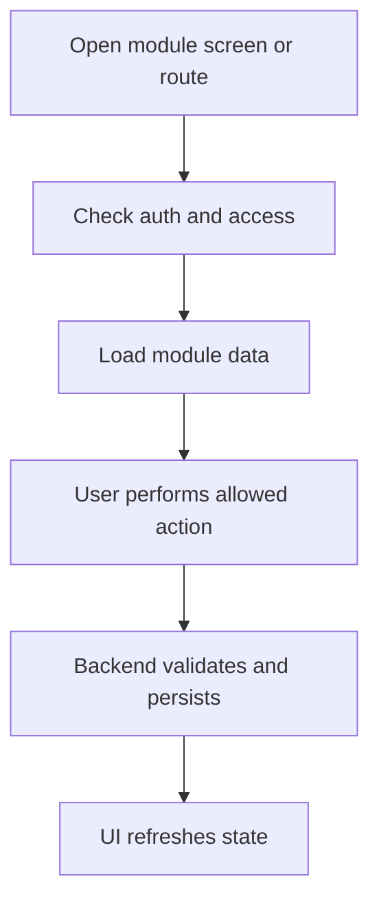

<!-- title: Inventory Module Overview -->
<!-- status: Active -->
<!-- system: SCS-TIX EPOS Release 1 -->
<!-- last_updated: 2026-06-08 -->

# Inventory Module Overview

## Purpose

Manage stock balances, stock movements, adjustments, stocktake, batches, expiry and alerts.

This file gives frontend and backend developers a shared Release 1 understanding
of the `Inventory` module.

## Release 1 Position

| Item | Decision |
|---|---|
| Module | `Inventory` |
| Primary users | Tenant Admin, Cashier |
| Frontend surfaces | Tenant Admin inventory screens; Cashier stock consumer. |
| Backend API group | `/api/v1/inventory` |

## Frontend Responsibilities

- Show only permitted screens, routes, tabs, buttons, and actions.
- Use feature entitlement and permission context.
- Use reusable UI components.
- Keep tenant-scoped state isolated.
- Clear stale tenant state when tenant changes.
- Display loading, empty, error, permission-denied, and feature-not-enabled states.
- Use typed API services and feature-level state.

## Backend Responsibilities

- Resolve tenant context server-side for tenant-owned actions.
- Enforce authentication, entitlement, permission, and business rules.
- Validate database constraints before mutation.
- Return safe error responses.
- Write audit logs for sensitive actions where required.
- Keep domain logic outside controllers.

## Main Database Tables

- `inventory_balances`
- `stock_movement_types`
- `stock_movements`
- `stock_adjustments`
- `stock_adjustment_lines`
- `stocktakes`
- `stocktake_lines`
- `product_batches`
- `inventory_batch_stocks`
- `inventory_alerts`

## High-Level Flow

## Core Rule

Stock movements are append-only; batches support expiry; quantity is positive and direction-controlled.

## Access Summary

| Control | Rule |
|---|---|
| Authentication | Required for protected actions |
| Tenant status | Required for tenant-owned operations |
| Feature entitlement | Required where module is feature-controlled |
| Permission | Required for protected actions |
| Tenant isolation | Required for tenant-owned data |
| Audit | Required for sensitive state changes |

## Dependencies

This module may depend on Auth, Tenant, Feature Entitlement, Role Permission,
and tenant context handling.

## Out of Scope

No supplier receiving, stock transfer or offline sync.

## Related Files

- [[02_Functional_Rules]]
- [[03_Technical_Contract]]
- [[../../01_RELEASE_SCOPE/Release_1_Scope]]
- [[../../02_ACCESS_CONTROL/Access_Control_Overview]]
