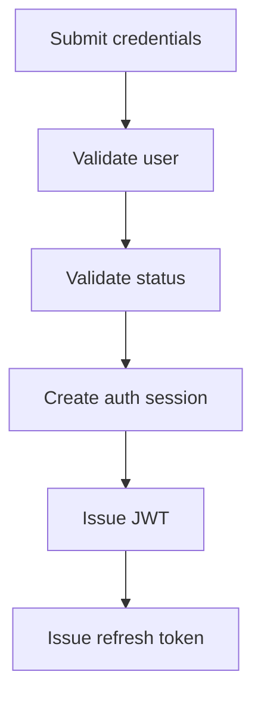

<!-- title: Authentication -->
<!-- status: Active -->
<!-- system: SCS-TIX EPOS Release 1 -->
<!-- last_updated: 2026-06-08 -->

# Authentication

## Purpose

This file defines Release 1 authentication rules for SCS-TIX EPOS.

Authentication confirms identity.

Authorization and POS context checks are handled separately.

## Identity Boundaries

| User Type | Identity Table |
|---|---|
| Platform Admin | `platform_users` |
| Tenant User | `users` |

Platform admins and tenant users must remain logically separated.

## Supported Authentication Flows

Release 1 includes:

- Platform admin login.
- Tenant user login.
- Tenant admin setup link.
- Staff invite acceptance.
- Password setup.
- Password reset.
- Refresh token rotation.
- Logout.
- Auth session validation.

## Token Strategy

| Token Type | Storage Rule |
|---|---|
| Access token | JWT, short-lived |
| Refresh token | Hash stored in `refresh_tokens` |
| Setup token | Hash stored in `user_setup_tokens` |
| Invite token | Hash stored in `user_invites` |
| Password reset token | Hash stored in `password_reset_tokens` |
| Payment link token | Hash stored in `subscription_payment_links` |
| Till activation code | Hash stored in `till_activation_codes` |

Raw tokens and raw activation codes must never be stored.

## Login Flow

## Tenant User Login Rule

Tenant user login must validate:

- User exists.
- Password is valid.
- User status allows login.
- Tenant exists.
- Tenant status allows operation.
- Auth session is created.
- Refresh token is stored as hash.

## Platform Admin Login Rule

Platform admin login must validate:

- Platform user exists.
- Password is valid.
- Platform user status allows login.
- Platform role/permission boundary applies after login.

Platform users do not automatically become tenant users.

## Password and PIN Rule

Passwords and POS PINs must be hashed.

Do not log passwords or PINs.

Do not return password or PIN state except safe setup indicators.

## Refresh Token Rule

Refresh tokens must be rotated.

Old refresh tokens must be marked used, revoked, or replaced.

A revoked or expired refresh token must not issue a new access token.

## Logout Rule

Logout must revoke the active auth session or token chain.

For POS, logout must respect till rules.

If a till session is open, the app must handle close-till flow before final logout
where required by business flow.

## Related Files

- [[Authorization_And_Permissions]]
- [[Multi_Tenant_Handling]]
- [[API_Standards]]
- [[../02_ACCESS_CONTROL/Access_Control_Overview]]
