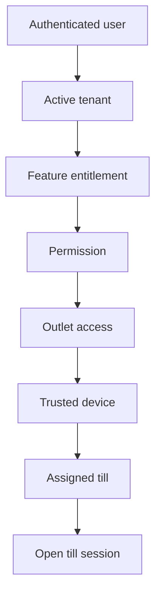

<!-- title: Authorization And Permissions -->
<!-- status: Active -->
<!-- system: SCS-TIX EPOS Release 1 -->
<!-- last_updated: 2026-06-18 -->

# Authorization And Permissions

## Purpose

This file defines Release 1 authorization rules.

Authentication confirms who the user is.

Authorization confirms what the user can do in the current tenant, outlet, device,
and till context.

## Authorization Model

SCS-TIX Release 1 uses:

- Feature entitlement.
- Feature flags.
- Role permissions.
- Role feature assignments.
- Outlet access.
- Trusted device checks.
- Assigned till checks.
- Open till-session checks.

## Required Checks

| Operation Type | Required Checks |
|---|---|
| Platform setup | Platform permission |
| Tenant admin operation | Tenant, entitlement, permission |
| Outlet operation | Tenant, entitlement, permission, outlet access |
| POS sale | Tenant, entitlement, permission, outlet, device, till session |
| Payment/refund | Tenant, entitlement, permission, till session, payment rules |
| Report | Tenant, entitlement, report permission |

## POS Access Chain

## Permission Code Strategy

Do not use one rigid permission enum.

Use module-wise permission constants in Domain module folders.

The database `permissions` table remains the source of truth for tenant
permissions.

The database `platform_permissions` table remains the source of truth for
platform permissions.

Catalog hierarchy and display metadata live on existing `platform_modules`,
`platform_features`, and permission tables. Release 1 exposes them through
permission catalog APIs; do not add parallel catalog tables. See
[[../02_ACCESS_CONTROL/Backend_Driven_Permission_Catalog]].

## Confirmed Permission Examples

| Permission | Usage |
|---|---|
| `platform.tenant.create` | Platform tenant creation |
| `catalog.product.create` | Product creation |
| `catalog.product.update` | Product update |
| `inventory.adjust` | Stock adjustment |
| `pos.sale.create` | POS sale creation |
| `pos.sale.discount.apply` | POS discount apply |
| `pos.refund.approve` | Refund approval |
| `loyalty.redeem` | Loyalty redemption |

## Feature and Permission Rule

Feature entitlement answers whether the tenant owns the feature.

Permission answers whether the user can perform the action.

Both must pass.

## Outlet Rule

Cashier and outlet-scoped users must be assigned to the outlet.

A user assigned to one outlet must not operate another outlet only by changing
frontend values.

## Device Rule

POS device must be trusted before protected POS actions.

Device must belong to the same tenant and outlet.

Where till is required, the device must be assigned to the selected till.

## Till Session Rule

Sale, payment, refund, exchange, cash movement, receipt, and close-till
operations require an open till session where the business flow requires till
control.

## Related Files

- [[Authentication]]
- [[Multi_Tenant_Handling]]
- [[../02_ACCESS_CONTROL/Backend_Driven_Permission_Catalog]]
- [[../02_ACCESS_CONTROL/Permission_Code_List]]
- [[../02_ACCESS_CONTROL/API_Authorization_Rules]]

## Platform Role Management Authorization 2026-06-23

Platform Admin role management requires platform JWT authentication plus platform permissions:

- `platform.roles.view`
- `platform.roles.create`
- `platform.roles.update`
- `platform.roles.permissions.view`
- `platform.roles.permissions.update`

System roles are protected from update and permission replacement to prevent accidental lockout. Permission replacement is a full-set update, not a patch.
