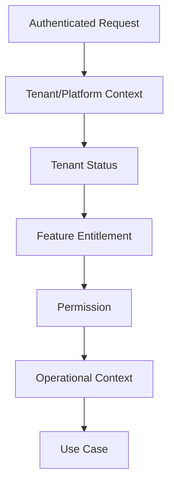

<!-- title: Authorization And Permissions -->
<!-- status: Active -->
<!-- system: TM-EPOS MVP -->
<!-- last_updated: 2026-06-29 -->

# Authorization And Permissions

## Purpose

This file defines backend authorization rules for TM-EPOS MVP.

Authorization must protect platform admin, tenant admin, POS, online store admin,
cart/checkout, orders, fulfilment, pickup, payments/refunds, offline sync,
notifications, integrations, and reports.

## Authorization Chain

## Core Rules

- Backend is final authority.
- Frontend hiding is not security.
- Do not hardcode role names.
- Roles are permission groups.
- Permission codes are stable action codes.
- Feature entitlement is checked before permission for module-level access.

## Platform Authorization

Platform endpoints require platform user, platform permission, and active
platform session.

Platform users must not bypass tenant permissions for tenant operations unless an
audited support operation exists.

## Tenant Authorization

Tenant endpoints require tenant user, active tenant, feature entitlement, and
permission.

Outlet-level actions require outlet assignment where applicable.

## POS Authorization

POS actions require POS entitlement, user permission, outlet access, trusted
device where required, selected till, and open till session for billing actions.

## Online Store And Checkout Authorization

Public storefront reads are tenant/channel scoped.
Checkout must validate tenant, channel, cart, customer/session, price, tax,
inventory, fulfilment method, and payment readiness.

Tenant admin storefront setup requires tenant permissions.

## Fulfilment And Pickup Authorization

Staff pickup and fulfilment actions require order/fulfilment/pickup permissions,
tenant isolation, outlet/pickup location access, and valid order status.

## Offline Sync Authorization

Offline sync requires approved offline client/device, tenant, outlet/device
context, feature entitlement, sync permission, idempotency, and payload validation.

## Related Files

- [[Access_Control_Overview]]
- [[API_Standards]]
- [[Offline_Operation_Architecture]]
