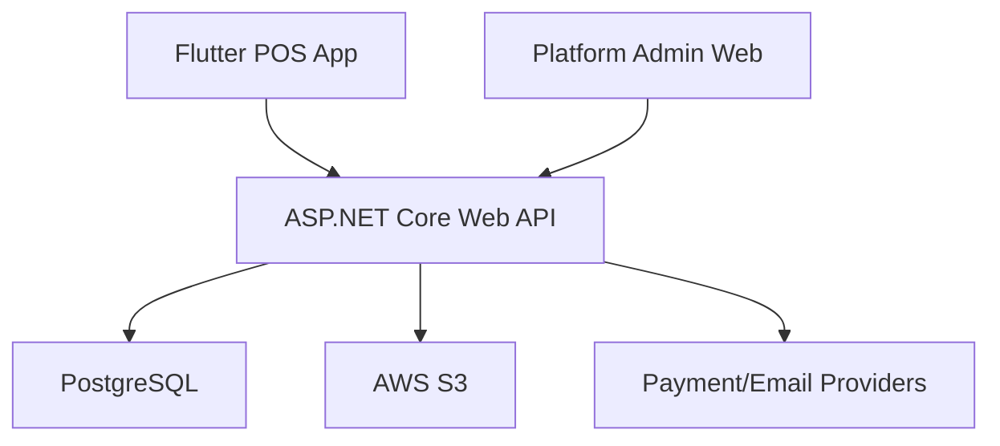

<!-- title: Backend Overview -->
<!-- status: Active -->
<!-- system: SCS-TIX EPOS Release 1 -->
<!-- last_updated: 2026-06-08 -->

# Backend Overview

## Purpose

This file defines the Release 1 backend architecture overview for SCS-TIX EPOS.

Release 1 backend is POS-first.

It supports Platform Admin, Tenant Admin inside the Flutter POS app, fixed POS,
portable POS, basic inventory, expiry discount, basic loyalty, return/refund,
exchange, reports, and hardware-ready checkout.

## Backend Position

| Area | Decision |
|---|---|
| Backend framework | .NET 10 / ASP.NET Core Web API |
| Language | C# |
| API style | REST API |
| Architecture | Clean Architecture with Service + Repository Pattern |
| Database | PostgreSQL |
| ORM | Entity Framework Core |
| Storage | AWS S3 |
| Hosting | AWS EC2 |
| CI/CD | GitHub Actions |
| Cache dependency | No Redis for Release 1 |

## Release 1 Backend Responsibility

The backend must:

- Authenticate platform admins and tenant users.
- Resolve tenant context securely.
- Enforce tenant isolation.
- Enforce feature entitlement and permissions.
- Validate outlet, device, till, and till session context for POS operations.
- Store sales, payments, receipts, returns, refunds, exchanges, and cash records.
- Support product, variant, inventory, batch, expiry, discount, loyalty, and reports.
- Store hardware configuration, test logs, and payment device references.
- Write audit logs for sensitive actions.

## Release 1 Backend Exclusions

Do not implement Release 1 backend modules for:

- E-commerce.
- Offline sync.
- Supplier management.
- Stock transfer between outlets.
- Delivery.
- Self-service kiosk.
- Coupons/promotions engine.
- AI onboarding.
- AI analytics.
- AI accounting.
- Full accounting.

## Application Clients

| Client | Backend Integration |
|---|---|
| Platform Admin Web | Tenant, subscription, entitlement, billing, activation APIs |
| Flutter POS App | Tenant admin, cashier, till, sales, payment, reports APIs |
| Portable POS Flow | Same POS APIs with portable channel and device rules |

## Backend Access Boundary

Protected POS operations must validate:

1. JWT and active auth session.
2. Active tenant and subscription status.
3. Feature entitlement.
4. User permission.
5. Outlet access.
6. Trusted POS device.
7. Assigned till where required.
8. Open till session where required.

## High-Level Deployment View

## Core Backend Modules

| Module | Release 1 Purpose |
|---|---|
| Auth | Login, setup, refresh, logout |
| Tenant | Tenant profile and status |
| Subscription | Plan, invoice, payment link |
| Entitlement | Feature assignment and checks |
| Role/Permission | Tenant role and permission control |
| Outlet/Till/Device | POS operating context |
| Catalog/Inventory | Product, stock, expiry |
| Sales/Payment | Checkout, payment, receipt |
| Return/Refund/Exchange | Post-sale operations |
| Loyalty | Basic earn and redeem |
| Reports | Summaries and exports |
| Hardware | Configuration and test records |

## Related Files

- [[Clean_Architecture_Layers]]
- [[Module_Based_Folder_Structure]]
- [[Authentication]]
- [[Authorization_And_Permissions]]
- [[Multi_Tenant_Handling]]
- [[../01_RELEASE_SCOPE/Release_1_Scope]]
