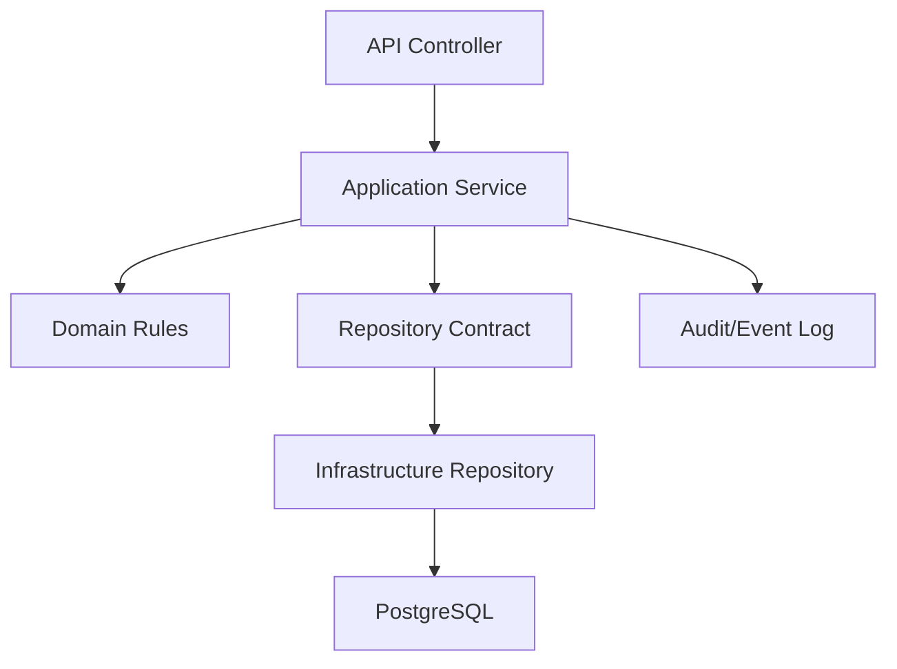

<!-- title: Backend Overview -->
<!-- status: Active -->
<!-- system: TM-EPOS MVP -->
<!-- last_updated: 2026-06-29 -->

# Backend Overview

## Purpose

This file defines the backend architecture direction for TM-EPOS MVP.

The backend supports mobile POS, desktop EPOS, online store, click and collect,
offline operation, unified order management, payment/refund, reporting, hardware,
notifications, integrations, and platform/tenant administration.

## Core Backend Decision

TM-EPOS backend uses Clean Architecture with module-based folders.

Controllers are thin.
Application services own use-case orchestration.
Domain owns business rules and contracts.
Infrastructure owns EF Core, PostgreSQL, external providers, and device/sync
adapters.

## MVP Backend Scope

| Area | Backend Responsibility |
|---|---|
| Platform Admin | Tenants, plans, entitlements, billing setup, platform users |
| Tenant Admin | Business setup, users, roles, products, inventory, reports |
| POS | Sale, till, device, cart/basket, receipt, cash movement |
| Online Store | Storefront catalogue, cart, checkout, customer order flow |
| Click & Collect | Pickup method, pickup slot/capacity, fulfilment workflow |
| Orders | Unified in-store and online sales order lifecycle |
| Payments/Refunds | Payment records, idempotency, refund allocation |
| Returns/Exchange | Return, inspection, exchange and settlement rules |
| Offline Operation | Offline clients, number blocks, sync batches, conflicts |
| Virtual Cache | Reference/config caching and safe invalidation |
| Notification | Notification event, template, message, delivery tracking |
| Integration | Provider setup, credentials, webhooks, request logs |

## Non-Negotiable Rules

- Backend is final authority for business truth.
- Frontend cache is not final authority.
- Offline records must be synced and revalidated.
- Tenant isolation must be enforced on every tenant-owned query.
- Feature entitlement and permission checks are mandatory.
- Payment, refund, exchange, sync, and checkout operations require idempotency.
- Do not introduce CQRS, MediatR, API Gateway, or Redis unless approved.
- Do not store raw tokens, passwords, card data, or provider secrets.

## Backend Flow

## Backend Final Authority

Backend validates final sale total, final inventory quantity, card/QR payment,
refund, exchange, loyalty/store credit, till final close, tenant access,
permission, idempotency, and audit.

## Related Files

- [[Clean_Architecture_Layers]]
- [[Module_Based_Folder_Structure]]
- [[Virtual_Caching_Architecture]]
- [[Offline_Operation_Architecture]]
