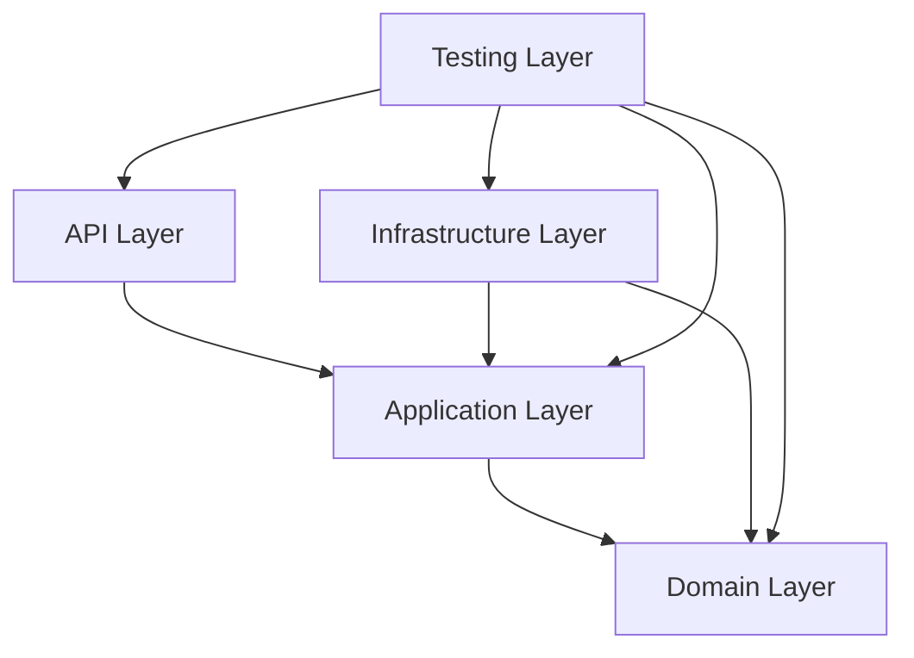

<!-- title: Clean Architecture Layers -->
<!-- status: Active -->
<!-- system: SCS-TIX EPOS Release 1 -->
<!-- last_updated: 2026-06-08 -->

# Clean Architecture Layers

## Purpose

This file explains the backend Clean Architecture layers for humans and AI
development assistants.

The goal is to keep business rules independent from ASP.NET Core, EF Core, AWS,
payment SDKs, and infrastructure tools.

## Dependency Rule

Domain must not reference API or Infrastructure.

Application must not depend on EF Core DbContext directly.

Infrastructure implements Application interfaces.

## API Layer

The API layer receives HTTP requests and returns HTTP responses.

It contains controllers, middleware, filters, authentication setup, authorization
attributes, API versioning, request/response formatting, and `Program.cs`.

Controllers must be thin.

They must not contain checkout rules, permission logic, tenant isolation logic, or
database transaction logic.

## Application Layer

The Application layer coordinates use cases.

It contains services, DTOs, validators, repository interfaces, access decision
services, permission checkers, feature entitlement checkers, and transaction
workflow orchestration.

This layer decides the use-case workflow without EF Core implementation details.

## Unit Of Work Rule

Application services may depend on an `IUnitOfWork` abstraction when a use case
needs to commit changes across multiple repositories.

Application must not depend on EF Core `DbContext` directly.

Infrastructure implements Unit of Work using `AppDbContext`.

EF Core `DbContext` remains the concrete persistence unit of work.

## Domain Layer

The Domain layer contains business concepts independent from technical
frameworks.

It contains entities, value objects, domain rules, module-wise permission code
constants, and business invariants.

Database status/type fields such as sale status, payment status, and till session
status must remain string properties in Domain models. Allowed values are enforced
through Application validation and Infrastructure EF Core database CHECK
constraints, not C# enum classes.

## Infrastructure Layer

The Infrastructure layer implements technical details.

It contains EF Core DbContext, repository implementations, entity configuration,
migrations, seed data, S3 service, JWT service, password hashing service, payment
provider adapters, and email provider adapters.

Infrastructure can depend on Application interfaces and Domain models.

## Testing Layer

The Testing layer verifies behavior.

It contains unit tests, integration tests, API tests, repository tests,
permission tests, tenant isolation tests, and POS flow tests.

Tests must not change production code to make tests pass.

## Where Rules Belong

| Rule Type | Correct Layer |
|---|---|
| HTTP route/status code | API |
| DTO validation | Application |
| Checkout workflow | Application |
| Stable business state | Domain |
| EF table mapping | Infrastructure |
| Tenant query filter | Infrastructure plus Application checks |
| Permission decision | Application |
| Audit persistence | Infrastructure |
| Test data builder | Testing |

## AI Development Rule

When generating code, AI must first identify the target layer.

Do not place `.cs` files randomly.

For every feature, generate files under the correct module folder inside each
layer.

## Related Files

- [[Module_Based_Folder_Structure]]
- [[Backend_Coding_Principles]]
- [[DTO_And_Mapping_Rules]]
- [[Authorization_And_Permissions]]
