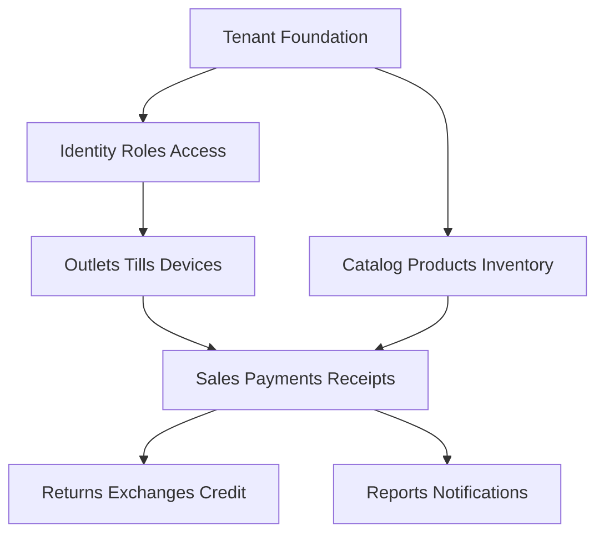

<!-- title: Database Overview -->
<!-- status: Active -->
<!-- system: SCS-TIX EPOS Release 1 -->
<!-- last_updated: 2026-06-08 -->

# Database Overview

## Purpose

This file explains the grouped database knowledge structure for SCS-TIX EPOS
Release 1.

The current database source is the updated `Release1_Database_Design_V3.docx`.

The `Tables/` folder is now grouped into smaller module files, with multiple
related tables in one file.

## Database Summary

| Item | Count |
|---|---:|
| Grouped module files | 28 |
| Table entities covered | 121 |
| Attributes covered | 1286 |
| Original database modules | 9 |

## Grouped Table Files

| File Key | Grouped Module | Tables |
|---|---|---|
| 01_Platform_Identity | Platform Identity | platform_users, platform_roles, platform_permissions, platform_role_permissions, platform_user_roles |
| 02_Platform_Settings_Audit | Platform Settings Audit | platform_settings, document_sequences, audit_logs |
| 03_Tenant_Foundation | Tenant Foundation | tenants, tenant_profiles, tenant_addresses, tenant_domains, tenant_storefront_settings |
| 04_Outlet_And_Tenant_Settings | Outlet And Tenant Settings | outlets, outlet_addresses, tenant_settings |
| 05_Subscription_Plans_Feature_Catalog | Subscription Plans Feature Catalog | platform_modules, platform_features, subscription_plans, subscription_plan_features |
| 06_Subscription_Billing_Lifecycle | Subscription Billing Lifecycle | tenant_subscriptions, tenant_subscription_history, subscription_invoices, subscription_invoice_lines, subscription_payment_links, subscription_payment_transactions |
| 07_Tenant_Feature_Access | Tenant Feature Access | tenant_feature_entitlements, feature_flags, role_feature_assignments |
| 08_Tenant_Identity_Roles | Tenant Identity Roles | users, roles, permissions, role_permissions, tenant_user_roles, outlet_user_roles |
| 09_User_Tokens_And_Sessions | User Tokens And Sessions | user_invites, user_setup_tokens, password_reset_tokens, auth_sessions, refresh_tokens |
| 10_Till_Device_Session | Till Device Session | tills, pos_devices, till_activation_codes, device_pairing_requests, till_sessions |
| 11_Hardware_Configuration | Hardware Configuration | hardware_profiles, hardware_devices, hardware_test_logs |
| 12_Cash_Drawer_Control | Cash Drawer Control | cash_movement_types, cash_movements, cash_count_denominations |
| 13_Catalog_Tax_Return_Policy | Catalog Tax Return Policy | categories, brands, tax_classes, tax_rates, tax_class_rates, return_policies |
| 14_Product_Core | Product Core | products, product_variants, product_attributes, attribute_values, variant_attribute_values |
| 15_Product_Media_Pricing_Import | Product Media Pricing Import | product_images, price_lists, price_list_items, product_import_batches, product_import_rows |
| 16_Inventory_Balance_Movement | Inventory Balance Movement | inventory_balances, stock_movement_types, stock_movements |
| 17_Inventory_Adjustment_Stocktake | Inventory Adjustment Stocktake | stock_adjustments, stock_adjustment_lines, stocktakes, stocktake_lines |
| 18_Inventory_Batches_Alerts | Inventory Batches Alerts | product_batches, inventory_batch_stocks, inventory_alerts |
| 19_Sales_Core | Sales Core | sales, sale_lines |
| 20_Payment_Core | Payment Core | payment_method_types, tenant_payment_methods, payment_provider_configs, payments, payment_transactions, sale_payment_allocations, payment_webhook_events |
| 21_Receipts_And_Refunds | Receipts And Refunds | refunds, receipt_templates, receipts, receipt_print_logs |
| 22_Discount_Core | Discount Core | discount_types, discount_scopes, discount_policies, product_discounts, pos_discount_applications |
| 23_Expiry_Discount | Expiry Discount | expiry_discount_rules, expiry_discount_applications |
| 24_Customer_Loyalty | Customer Loyalty | customers, loyalty_programs, loyalty_earning_rules, loyalty_redemption_rules, customer_memberships, loyalty_transactions |
| 25_Returns | Returns | return_reason_codes, returns, return_lines, return_refund_allocations |
| 26_Exchanges_Customer_Credit | Exchanges Customer Credit | exchanges, exchange_lines, exchange_payment_allocations, exchange_refund_allocations, customer_credits, customer_credit_transactions |
| 27_Reports_Exports | Reports Exports | daily_sales_summaries, daily_payment_summaries, daily_inventory_summaries, daily_discount_return_summaries, report_export_jobs |
| 28_Notifications | Notifications | notification_templates, notifications, notification_delivery_logs |

## Module Map

## Core Design Rules

- Every tenant-owned table has `tenant_id`.
- Platform-owned catalogs do not contain `tenant_id` unless tenant-specific.
- Tenant data uses tenant-aware unique indexes.
- `document_sequences` generates business document numbers.
- Ledger tables are append-only.
- Setup links, invite links, payment links, refresh tokens, and activation codes
  store hashes only.
- Hardware uses `hardware_profiles` and `hardware_devices`.
- Customer credit is separate from refunds.

## Scope Warning

`tenant_storefront_settings` and e-commerce setup references are future/deferred
unless the official Release 1 scope changes.

## Related Files

- [[Tenant_Id_Rules]]
- [[Table_Naming_Standards]]
- [[Migration_Rules]]
- [[../01_RELEASE_SCOPE/Release_1_Scope]]
- [[../05_BACKEND_ARCHITECTURE/Multi_Tenant_Handling]]
