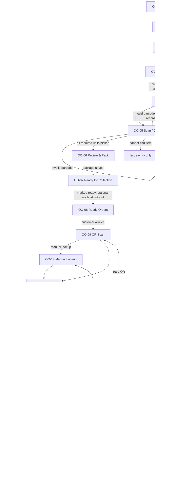

# Online Order Prototype Flow

| Field | Value |
|---|---|
| Journey | `POS-UJ-036` Online Order Fulfilment / Click & Collect |
| Layer | Approved prototype flow and production journey mapping |
| Status | **OO-01 APPROVED TARGET CANONICALIZED; CHUNK 2/3 IMPLEMENTATION PENDING** |
| Updated | 2026-08-27 |
| Authority | Journey and module rules outrank this prototype specification |

## Authority chain

1. [[../../00_START_HERE/Current_Source_Of_Truth]]
2. [[../../03_USER_JOURNEYS/Cashier/POS-UJ-036_Online_Order_Fulfilment_Collection]]
3. [[../../04_MODULE_KNOWLEDGE/23_Fulfilment_Pickup_ClickCollect/02_Functional_Rules]] and [[../../04_MODULE_KNOWLEDGE/23_Fulfilment_Pickup_ClickCollect/03_Technical_Contract]]
4. [[../../02_ACCESS_CONTROL/Permission_Code_List]], [[../../05_BACKEND_ARCHITECTURE/API_ENDPOINTS]], and [[../../06_DATABASE_KNOWLEDGE/Tables/23_Fulfilment_And_Pickup_UPDATED]]
5. [[../../08_FLUTTER_POS_KNOWLEDGE/Flutter_Order_ClickCollect_Fulfilment]]
6. This document and its sibling visual/component/mapping specifications.

The HTML prototype is a visual validation artefact. It is not a business-rule, authorization, API, or persistence authority, and its sample values are never production inputs.

## Screen register

| ID | Screen/state | Primary purpose |
|---|---|---|
| OO-01 | Online Order Queue | Search and review eligible outlet orders; open detail without mutation. |
| OO-02 | Online Order Detail | Review customer, collection, payment and item facts. |
| OO-03 | Start Preparation | Confirm start and assign operational ownership. |
| OO-04 | Picking Workspace | Display progress, sequence, locations and remaining units. |
| OO-05 | Scan / Confirm Pick | Validate barcode or permitted manual entry per line. |
| OO-06 | Review & Pack | Reconcile picked quantities and capture packing data. |
| OO-07 | Ready for Collection | Mark ready, stage package, notify/print where authorized. |
| OO-08 | Ready Orders | Locate an arriving customer's ready order. |
| OO-09 | QR Collection Scan | Capture QR or choose manual lookup. |
| OO-10 | Collection Validation Success | Show server-authoritative validation and next actions. |
| OO-11 | Collection Validation Failure | Show reason and safe recovery route. |
| OO-12 | Verify & Handover | Retrieve package, verify contents and confirm handover. |
| OO-13 | Collection Complete | Confirm pickup collected and order completion outcome. |
| OO-14 | Manual Collection Lookup | Find by approved identifiers, then rejoin server validation. |
| OO-15A | Cash Due | Explain remaining amount and begin cash tender. |
| OO-15B | Cash Tender | Enter received amount and submit once. |
| OO-15C | Cash Success | Show paid/change facts and unlock handover. |
| OO-15D | Cash Failure | Preserve safe input, explain failure and permit explicit retry. |

All IDs are sub-states of `POS-UJ-036`, not independent journeys.

## Canonical flow

## Branch rules

### OO-01 approved target

- Reuse the existing POS header and bottom navigation unchanged.
- Present `Online Orders` / `Click & Collect orders from your online store`, one wide server-side debounced search, six authoritative summary cards and responsive rounded order cards.
- The visible target contains no Filters action, status/type/payment/slot controls, status tabs, Orders queue heading, sort control, table header, Open/Start button or pagination footer. Internal bounded API query capabilities remain valid.
- The card chevron is the only order-level action and leads to OO-02 without mutating list or fulfilment state.
- Loading, refreshing, empty, empty-search, retry/error, denied, not-entitled and network/server failure are distinct states.
- The orange priority star is a visual requirement without verified business authority; it adds no priority API/persistence semantics.

- OO-05 invalid barcode stays on OO-05, does not increment picked quantity, and clearly identifies the mismatch.
- “Can’t Find Item” opens the issue-entry path only; it never silently shorts, substitutes, cancels, or changes inventory.
- OO-11 must distinguish `INVALID_QR`, `NOT_READY`, `ALREADY_COLLECTED`, `EXPIRED`, `CANCELLED`, and `WRONG_OUTLET`; recovery is QR retry or OO-14 where allowed.
- OO-14 always rejoins the same server validation used by OO-09. A local match is not collection authorization.
- Handover is impossible from OO-15D. Only OO-15C can rejoin OO-12.
- Backend time is authoritative for expiry, delay and collection windows. Device time is display assistance only.
- Outlet, tenant, entitlement and resource scope must be revalidated by the server on every command.

## State transition contract

| Current UI | Action | Backend command | Success next | Failure state | Permission |
|---|---|---|---|---|---|
| OO-01 | Tap card chevron | Read detail | OO-02 | Inline error / retry | `commerce.online_order.orders.access`, `commerce.online_order.orders.view` |
| OO-02 | Start preparation | Start fulfilment | OO-03 then OO-04 | Remain OO-02 | `commerce.online_order.fulfilment.start` |
| OO-03 | Confirm assignment | Start/assign | OO-04 | Validation message | `commerce.online_order.fulfilment.start` |
| OO-04 | Open line | Read picking state | OO-05 | Inline error | `commerce.online_order.picking.view` |
| OO-05 | Scan barcode | Confirm scanned pick | OO-04 or OO-06 | Remain OO-05 | `commerce.online_order.picking.pick`, `commerce.online_order.picking.scan` |
| OO-05 | Manual confirm | Confirm manual pick | OO-04 or OO-06 | Remain OO-05 | `commerce.online_order.picking.pick`, `commerce.online_order.picking.manual_entry` |
| OO-05 | Can’t Find Item | Report issue | OO-04 issue state | Remain OO-05 | `commerce.online_order.picking.report_issue` |
| OO-06 | Save package | Pack fulfilment | OO-07 | Remain OO-06 | `commerce.online_order.packing.pack` |
| OO-07 | Mark ready | Mark ready | OO-08 | Remain OO-07 | `commerce.online_order.collection.mark_ready` |
| OO-07 | Notify customer | Send notification | OO-07 confirmation | Non-blocking error | `commerce.online_order.collection.notify_customer` |
| OO-08 | Begin collection | Read ready order | OO-09 | Inline error | `commerce.online_order.collection.view_ready` |
| OO-09 | Submit QR | Validate pickup credential | OO-10 or OO-11 | OO-11 | `commerce.online_order.collection.scan_qr`, `commerce.online_order.collection.validate_qr` |
| OO-14 | Manual lookup | Lookup then validate | OO-10 or OO-11 | OO-14 error | `commerce.online_order.collection.manual_lookup`, `commerce.online_order.collection.validate_qr` |
| OO-10 | Continue | Read payment/contents | OO-12 or OO-15A | Inline error | `commerce.online_order.collection.verify_items` |
| OO-15B | Confirm cash | Accept cash payment | OO-15C | OO-15D | `commerce.online_order.payment.accept_cash` |
| OO-15D | Retry cash | Explicit payment retry | OO-15C or OO-15D | OO-15D | `commerce.online_order.payment.accept_cash`, `commerce.online_order.payment.retry` |
| OO-12 | Confirm items | Verify handover checklist | OO-12 ready | Remain OO-12 | `commerce.online_order.collection.verify_items` |
| OO-12 | Handover | Collect/handover | OO-13 | Remain OO-12 | `commerce.online_order.collection.handover`, `commerce.online_order.collection.collect` |

Effective authorization is authenticated user + `click_collect` entitlement + permission + tenant + outlet + resource scope. Cash additionally requires trusted device/terminal/till and an open till session.

## Prototype data policy

Names, order numbers, amounts, times, SKUs, barcodes and QR values in a prototype must be labelled **DISPLAY-ONLY EXAMPLE**. They may not be copied into Flutter, backend seeds, API contracts or tests as production truth.

## Exit criterion

Flow coverage, recovery routes, authorization points, API ownership and persistence ownership are specified. The approved OO-01 target is documentation-complete only; backend is pending Chunk 2, Flutter is pending Chunk 3, and E2E is pending. Later states remain governed by this flow and their own implementation evidence.
