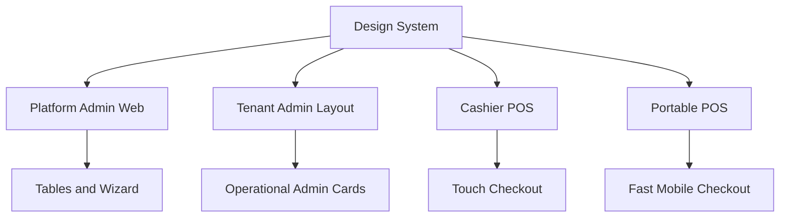

<!-- title: Design System -->
<!-- status: Active -->
<!-- system: SCS-TIX EPOS Release 1 -->
<!-- last_updated: 2026-06-08 -->

# Design System

## Purpose

This file defines the visual system for SCS-TIX EPOS Release 1 UI work.

It applies to Platform Admin Web, Tenant Admin inside Flutter POS, Fixed POS,
and Portable POS.

## Source Basis

The design direction comes from uploaded SCS-TIX UI screens, POS flow screens,
tenant admin screens, platform admin screens, and confirmed project decisions.

This is not a generic POS theme.

## Brand Position

| Item | Rule |
|---|---|
| Product | SCS-TIX EPOS |
| Business context | Event, stadium, venue, merchandise, retail POS |
| UI personality | Enterprise, premium, practical, touch-friendly |
| Main app feel | Dark blue and white POS/admin layout |
| Presentation feel | Clean investor-ready SCS-TIX screens |

## Color System

| Usage | Color Direction |
|---|---|
| Main dark surface | Deep navy / dark blue |
| Primary action | Blue for app actions, golden yellow where previous premium kiosk style applies |
| Content surface | White or soft ivory card surface |
| Primary text | Charcoal or deep navy |
| Secondary text | Muted gray-blue |
| Success | Use status styling, not decorative color overload |
| Warning | Use clear warning state for stock, expiry, payment, till variance |
| Error | Strong red/error state with text explanation |

Do not create a colorful consumer app style.

## Layout Principles

- Use large touch targets for POS.
- Use clear card surfaces.
- Keep top-level navigation stable.
- Make permission-hidden actions visually absent, not just disabled.
- Keep table/list screens readable for enterprise use.
- Prioritize speed for cashier flows.
- Avoid decorative UI that slows checkout.

## Typography

| Area | Rule |
|---|---|
| Screen title | Clear, large, short |
| POS action button | Large and direct |
| Table header | Compact but readable |
| Warning/error text | Human-readable and action-focused |
| Amounts | Use clear numeric alignment |
| Product name | Prioritize scannability over decoration |

## Component Rules

| Component | Release 1 Usage |
|---|---|
| Sidebar | Role/permission driven navigation |
| Top bar | Outlet, till, user, device context where relevant |
| Cards | Dashboard metrics and setup steps |
| Tables | Admin lists, product list, reports |
| Modals | Confirmation, discount, refund, manager approval |
| Toasts | Non-critical feedback |
| Blocking panels | Permission denied, tenant suspended, device not trusted |

## Flutter POS Primary Action Buttons

The Flutter POS canonical primary action is
`lib/shared/widgets/pos_action_buttons.dart`.

| Token | Value |
|---|---|
| Gradient start | `#0E2748` (`TenantAdminColors.navySoft`) |
| Gradient end | `#3F2BFF` (`TenantAdminColors.primary`) |
| Direction | Horizontal, center-left to center-right |
| Foreground | White |
| Radius | 12 logical pixels |
| Standard height | 56 logical pixels |
| Compact height | 48 logical pixels |
| Typography | Weight 800, single-line ellipsis |

- Use `PosPrimaryActionButton` for the main forward/confirm action on screens,
  dialogs, sheets, and recovery states.
- Disabled actions use the neutral border background and muted foreground; the
  active gradient must not remain visible.
- Loading blocks duplicate taps and keeps the button dimensions stable.
- Desktop hover, keyboard focus, pressed feedback, semantics labels, leading
  and trailing icons, compact sizing, and full-width sizing are owned by the
  shared component.
- Back, Cancel, and Close remain outlined/neutral. Delete, Void, Reject, and
  other destructive actions retain semantic red styling.
- Feature code must not duplicate the navy-to-violet primary gradient.

## Form Rules

Forms must show:

- Required fields.
- Field-level validation.
- Server validation errors.
- Clear save/cancel actions.
- Disabled state during submission.
- Success state after completion.

## Data Display Rules

Use the same business terms across UI and Second Brain.

Examples:

| UI Label | Meaning |
|---|---|
| Tenant | Customer business account |
| Outlet | Physical store/stock location |
| Till | Cash register/session device point |
| POS Device | Trusted tablet/mobile/admin browser |
| Feature Entitlement | Tenant-enabled feature |
| Permission | User action right |

## Mermaid UI Relationship

## Out of Scope

- E-commerce storefront UI is not active Release 1.
- Self-service kiosk UI is not active Release 1.
- Delivery UI is not active Release 1.
- AI analytics UI is not active Release 1.

## Related Files

- [[POS_App_UI_Rules]]
- [[Tenant_Admin_UI_Rules]]
- [[Platform_Admin_UI_Rules]]
- [[Permission_Based_UI_Rules]]
- [[Empty_Error_Loading_States]]
- [[../01_RELEASE_SCOPE/Release_1_Scope]]
