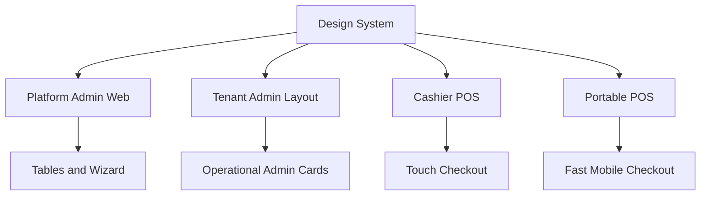

<!-- title: Design System -->
<!-- status: Active -->
<!-- system: OneVerz POS MVP -->
<!-- last_updated: 2026-08-13 -->

# Design System

## Purpose

This file defines the visual system for OneVerz POS MVP UI work.

It applies to Platform Admin Web, Tenant Admin inside Flutter POS, Fixed POS,
and Portable POS.

## Source Basis

The design direction comes from approved OneVerz POS UI screens, POS flow screens,
tenant admin screens, platform admin screens, and confirmed project decisions.

This is not a generic POS theme.

## Brand Position

| Item | Rule |
|---|---|
| Product | OneVerz POS |
| Business context | Event, stadium, venue, merchandise, retail POS |
| UI personality | Enterprise, premium, practical, touch-friendly |
| Main app feel | Dark blue and white POS/admin layout |
| Presentation feel | Clean production-ready OneVerz POS screens |

## Color System

| Usage | Color Direction |
|---|---|
| Main dark surface | Deep navy / dark blue |
| Primary action | OneVerz orange; feature-specific semantic/status colours may be used only where their approved screen contract requires them |
| Content surface | White or soft ivory card surface |
| Primary text | Charcoal or deep navy |
| Secondary text | Muted gray-blue |
| Success | Use status styling, not decorative color overload |
| Warning | Use clear warning state for stock, expiry, payment, till variance |
| Error | Strong red/error state with text explanation |

**Open Till (2026-08-11):** The approved Open Till primary action / accent colour
is OneVerz **orange**. Do not treat blue or purple/violet as the approved Open
Till primary. Reuse existing orange theme tokens (for example
`posHomeAccentOrange` / `posHomeOrangeStart` / `posHomeOrangeEnd`). Screen
contract:
[[../08_FLUTTER_POS_KNOWLEDGE/Flutter_Open_Till_Screen_Implementation_Specification]].

Do not create a colorful consumer app style.

Tenant-configurable POS Login Branding does not change the product primary
action colour or enable arbitrary application theming. The Sign In action stays
OneVerz orange even when the tenant configures login background media or colour.

Login and Device Activation use one shared POS branding panel. Activation uses
the same heading, subtitle, field, radius and orange primary-action visual
language as Login. Feature widgets must not define direct colour literals or
duplicate orange/theme constants; use canonical theme/design tokens and shared
input/button components. A missing semantic colour is added once to the
canonical theme token file.

## Layout Principles

- Use large touch targets for POS.
- Use clear card surfaces.
- Keep top-level navigation stable.
- Make permission-hidden actions visually absent, not just disabled.
- Keep table/list screens readable for enterprise use.
- Prioritize speed for cashier flows.
- Avoid decorative UI that slows checkout.

## Typography

| Area | Rule |
|---|---|
| Screen title | Clear, large, short |
| POS action button | Large and direct |
| Table header | Compact but readable |
| Warning/error text | Human-readable and action-focused |
| Amounts | Use clear numeric alignment |
| Product name | Prioritize scannability over decoration |

## Component Rules

| Component | Release 1 Usage |
|---|---|
| Sidebar | Role/permission driven navigation |
| Top bar | Outlet, till, user, device context where relevant |
| Cards | Dashboard metrics and setup steps |
| Tables | Admin lists, product list, reports |
| Modals | Confirmation, discount, refund, manager approval |
| Toasts | Non-critical feedback |
| Blocking panels | Permission denied, tenant suspended, device not trusted |

Current cashier Discount does not use manager approval. Its modal is
tablet-first adaptive, stacks on narrow widths, respects keyboard/viewInsets and
safe areas, and keeps amounts/errors/actions untruncated and reachable. See
[[../13_DECISIONS_AND_CHANGES/POS_CASHIER_DISCOUNT_CURRENT_RELEASE_DECISION_2026-08-09]].

## Flutter POS Primary Action Buttons

The Flutter POS canonical primary action is
`lib/shared/widgets/pos_action_buttons.dart`.

| Token | Value |
|---|---|
| Gradient start | `#0E2748` (`TenantAdminColors.navySoft`) |
| Gradient end | `#3F2BFF` (`TenantAdminColors.primary`) |
| Direction | Horizontal, center-left to center-right |
| Foreground | White |
| Radius | 12 logical pixels |
| Standard height | 56 logical pixels |
| Compact height | 48 logical pixels |
| Typography | Weight 800, single-line ellipsis |

- Use `PosPrimaryActionButton` for the main forward/confirm action on screens,
  dialogs, sheets, and recovery states.
- Disabled actions use the neutral border background and muted foreground; the
  active gradient must not remain visible.
- Loading blocks duplicate taps and keeps the button dimensions stable.
- Desktop hover, keyboard focus, pressed feedback, semantics labels, leading
  and trailing icons, compact sizing, and full-width sizing are owned by the
  shared component.
- Back, Cancel, and Close remain outlined/neutral. Delete, Void, Reject, and
  other destructive actions retain semantic red styling.
- Feature code must not duplicate the navy-to-violet primary gradient.

**Open Till exception to violet shared CTA:** Open Till’s approved primary is
**orange**, not the navy→violet `PosPrimaryActionButton` gradient. Prefer
shared/orange tokenized CTA styling for that screen; do not introduce blue or
purple Open Till primary actions.

**Cashier POS Cash Drawer / cash-control exception (2026-08-13):** Cash Drawer
and related Cash In / Cash Out·Drop / Close Till Cashier surfaces use the
approved Cashier POS visual direction:

| Purpose | Hex (docs only) | Shared token — never hard-code hex in feature widgets |
|---|---|---|
| Primary orange | `#FF6A00` | `TenantAdminColors.posHomeAccentOrange` |
| Shell / workspace black | `#000000` / `#030303` | `TenantAdminColors.posHomeDarkBackground` / `background` |
| Success / error / info | semantic | `TenantAdminColors.success`, `danger`, and existing info tokens |

White content surface; semantic green/red/(info)blue for movement styling.
Touch-friendly enterprise layout. **Do not** globally overwrite Tenant Admin or
Platform Admin themes. Feature code must not use direct `Color(0x...)`, `#hex`,
or a feature-local `CashDrawerColors` file. Canonical:
[[../08_FLUTTER_POS_KNOWLEDGE/Flutter_Cash_Drawer_Management_Implementation_Specification]].

## Form Rules

Forms must show:

- Required fields.
- Field-level validation.
- Server validation errors.
- Clear save/cancel actions.
- Disabled state during submission.
- Success state after completion.

## Data Display Rules

Use the same business terms across UI and Second Brain.

Examples:

| UI Label | Meaning |
|---|---|
| Tenant | Customer business account |
| Outlet | Physical store/stock location |
| Till | Cash register/session device point |
| POS Device | Trusted tablet/mobile/admin browser |
| Feature Entitlement | Tenant-enabled feature |
| Permission | User action right |

## Mermaid UI Relationship

```mermaid
flowchart TD
    A[Design System] --> B[Platform Admin Web]
    A --> C[Tenant Admin Layout]
    A --> D[Cashier POS]
    A --> E[Portable POS]
    B --> F[Tables and Wizard]
    C --> G[Operational Admin Cards]
    D --> H[Touch Checkout]
    E --> I[Fast Mobile Checkout]
```

## Out of Scope

- Online Store UI belongs to its browser surface and separate design contract.
- Self-service kiosk UI is not active Release 1.
- Delivery UI is not active Release 1.
- AI analytics UI is not active Release 1.

## Related Files

- [[POS_App_UI_Rules]]
- [[Tenant_Admin_UI_Rules]]
- [[Platform_Admin_UI_Rules]]
- [[Permission_Based_UI_Rules]]
- [[Empty_Error_Loading_States]]
- [[../01_RELEASE_SCOPE/Release_1_Scope]]

## OneVerz Tenant Admin sidebar exception (2026-07-29)

For the **Tenant Admin shared sidebar**, the final approved visual is **white / very light** with light-purple active states — not a dark-blue full sidebar.

"Dark blue and white POS/admin layout" elsewhere in this design system remains historical guidance for broader POS surfaces, but is **superseded for the Tenant Admin shared sidebar** by:

- [[../08_FLUTTER_POS_KNOWLEDGE/Tenant_Admin_Sidebar_Navigation]]
- [[../08_FLUTTER_POS_KNOWLEDGE/Tenant_Admin_Settings_Shared_Layout_Architecture]]
- [[Tenant_Admin_UI_Rules]]
