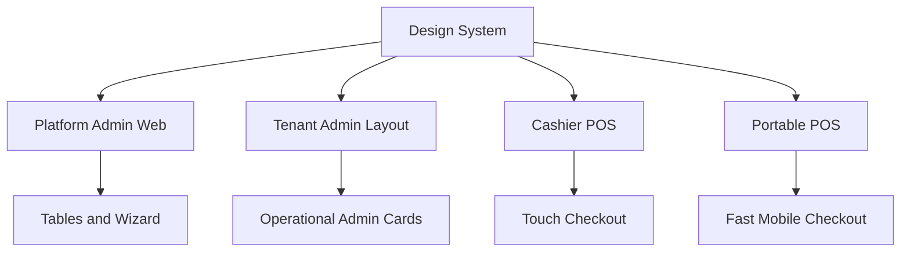

<!-- title: Design System -->
<!-- status: Active -->
<!-- system: OneVerz POS MVP -->
<!-- last_updated: 2026-09-01 -->

# Design System

## Implemented Flutter Component Registry

Verified reusable POS component paths, dimensions, variants, typography,
spacing, radius, icon/image, semantic colour and responsive rules are owned by
[[POS_Reusable_Component_Specifications]]. This file owns design principles and
theme intent; the registry owns implementation-proven component measurements.
Prototype screenshots define hierarchy and visual intent, not reusable control
pixels.

## Purpose

This file defines the visual system for OneVerz POS MVP UI work.

It applies to Platform Admin Web, Tenant Admin inside Flutter POS, Fixed POS,
and Portable POS.

## Source Basis

The design direction comes from approved OneVerz POS UI screens, POS flow screens,
tenant admin screens, platform admin screens, and confirmed project decisions.

This is not a generic POS theme.

## Brand Position

| Item | Rule |
|---|---|
| Product | OneVerz POS |
| Business context | Event, stadium, venue, merchandise, retail POS |
| UI personality | Enterprise, premium, practical, touch-friendly |
| Main app feel | Dark blue and white POS/admin layout |
| Presentation feel | Clean production-ready OneVerz POS screens |

## Color System

| Usage | Color Direction |
|---|---|
| Main dark surface | Deep navy / dark blue |
| Primary action | OneVerz orange; feature-specific semantic/status colours may be used only where their approved screen contract requires them |
| Content surface | White or soft ivory card surface |
| Primary text | Charcoal or deep navy |
| Secondary text | Muted gray-blue |
| Success | Use status styling, not decorative color overload |
| Warning | Use clear warning state for stock, expiry, payment, till variance |
| Error | Strong red/error state with text explanation |

**Open Till (updated 2026-08-31):** The approved visual baseline uses the
default OneVerz orange primary. Production resolves that primary through the
backend-driven POS theme; blue/purple is not an independent Open Till override.
Reuse the resolved theme tokens rather than feature-local orange constants.
Screen contract:
[[../08_FLUTTER_POS_KNOWLEDGE/Flutter_Open_Till_Screen_Implementation_Specification]].

Do not create a colorful consumer app style.

POS Login background branding and authenticated POS application theming are
separate contracts. Login-background media/colour does not itself redefine
application tokens. Authenticated POS theme tokens are backend-driven through
`GET /api/v1/pos/theme` and may be tenant-customized as defined below.

Login and Device Activation use one shared POS branding panel. Activation uses
the same heading, subtitle, field, radius and orange primary-action visual
language as Login. Feature widgets must not define direct colour literals or
duplicate orange/theme constants; use canonical theme/design tokens and shared
input/button components. A missing semantic colour is added once to the
canonical theme token file.

## Backend-Driven POS Theme

Authenticated POS surfaces resolve brand tokens from the existing backend
theme authority:

```text
GET /api/v1/pos/theme
TenantSetting override
→ SettingDefinition default
→ safe application fallback
```

| Token | Setting key | Default |
|---|---|---|
| Primary brand | `pos.theme.primary_color` | `#FF6A00` |
| Secondary brand | `pos.theme.secondary_color` | `#000000` |

Defaults are fallbacks, not permanent screen colour literals. When a tenant
changes primary from `#FF6A00` to `#FF1493`, theme-driven primary buttons,
active navigation, selected tabs/indicators, primary icons, highlights,
focus/selected states, card accents, progress indicators, and design-system
primary links/actions become pink after canonical theme refresh. No
feature-screen source change is required.

Feature screens consume `ThemeData`, the theme provider, and shared design
tokens. Direct branding literals such as `Color(0xFFFF6A00)` or
`Color(0xFF000000)` are forbidden in feature widgets; one centralized safe
fallback is acceptable.

## Brand Tokens Versus Semantic Tokens

Tenant theme colours style brand/primary intent. Success, warning, error, info,
and disabled states remain canonical semantic tokens unless a future approved
semantic-token contract makes them configurable. Changing primary orange to
pink must not turn success green or error red into pink.

## Layout Principles

- Use large touch targets for POS.
- Use clear card surfaces.
- Keep top-level navigation stable.
- Make permission-hidden actions visually absent, not just disabled.
- Keep table/list screens readable for enterprise use.
- Prioritize speed for cashier flows.
- Avoid decorative UI that slows checkout.

## Typography

| Area | Rule |
|---|---|
| Screen title | Clear, large, short |
| POS action button | Large and direct |
| Table header | Compact but readable |
| Warning/error text | Human-readable and action-focused |
| Amounts | Use clear numeric alignment |
| Product name | Prioritize scannability over decoration |

Screens use canonical `TextTheme`/shared typography tokens for font family,
size, weight, and line height. Prototype screenshots define hierarchy, not
production numeric literals. Repeated feature-local font sizes and weights are
forbidden when a canonical style exists.

Spacing, padding, gaps, radii, elevation, button/input heights, and icon sizes
likewise come from established tokens or shared components; repeated
screen-specific magic values do not become a second design system.

## Component Rules

| Component | Release 1 Usage |
|---|---|
| Sidebar | Role/permission driven navigation |
| Top bar | Outlet, till, user, device context where relevant |
| Cards | Dashboard metrics and setup steps |
| Tables | Admin lists, product list, reports |
| Modals | Confirmation, discount, refund, manager approval |
| Toasts | Non-critical feedback |
| Blocking panels | Permission denied, tenant suspended, device not trusted |

Current cashier Discount does not use manager approval. Its modal is
tablet-first adaptive, stacks on narrow widths, respects keyboard/viewInsets and
safe areas, and keeps amounts/errors/actions untruncated and reachable. See
[[../13_DECISIONS_AND_CHANGES/POS_CASHIER_DISCOUNT_CURRENT_RELEASE_DECISION_2026-08-09]].

## Flutter POS Primary Action Buttons

The Flutter POS canonical primary action is
`lib/shared/widgets/pos_action_buttons.dart`.

| Token | Value |
|---|---|
| Gradient start | `#0E2748` (`TenantAdminColors.navySoft`) |
| Gradient end | `#FF6A00` (`TenantAdminColors.primary`) |
| Direction | Horizontal, center-left to center-right |
| Foreground | White |
| Radius | 12 logical pixels |
| Standard height | 56 logical pixels |
| Compact height | 48 logical pixels |
| Typography | Weight 800, single-line ellipsis |

- Use `PosPrimaryActionButton` for the main forward/confirm action on screens,
  dialogs, sheets, and recovery states.
- Disabled actions use the neutral border background and muted foreground; the
  active gradient must not remain visible.
- Loading blocks duplicate taps and keeps the button dimensions stable.
- Desktop hover, keyboard focus, pressed feedback, semantics labels, leading
  and trailing icons, compact sizing, and full-width sizing are owned by the
  shared component.
- Back, Cancel, and Close remain outlined/neutral. Delete, Void, Reject, and
  other destructive actions retain semantic red styling.
- Feature code must not duplicate the navy-to-orange primary gradient.

**Open Till shared CTA rule:** Open Till does not use the navy→orange gradient.
Its primary CTA consumes the resolved POS primary theme token (orange by
default) and therefore follows an approved tenant primary override.

**Cashier POS Cash Drawer / cash-control exception (2026-08-13):** Cash Drawer
and related Cash In / Cash Out·Drop / Close Till Cashier surfaces use the
approved Cashier POS visual direction:

| Purpose | Hex (docs only) | Shared token — never hard-code hex in feature widgets |
|---|---|---|
| Primary brand | Default `#FF6A00`; tenant override supported | Resolved POS primary theme token |
| Shell / workspace secondary | Default `#000000` / `#030303`; tenant override where mapped | Resolved POS secondary/surface tokens |
| Success / error / info | semantic | `TenantAdminColors.success`, `danger`, and existing info tokens |

White content surface; semantic green/red/(info)blue for movement styling.
Touch-friendly enterprise layout. **Do not** globally overwrite Tenant Admin or
Platform Admin themes. Feature code must not use direct `Color(0x...)`, `#hex`,
or a feature-local `CashDrawerColors` file. Canonical:
[[../08_FLUTTER_POS_KNOWLEDGE/Flutter_Cash_Drawer_Management_Screen_Implementation_Specification]].

## Form Rules

Forms must show:

- Required fields.
- Field-level validation.
- Server validation errors.
- Clear save/cancel actions.
- Disabled state during submission.
- Success state after completion.

## Data Display Rules

Use the same business terms across UI and Second Brain.

Examples:

| UI Label | Meaning |
|---|---|
| Tenant | Customer business account |
| Outlet | Physical store/stock location |
| Till | Cash register/session device point |
| POS Device | Trusted tablet/mobile/admin browser |
| Feature Entitlement | Tenant-enabled feature |
| Permission | User action right |

## Mermaid UI Relationship


```mermaid
flowchart TD
    A[Design System] --> B[Platform Admin Web]
    A --> C[Tenant Admin Layout]
    A --> D[Cashier POS]
    A --> E[Portable POS]
    B --> F[Tables and Wizard]
    C --> G[Operational Admin Cards]
    D --> H[Touch Checkout]
    E --> I[Fast Mobile Checkout]
```

## Out of Scope

- Online Store UI belongs to its browser surface and separate design contract.
- Self-service kiosk UI is not active Release 1.
- Delivery UI is not active Release 1.
- AI analytics UI is not active Release 1.

## Related Files

- [[POS_App_UI_Rules]]
- [[Tenant_Admin_UI_Rules]]
- [[Platform_Admin_UI_Rules]]
- [[Permission_Based_UI_Rules]]
- [[Empty_Error_Loading_States]]
- [[../01_RELEASE_SCOPE/Release_1_Scope]]


## OneVerz Tenant Admin sidebar exception (2026-07-29)

For the **Tenant Admin shared sidebar**, the final approved visual is **white / very light** with light-purple active states — not a dark-blue full sidebar.

"Dark blue and white POS/admin layout" elsewhere in this design system remains historical guidance for broader POS surfaces, but is **superseded for the Tenant Admin shared sidebar** by:

- [[../08_FLUTTER_POS_KNOWLEDGE/Tenant_Admin_Sidebar_Navigation]]
- [[../08_FLUTTER_POS_KNOWLEDGE/Tenant_Admin_Settings_Shared_Layout_Architecture]]
- [[Tenant_Admin_UI_Rules]]
