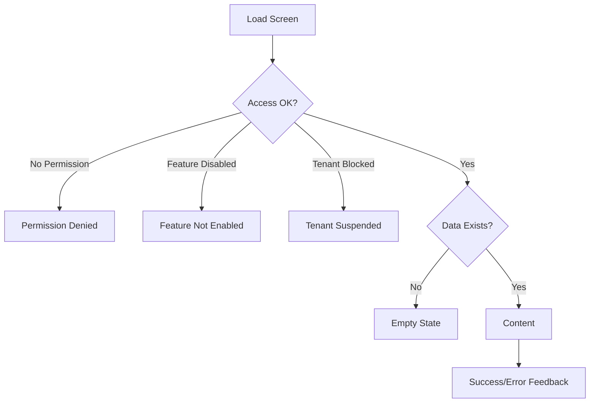

<!-- title: Empty Error Loading States -->
<!-- status: Active -->
<!-- system: SCS-TIX EPOS Release 1 -->
<!-- last_updated: 2026-06-08 -->

# Empty Error Loading States

## Purpose

This file defines empty, error, loading, blocked, and success states for SCS-TIX
Release 1 UI.

These states must support Platform Admin, Tenant Admin, Cashier POS, and Portable
POS.

## General Loading Rule

Use loading states that match the screen importance.

| Screen Type | Loading State |
|---|---|
| POS checkout | Short blocking loader only when required |
| Admin list | Skeleton rows or table loading |
| Dashboard | Metric card skeletons |
| Payment | Clear processing state |
| Device activation | Blocking validation state |
| Report export | Queued/processing status |

## Empty State Rule

Empty states must explain what is missing and the next allowed action.

Examples:

| Screen | Empty State |
|---|---|
| Outlets | No outlets created yet |
| Tills | No tills configured for this outlet |
| Products | No products onboarded |
| Inventory | No stock records available |
| Reports | No report data for selected filters |
| Parked Sales | No parked sales available |
| Hardware | No hardware devices configured |

## Permission Denied State

Use when authenticated user lacks permission.

Message pattern:

```text
You do not have permission to perform this action.
Contact an administrator if access is required.
```

Do not expose permission internals unless useful for admin debugging.

## Feature Not Enabled State

Use when tenant does not have the feature enabled.

Message pattern:

```text
This feature is not enabled for your tenant.
```

Do not show upgrade/cross-sell UI unless confirmed by product scope.

## Tenant Suspended State

Use when tenant status blocks operation.

Show tenant unavailable message, contact admin/support direction, and no POS
sale, refund, exchange, or cash drawer actions.

## POS Critical Error States

| Condition | UI State |
|---|---|
| No outlet assigned | Block POS with no-outlet message |
| No till available | Block till open and show setup required |
| Device not trusted | Show device activation screen |
| No open till | Show till open screen |
| Payment failed | Keep sale unpaid and show retry/alternative method |
| Printer failed | Show receipt generated but print failed |
| Refund not allowed | Show reason and block refund |
| Insufficient stock | Block or warn according to business rule |

## Form Error Rule

Forms must show field-level validation.

Server errors must map to fields where possible, with general errors at the top
or in a blocking modal when needed.

## Success State Rule

Success states must confirm completed action and next step.

Examples include tenant created, payment link sent, outlet created, till
activated, device trusted, till opened, sale completed, refund completed, and
report export queued.

## State Diagram



## Release 1 Exclusions

Do not create empty/error states for active e-commerce, delivery, kiosk,
supplier, offline sync, coupon, AI, or accounting modules.

If such references appear, mark them future/deferred.

## Related Files

- [[Design_System]]
- [[Permission_Based_UI_Rules]]
- [[POS_App_UI_Rules]]
- [[Tenant_Admin_UI_Rules]]
- [[Platform_Admin_UI_Rules]]
