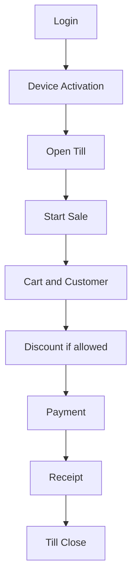

<!-- title: POS App UI Rules -->
<!-- status: Active -->
<!-- system: SCS-TIX EPOS Release 1 -->
<!-- last_updated: 2026-06-08 -->

# POS App UI Rules

## Purpose

This file defines the Release 1 POS app UI rules for SCS-TIX.

It covers Fixed POS and Portable POS queue-busting flow.

## Layout Decision

The POS app uses a changed dark-blue and white operational layout.

It must be practical for checkout, not generic dashboard software.

## POS Surfaces

| Surface | Rule |
|---|---|
| Fixed POS | Tablet-first cashier checkout |
| Portable POS | Mobile/tablet checkout for queue-busting |
| Tenant Admin | Separate operational layout inside same Flutter app |
| Customer display | Not included in Release 1 |
| Kiosk | Not included in Release 1 |

## Fixed POS Layout

The Fixed POS layout should include:

- Left or top navigation based on screen size.
- Product grid/search area.
- Cart panel.
- Payment and action panel.
- Outlet/till/session context.
- Clear cashier/user display.
- Large product tiles.
- Clear subtotal, discount, tax, grand total, paid, and change.

## POS Home Rules

POS home must show only permitted actions.

Allowed Release 1 actions include:

- Start sale.
- Park/recall sale.
- Return/refund.
- Exchange.
- Cash drawer.
- Till close.
- Hardware testing where permitted.
- Reports only if permission is enabled.

Do not show inventory/product admin shortcuts to cashier unless permission grants it.

## Checkout Screen Rules

| Area | UI Requirement |
|---|---|
| Product search | Search, scan, category/product tile support |
| Variant selection | Clear variant options before add to cart |
| Cart | Editable quantity, remove item, line detail |
| Totals | Always visible |
| Payment CTA | Strong and reachable |
| Discount | Visible only if entitled and permitted |
| Customer | Add/select customer action |
| Loyalty | Show earn/redeem only when enabled |

## Payment UI Rules

Payment screen must support cash, card, QR, split payment, and store credit where
used by refund/exchange/customer credit flow.

Card payment must reflect real reader/provider integration where configured.

## Return Refund UI Rules

Return/refund screens must show original sale lookup, sale line selection,
returnable quantity, non-returnable disabled state, reason, refund method,
manager approval where required, and store credit where supported.

## Till UI Rules

Till open must show opening cash/float entry when required.

Till close must show counted cash, expected cash, variance, and close note.

Cash in/out must require type, amount, and reason.

## Device UI Rules

Device activation screen must support activation code entry.

Device context must clearly show trusted/untrusted status.

Device not trusted must block POS actions and show a clear activation path.

## Portable POS Rule

Portable POS is not a separate queue-busting module.

It uses the same sale, payment, permission, outlet, device, and receipt rules as
fixed POS.

## POS Flow Diagram

## Out of Scope

- Offline sale queue UI is excluded.
- E-commerce order management is excluded.
- Kiosk UI is excluded.
- Delivery UI is excluded.

## Related Files

- [[Design_System]]
- [[Permission_Based_UI_Rules]]
- [[Empty_Error_Loading_States]]
- [[../03_USER_JOURNEYS/Cashier/04_Start_Sale_Flow]]
- [[../03_USER_JOURNEYS/Cashier/07_Payment_Flow]]
