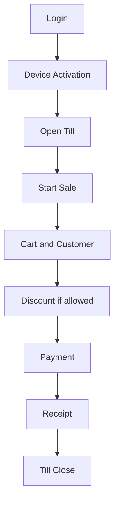

<!-- title: POS App UI Rules -->
<!-- status: Active -->
<!-- system: OneVerz POS MVP -->
<!-- last_updated: 2026-08-27 -->

# POS App UI Rules

> Payment Method screen decision (2026-08-02): the active release surface shows
> Cash, Card, QR Pay and Split Payment only. Its reusable equal-card component
> derives 1/2/3/4/5-card layouts from count; the four-method release is 2 x 2.
> Pay Later is not a fifth method.

## Purpose

This file defines the current OneVerz POS MVP app UI rules.

It covers fixed and portable OneVerz POS operation.

## Layout Decision

The POS app uses a changed dark-blue and white operational layout.

It must be practical for checkout, not generic dashboard software.

## POS Surfaces

| Surface | Rule |
|---|---|
| Fixed POS | Tablet-first cashier checkout |
| Portable POS | Mobile/tablet checkout for queue-busting |
| Tenant Admin | Separate operational layout inside same Flutter app |
| Customer display | Not included in Release 1 |
| Kiosk | Not included in Release 1 |

## Fixed POS Layout

The Fixed POS layout should include:

- Left or top navigation based on screen size.
- Product grid/search area.
- Cart panel.
- Payment and action panel.
- Outlet/till/session context.
- Clear cashier/user display.
- Large product tiles.
- Clear subtotal, discount, tax, grand total, paid, and change.

## POS Home Rules

### Shared POS Bottom Navigation

The cashier POS uses one canonical shared bottom-navigation component:
`PosCashierBottomNavigation`. Every destination renders as a compact horizontal
pair in the form `[Icon] Navigation Name`.

The fixed destination order is Home, New Sale, Orders, Customers, Settings.
The icon appears on the left and the label on the right within the same row.
Icon and label share the same active/inactive state, while the existing active
underline remains the selected-route indicator.

The shared component remains responsible for route selection and
permission-aware destination visibility. Feature screens must reuse it rather
than create screen-local navigation copies. On narrow viewports, the horizontal
icon/label pair may scale down inside its existing touch target to prevent
clipping or overflow; destination order, labels, routes, permission checks, and
navigation behaviour must not change.

POS home must show only permitted actions.

Allowed Release 1 actions include:

- Start sale.
- Park/recall sale.
- Return/refund.
- Exchange.
- Cash drawer.
- Till close.
- Hardware testing where permitted.
- Reports only if permission is enabled.

Do not show inventory/product admin shortcuts to cashier unless permission grants it.

## Checkout Screen Rules

| Area | UI Requirement |
|---|---|
| Product search | Search, scan, category/product tile support |
| Variant selection | Clear variant options before add to cart |
| Cart | Editable quantity, remove item, line detail |
| Totals | Always visible |
| Payment CTA | Strong and reachable |
| Discount | Visible only if entitled and permitted |
| Customer | Clickable Payment Method Customer card; optional full-screen select/add journey |
| Loyalty | Deferred; do not show in Release 1 Cashier UI |

### Discount Popup

- MANUAL only; exactly one active cashier discount.
- Order supports Percentage/Fixed; Item supports Percentage only with exact cart line.
- Above authority is rejected; no manager approval/POLICY selector in current flow.
- Tablet landscape prefers two columns; smaller tablets adapt without fixed
  overflow; narrow widths stack. Keyboard, safe areas, text scale, long products
  and errors must keep Apply/Cancel reachable.
- Offline preview is provisional and shows pending/failed/conflict sync state.
- Normative decision:
  [[../13_DECISIONS_AND_CHANGES/POS_CASHIER_DISCOUNT_CURRENT_RELEASE_DECISION_2026-08-09]].

### Customer Management Master-Detail

- `/pos/customers` starts with no selection and a 100%-width customer table.
- Do not render an empty right-side placeholder before selection.
- Selecting the whole row highlights it, shrinks the list responsively to about
  64%, and opens a non-overlay detail panel at about 36%.
- Clearing or invalidating selection removes detail and restores full width.
- Detail loading must not unnecessarily block the list.
- Use touch-first action targets and prevent horizontal overflow at supported
  POS tablet widths.
- Do not show loyalty points, earn/redeem, membership badges, or tiers in
  Release 1 Customer Management.

### Checkout Customer Selection

Normative screen specification:
[[../08_FLUTTER_POS_KNOWLEDGE/Flutter_Checkout_Customer_Selection_Implementation_Specification]].

- Customer selection is optional; walk-in/guest checkout must remain available.
- Tapping the Payment Method Customer card opens a separate full-screen checkout
  customer selection/add screen.
- Do not use a popup, modal, dialog, or the bottom-navigation `/pos/customers`
  Customer Management screen for this checkout journey.
- Search supports customer name, mobile, and email.
- Use approximately 300 ms debounce, stale-response protection, `pageSize = 20`
  and append-only Load More; do not use numbered pages or load all customers.
- Wide tablets use side-by-side select/add sections; narrow widths stack without
  overflow. The whole row is tappable and touch targets are at least
  approximately 44 logical pixels where no stricter rule applies.
- Do not show checkout Filter, Recent Customers, customer type, notes, tiers,
  visits, photos, loyalty balance, or fabricated profile data.
- Selecting an existing customer or successfully creating a new customer
  automatically associates it with the active checkout and automatically
  returns to Payment Method, where the Customer card shows the selected name.
- Do not show an Attach or Save/Attach button and do not require a newly created
  customer to be searched again.

## Payment UI Rules

Payment screen supports the approved Release 1 payment methods. Store credit is
future/deferred and is not Release 1 Customer Management functionality.

Card payment must reflect real reader/provider integration where configured.

## Return Refund UI Rules

Return/refund screens must show original sale lookup, sale line selection,
returnable quantity, non-returnable disabled state, reason, refund method,
manager approval where required. Store credit remains future/deferred unless a
separate approved release decision activates it.

## Till UI Rules

Till open must show opening cash/float entry when required.

Approved Open Till UI contract (2026-08-11):

- Reuse the existing Dashboard Top Bar / POS shell header — do not create an
  Open Till-only top bar.
- OneVerz **orange** primary theme (not blue/purple).
- Main content on a full **white** parent surface; preserve component-wise form
  cards (float, keypad, quick amounts, note, till summary, CTA).
- Important text dark and strong/bold.
- Responsive Phone + Tablet + Desktop without overflow/clipping/unusable
  targets.
- Online backend confirmation only; never claim OPEN locally first.

Canonical:
[[../04_MODULE_KNOWLEDGE/08_Hardware_Till_Cash_Control/04_Open_Till_Feature]],
[[../08_FLUTTER_POS_KNOWLEDGE/Flutter_Open_Till_Screen_Implementation_Specification]].

Till close must show counted cash, expected cash, variance, and close note.

Cash in/out must require type, amount, and reason.

### Cash Drawer UI contract (2026-08-13)

- Title **Cash Drawer** and subtitle inside the main **white** content card
  below the standard POS top bar.
- No back-arrow; no “Continue to Dashboard”.
- Normal POS bottom navigation remains available.
- Simplified summary: Till, Status, Opening Cash, Cash Sales, Current Expected
  Cash (backend-authoritative Expected Cash).
- Actions: Open Drawer, Cash In, Cash Out/Drop, Close Till.
- Recent movements newest first; colour is semantic only.
- Phone + Tablet + Desktop; reuse `TenantAdminBreakpoints`.
- Orange primary / black shell via shared tokens only — no feature hex.

Canonical:
[[../04_MODULE_KNOWLEDGE/08_Hardware_Till_Cash_Control/06_Cash_Drawer_Feature]],
[[../08_FLUTTER_POS_KNOWLEDGE/Flutter_Cash_Drawer_Management_Screen_Implementation_Specification]].

## Device UI Rules

Device activation screen must support activation code entry.

Device context must clearly show trusted/untrusted status.

Device not trusted must block POS actions and show a clear activation path.

## Persistent Payment Error Rule

Payment failure feedback must remain visible and accessible after transient
notifications disappear. Show a safe message, backend code when present and the
short correlation reference. For an unknown transaction outcome, explicitly
warn against retrying until reconciliation. Preserve the cart and tender and
avoid layout overflow at supported POS widths. Never expose the raw idempotency
key or credentials in the UI.

## Portable POS Rule

Portable POS is not a separate queue-busting module.

It uses the same sale, payment, permission, outlet, device, and receipt rules as
fixed POS.

## POS Flow Diagram

```mermaid
flowchart TD
    A[Login] --> B[Device Activation]
    B --> C[Open Till]
    C --> D[Start Sale]
    D --> E[Cart and Customer]
    E --> F[Discount if allowed]
    F --> G[Payment]
    G --> H[Receipt]
    H --> I[Till Close]
```

## Out of Scope

- Offline sale/Discount pending, failed, and conflict states are included in the
  OneVerz POS continuity model; full reconciliation UX remains implementation work.
- E-commerce order management is excluded.
- Kiosk UI is excluded.
- Delivery UI is excluded.

## Related Files

- [[Design_System]]
- [[Permission_Based_UI_Rules]]
- [[Empty_Error_Loading_States]]
- [[../03_USER_JOURNEYS/Cashier/04_Start_Sale_Flow]]
- [[../03_USER_JOURNEYS/Cashier/07_Payment_Flow]]

## Cash Persistent Payment Errors

Persistent Cash errors belong inside the Cash card's scrollable content region;
totals, tender and bottom actions keep their layout ownership. Full message,
backend code and correlation remain accessible at 1280x800 landscape and 1200,
900 and 600 logical widths, with keyboard insets and supported increased text
scale. Never truncate the support reference or hide a RenderFlex overflow.
