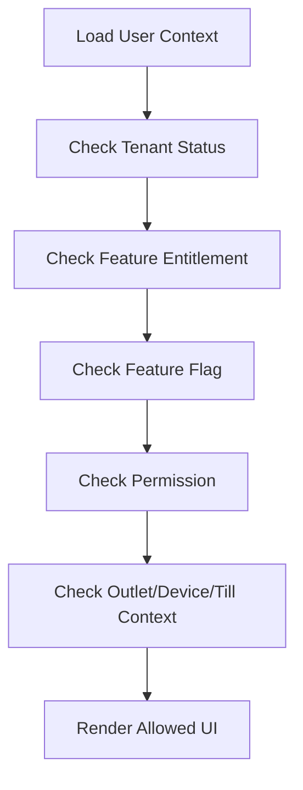

<!-- title: Permission Based UI Rules -->
<!-- status: Active -->
<!-- system: SCS-TIX EPOS Release 1 -->
<!-- last_updated: 2026-06-08 -->

# Permission Based UI Rules

## Purpose

This file defines how SCS-TIX Release 1 UI must respond to feature entitlement,
role permissions, user rights, outlet access, device trust, and till session
state.

This rule applies to Platform Admin Web and Flutter POS app.

## Core Rule

UI must not be fixed role-based.

Every screen, sidebar item, button, tab, and action must be controlled by tenant
feature entitlement, role permission, and user rights.

Backend enforcement is still mandatory.

## UI Access Inputs

| Input | Meaning |
|---|---|
| Feature entitlement | Tenant has the feature enabled |
| Feature flag | Feature is enabled for tenant/outlet/user scope |
| Role permission | User can perform action |
| Outlet role | User can operate specific outlet |
| Device trust | POS device is approved/trusted |
| Till session | Till is open where needed |
| Tenant status | Tenant can operate |

## Rendering Decision

## Sidebar Rule

Sidebar items must appear only if the current user can access the feature.

Example:

| Feature | UI Behavior |
|---|---|
| Reports disabled | Hide Reports menu |
| Refund permission missing | Hide Return/Refund action |
| Discount permission missing | Hide/disable discount action |
| Inventory disabled | Hide Inventory |
| Device not trusted | Show activation block, not POS home |

## Button Rule

Buttons must be hidden or disabled based on permission and context.

| Button | Required Context |
|---|---|
| Start Sale | POS feature, sale permission, trusted device, open till |
| Apply Discount | Discount feature and permission |
| Refund | Return/refund permission and original sale |
| Close Till | Till close permission and open session |
| Generate Activation Code | Till/device management permission |
| Export Report | Reports feature and export permission |

## Route Guard Rule

Routes must be guarded.

Deep links must not bypass permissions.

If a user opens a blocked route directly, show permission denied or feature not
enabled state.

## Backend Rule

UI hiding is not security.

Backend APIs must still return 403 for blocked entitlement, permission, outlet,
device, or till-session context.

## Tenant Admin Rule

Tenant Admin screens must render according to entitlement and permissions.

Tenant Admin should not automatically see every tenant feature.

## Cashier Rule

Cashier POS home must show only permitted cashier actions.

Cashier should not see device/hardware configuration unless permission grants it.

## Platform Admin Rule

Platform Admin UI uses platform permissions.

Platform access must not bypass tenant-side entitlement rules for tenant
operations.

## State Change Rule

When permissions or entitlements change:

- Refresh user context.
- Rebuild menu and route access.
- Close or block now-disallowed screens.
- Show safe access-denied state if needed.

## Related Files

- [[Design_System]]
- [[Empty_Error_Loading_States]]
- [[../02_ACCESS_CONTROL/Access_Control_Overview]]
- [[../02_ACCESS_CONTROL/Feature_Entitlement_Matrix]]
- [[../02_ACCESS_CONTROL/API_Authorization_Rules]]
