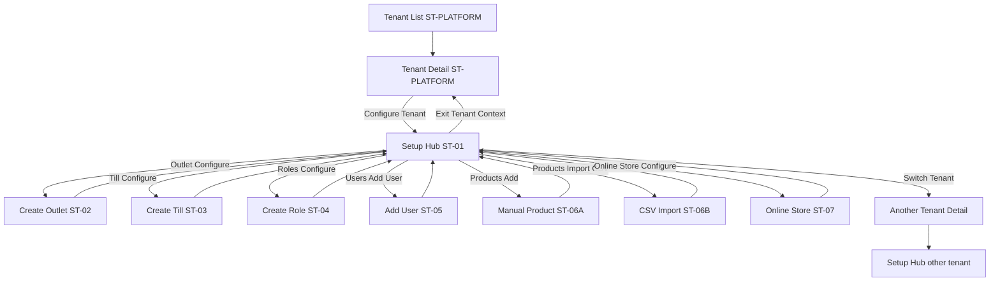
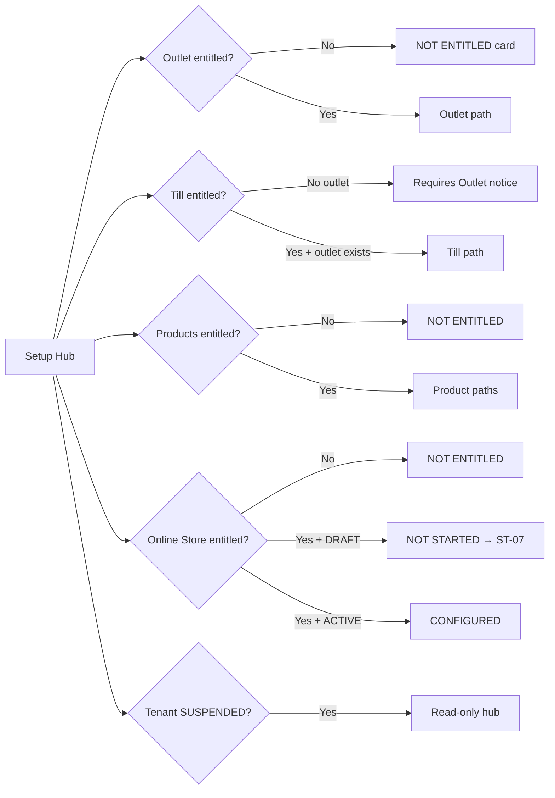

# Selected-Tenant Prototype Flow Map

**Date:** 2026-08-12  
**Status:** APPROVED prototype navigation contract  

## Mermaid — primary flow

## Conditional branches

## Shell state prototypes

| ID | Purpose |
|---|---|
| ST-SHELL-01 | Entered selected-tenant context |
| ST-SHELL-02 | Switch tenant dialog |
| ST-SHELL-03 | Exit confirmation (dirty form) |
| ST-SHELL-04 | Suspended tenant |
| ST-SHELL-05 | Feature not entitled |
| ST-SHELL-06 | Permission denied |

Prototype file: `prototypes/selected-tenant/shell-states.html`

## Journey mapping

| Screen | Journey |
|---|---|
| ST-01 | SA-ST-UJ-001 (+ hub read) |
| ST-02 | SA-ST-UJ-005 |
| ST-03 | SA-ST-UJ-006 |
| ST-04 | SA-ST-UJ-007 |
| ST-05 | SA-ST-UJ-008 |
| ST-06A | SA-ST-UJ-009 |
| ST-06B | SA-ST-UJ-010 |
| ST-07 | SA-ST-UJ-011 → SA-UJ-057 |
| ST-SHELL-* | SA-ST-UJ-001/002/003 + error contracts |

## Online Store (ST-07) — APPROVED

| Screen | Journey | Notes |
|---|---|---|
| ST-07 | SA-ST-UJ-011 → SA-UJ-057 | Optional bootstrap; entitlement `online_store` |
| Hub Online Store card | Derived NOT_STARTED / CONFIGURED / NOT_ENTITLED | `DECISION_REQUIRED` retired |

Entry remains: Tenant Detail → Configure Tenant → Setup Hub → Online Store.  
No permanent Platform sidebar item.

`storeStatus`: `DRAFT` | `ACTIVE`. `taxDisplayMode`: optional `MATCH_TENANT`.

See [[../../03_USER_JOURNEYS/Platform_Admin/Selected_Tenant_Online_Store_Bootstrap_Contract]].
