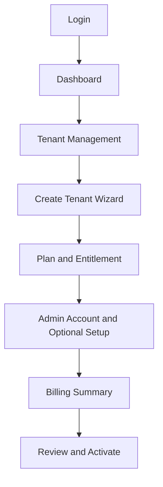

<!-- title: Platform Admin UI Rules -->
<!-- status: Active -->
<!-- system: SCS-TIX EPOS Release 1 -->
<!-- last_updated: 2026-06-08 -->

# Platform Admin UI Rules

## Purpose

This file defines Platform Admin Web UI rules for SCS-TIX Release 1.

Platform Admin is used for tenant setup, subscription, feature entitlement,
billing link, and activation.

## Layout Decision

Platform Admin Web uses a changed enterprise admin layout.

It must be clean, structured, and wizard-driven.

It must not look like the POS cashier layout.

## Primary Navigation

Release 1 Platform Admin navigation includes:

| Navigation Item | Purpose |
|---|---|
| Dashboard | Tenant/payment/status summary |
| Tenant | Tenant list and tenant detail |
| Subscription Plans | Plans and plan features |
| Modules & Features | Platform module/feature catalog |
| Pricing | Billing/price setup where supported |
| Platform Settings | Platform-level settings |
| Audit Logs | Platform and tenant-sensitive event visibility |

Do not add e-commerce admin navigation as active Release 1 behavior.

## Dashboard Rules

Dashboard may show:

- Total tenants.
- Trial tenants.
- Suspended tenants.
- Payment pending requests.
- Revenue/billing summary.
- Recent activity.
- Expired/past-due list.
- Quick actions.

Dashboard must not expose tenant-owned POS data beyond platform summary needs.

## Tenant Wizard Rules

Tenant wizard should follow the confirmed onboarding flow:

1. Business details.
2. Domain/subdomain setup where applicable.
3. Subscription and add-ons/custom plan.
4. Tenant admin account.
5. Optional setup steps.
6. Billing summary.
7. Review and create.
8. Activation.

Optional setup may include outlet, till, roles/users, and product onboarding.

## Feature Entitlement UI

Feature entitlement UI must separate:

- Tenant feature entitlement.
- Subscription plan features.
- Role/permission assignment.
- Runtime feature flags.

The user must not think feature entitlement alone gives user access.

## Billing UI

Billing summary must show:

- Plan.
- Add-ons/features where applicable.
- Invoice line items.
- Currency.
- Grand total.
- Payment link status.
- Payment result.

Provider is configurable/TBD.

## Tenant Activation UI

Tenant activation screen must show:

- Tenant status.
- Setup checklist.
- Billing/payment state.
- Tenant admin account status.
- Required entitlement state.
- Activate action only when allowed.

Activation must be auditable.

## Platform Admin Flow Diagram

## Out of Scope

- Tenant POS checkout is not done in Platform Admin.
- Tenant inventory operations are not managed by Platform Admin after setup.
- E-commerce storefront setup is future/deferred.
- Delivery, kiosk, AI, and accounting UI are excluded.

## Related Files

- [[Design_System]]
- [[Permission_Based_UI_Rules]]
- [[../03_USER_JOURNEYS/Platform_Admin/02_Create_Tenant_Flow]]
- [[../03_USER_JOURNEYS/Platform_Admin/04_Module_Feature_Entitlement_Flow]]
- [[../03_USER_JOURNEYS/Platform_Admin/07_Tenant_Activation_Flow]]
