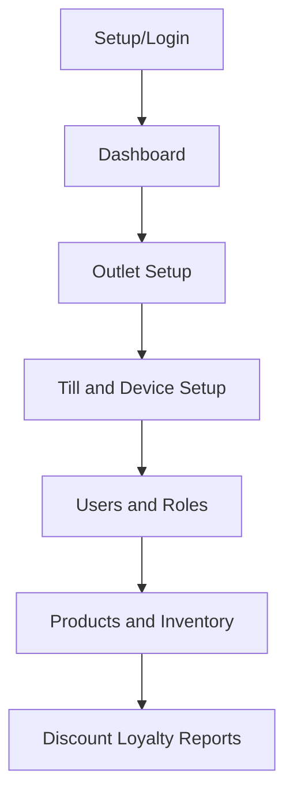

<!-- title: Tenant Admin UI Rules -->
<!-- status: Active -->
<!-- system: SCS-TIX EPOS Release 1 -->
<!-- last_updated: 2026-06-08 -->

# Tenant Admin UI Rules

## Purpose

This file defines Tenant Admin UI rules for SCS-TIX Release 1.

Tenant Admin works inside the same Flutter POS app, but uses a separate
operational admin layout.

## Layout Decision

Tenant Admin UI must be changed from cashier POS layout.

It should look like a dark-blue and white operational control panel inside the
Flutter app.

It is not a separate Tenant Admin web application in Release 1.

## Sidebar / Navigation

Tenant Admin navigation should be permission-based.

Confirmed Release 1 tenant areas include:

| Navigation Item | Purpose |
|---|---|
| Dashboard | Operational overview |
| Outlet | Outlet list/create/update |
| Till | Till setup and activation code |
| Users | Staff/user management |
| Roles & Permission | Role and permission assignment |
| Products | Product onboarding and management |
| Inventory | Stock, batch, expiry, adjustment, stocktake |
| Discounts | Product/POS/expiry discount setup |
| Loyalty | Basic loyalty setup |
| Reports | Report view/export if permitted |

Do not show Release 2 modules as active menu items.

## Dashboard Rules

Tenant dashboard may show outlet count, till count, user count, inventory alerts,
product/stock summary, expiry alerts, and sales summary where reports feature is
enabled.

Dashboard cards must be tenant-scoped.

## Outlet Screen Rules

Outlet screens must support:

- Outlet list.
- Create/edit outlet.
- Outlet contact details.
- Outlet address.
- Status.
- Empty state when no outlet exists.

Outlet setup must not become stock-transfer or delivery setup.

## Till Screen Rules

Till screens must support:

- Till list.
- Create/edit till.
- Outlet assignment.
- Status.
- Opening cash required flag.
- Hardware profile link where relevant.
- Activation code generation/view.

Activation code must be shown as sensitive and short-lived.

## Device and Hardware Admin

Tenant Admin or permitted admin user can manage POS device trust/block status,
hardware profiles, hardware devices, printer/scanner/cash drawer/card reader
details, and hardware test results.

Cashier must not freely configure system hardware.

## Product and Inventory Rules

Product onboarding must support manual or CSV import as confirmed.

Inventory UI must show:

- Stock by outlet/product/variant.
- Batches and expiry.
- Low stock and expiry alerts.
- Stock adjustment.
- Stocktake.

Supplier management and stock transfer are excluded from Release 1.

## Role Permission UI

Role/permission UI must make it clear that access is controlled by:

1. Tenant feature entitlement.
2. Role feature assignment.
3. Role permission.
4. User or outlet assignment.

Do not hardcode cashier/manager/admin access in UI.

## Tenant Admin Flow Diagram

## Out of Scope

- Separate Tenant Admin web app is excluded.
- E-commerce storefront management is excluded.
- Supplier and stock transfer management is excluded.
- AI onboarding is excluded.

## Related Files

- [[Design_System]]
- [[Permission_Based_UI_Rules]]
- [[../03_USER_JOURNEYS/Tenant_Admin/03_Outlet_Management_Flow]]
- [[../03_USER_JOURNEYS/Tenant_Admin/04_Till_Management_Flow]]
- [[../06_DATABASE_KNOWLEDGE/Database_Overview]]
