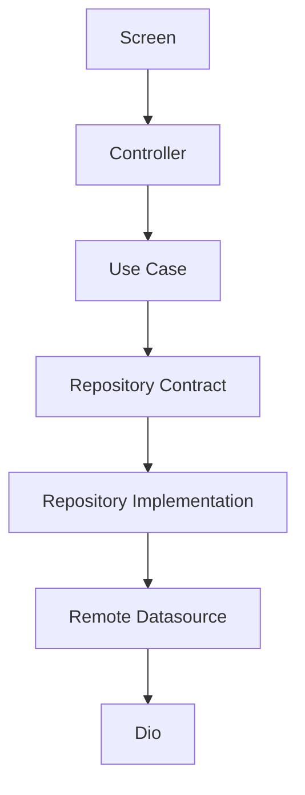

<!-- title: Flutter API Integration -->
<!-- status: Active -->
<!-- system: SCS-TIX EPOS Release 1 -->
<!-- last_updated: 2026-06-24 -->


# Flutter API Integration

## Purpose

This file defines API integration rules for Release 1 Flutter POS features.

## Core Rule

Screens must not call APIs directly.

Screens call controllers or notifiers.

Controllers call use cases.

Use cases call repositories.

Repositories call remote datasources through centralized Dio.

## Feature API Pattern

```text
features/<feature>/
  application/usecases/
  domain/repositories/
  data/models/
  data/datasources/
  data/repositories/
```

## API Flow



## DTO Rule

| Layer | Model Type |
|---|---|
| Data | DTO/request/response models |
| Domain | Entities and value objects |
| Presentation | View state or view model |

Do not pass raw DTOs into widgets when domain/view models are expected.

## API Groups

| Feature Area | API Group |
|---|---|
| Auth | `/api/v1/auth` |
| Device activation | `/api/v1/devices` |
| Tenant context | Tenant context API |
| Outlet/till | `/api/v1/outlets`, `/api/v1/tills` |
| Sales | `/api/v1/pos/sales` |
| POS catalog (cashier) | `/api/v1/pos/products`, `/api/v1/pos/catalog` |
| POS home | `/api/v1/pos/home` |
| Payment/receipt | `/api/v1/pos/payments`, `/api/v1/pos/receipts` |
| Return/refund | `/api/v1/pos/returns`, `/api/v1/pos/refunds` |
| Exchange | `/api/v1/pos/exchanges` |
| Products/categories | `/api/v1/products`, `/api/v1/categories` |
| Reports | `/api/v1/reports` |

Use exact backend endpoints when implementation contracts exist.

POS tenant login posts to `POST /api/v1/auth/tenant-login` with `email` and
`password` only. Flutter must not send or hide a `tenantCode`; backend resolves
tenant from the email and returns `TENANT_SELECTION_REQUIRED` if the email maps
to multiple tenants.

POS product summaries may include `variantSearchTerms` and `directSearchTerms`.
Flutter uses product name as the primary New Sale search match, uses variant
terms only as refiners after a product-name term matches, and keeps exact
SKU/barcode as a direct search path.

Cashier New Sale calls home/product endpoints, checkout summary, cash checkout,
and receipt print audit. Cash confirm posts to
`POST /api/v1/pos/checkout/start-payment` with `cashReceived`; the backend
creates the sale, payment, receipt, and returns `receiptNumber` plus
`barcodeValue`. Print Receipt records audit through
`POST /api/v1/pos/receipts/{saleId}/print`.

Checkout summary/start-payment line payloads must use backend `variantId`, not
`productId`. The POS product summary endpoint returns `variantId` for
simple/non-variant products; variant-parent products use the selected variant
from product detail.

## Current POS Payment Integration

Verified current Flutter wiring:

| Flow | Backend Endpoint | Flutter Status |
|---|---|---|
| Payment summary | `POST /api/v1/pos/checkout/summary` | Wired through `PosCheckoutRemoteDatasource.getCheckoutSummary`. |
| Cash payment completion | `POST /api/v1/pos/checkout/start-payment` | Wired from Cash Payment; stores returned `saleId`, `receiptNumber`, `barcodeValue`, totals, and items. |
| Receipt preview | `GET /api/v1/pos/receipts/{saleId}` | Backend endpoint exists, but Flutter print preview currently uses checkout success state instead of this GET endpoint. Needs Verification before marking fully wired. |
| Receipt print audit | `POST /api/v1/pos/receipts/{saleId}/print` | Wired from Print Receipt screen when `saleId` exists. |
| Payment method list | From checkout summary response | No separate `GET /api/v1/pos/payment-methods` endpoint found. |
| Printer settings | Local/future scope | No backend `GET /api/v1/pos/printer-settings` endpoint found. |

Cash payment completion sends `cashReceived` to the backend. After successful
checkout, Payment Success and receipt preview must use backend response
`cashReceived` and `changeDue` as the source of truth.

## Needs Verification

- Current architecture rule says screens call controllers/notifiers/use cases, then
  repositories and datasources. The verified cash payment screen currently calls
  `posCheckoutRemoteDatasourceProvider.startPayment` directly from presentation
  code. Keep this as a known layering mismatch until the flow is moved behind a
  controller/use case/repository boundary.

## Backend Authority

Backend remains final authority for permission, entitlement, tenant isolation,
outlet/till assignment, device trust, stock validation, payment, return/refund,
exchange, discount approval, and audit.

## Related Files

- [[Flutter_API_Network]]
- [[Flutter_State_Management_Riverpod]]
- [[../05_BACKEND_ARCHITECTURE/API_Standards]]
