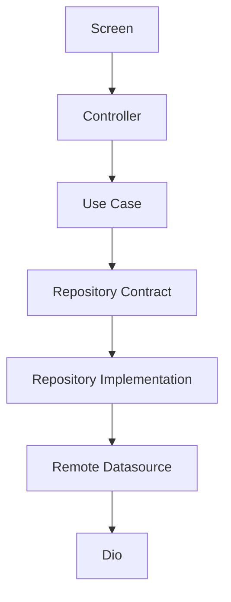

<!-- title: Flutter API Integration -->
<!-- status: Active -->
<!-- system: SCS-TIX EPOS Release 1 -->
<!-- last_updated: 2026-06-08 -->


# Flutter API Integration

## Purpose

This file defines API integration rules for Release 1 Flutter POS features.

## Core Rule

Screens must not call APIs directly.

Screens call controllers or notifiers.

Controllers call use cases.

Use cases call repositories.

Repositories call remote datasources through centralized Dio.

## Feature API Pattern

```text
features/<feature>/
  application/usecases/
  domain/repositories/
  data/models/
  data/datasources/
  data/repositories/
```

## API Flow



## DTO Rule

| Layer | Model Type |
|---|---|
| Data | DTO/request/response models |
| Domain | Entities and value objects |
| Presentation | View state or view model |

Do not pass raw DTOs into widgets when domain/view models are expected.

## API Groups

| Feature Area | API Group |
|---|---|
| Auth | `/api/v1/auth` |
| Device activation | `/api/v1/devices` |
| Tenant context | Tenant context API |
| Outlet/till | `/api/v1/outlets`, `/api/v1/tills` |
| Sales | `/api/v1/pos/sales` |
| Payment/receipt | `/api/v1/pos/payments`, `/api/v1/pos/receipts` |
| Return/refund | `/api/v1/pos/returns`, `/api/v1/pos/refunds` |
| Exchange | `/api/v1/pos/exchanges` |
| Products/categories | `/api/v1/products`, `/api/v1/categories` |
| Reports | `/api/v1/reports` |

Use exact backend endpoints when implementation contracts exist.

## Backend Authority

Backend remains final authority for permission, entitlement, tenant isolation,
outlet/till assignment, device trust, stock validation, payment, return/refund,
exchange, discount approval, and audit.

## Related Files

- [[Flutter_API_Network]]
- [[Flutter_State_Management_Riverpod]]
- [[../05_BACKEND_ARCHITECTURE/API_Standards]]
