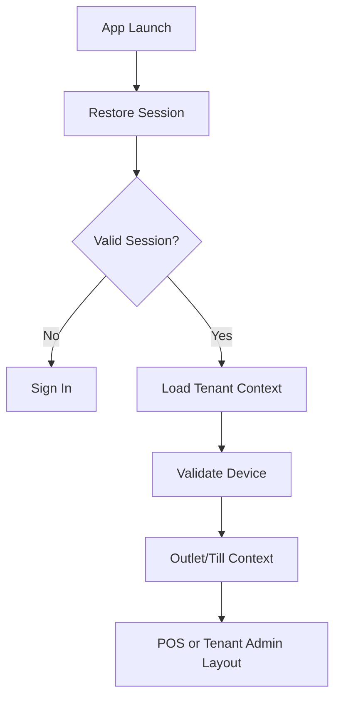

<!-- title: Flutter App Architecture -->
<!-- status: Active -->
<!-- system: SCS-TIX EPOS Release 1 -->
<!-- last_updated: 2026-06-08 -->

# Flutter App Architecture

## Purpose

This file defines the Release 1 Flutter POS app architecture for SCS-TIX EPOS.

The app targets Android tablet and Android phone.

## Release 1 Decisions

| Area | Decision |
|---|---|
| Framework | Flutter |
| Language | Dart |
| State | Riverpod providers, notifiers, controllers |
| Routing | GoRouter with redirect guards |
| API | Dio |
| Storage | Secure storage and limited cache |
| Architecture | Feature-Based Clean Architecture |
| Mode | Online-first POS |

## Active Scope

Release 1 Flutter supports sign-in, device activation, outlet selection, till
selection, till open/close, sale, product lookup, barcode scan, cart, discount,
customer attach, payment, receipt, park/recall sale, return/refund, exchange,
cash in/out, hardware settings, Tenant Admin operational layout, and reports
where enabled.

## Boundary

Full offline sale completion, offline payment queue, conflict resolver, and full
offline sync engine are not active Release 1 behavior.

## Architecture Principles

- Screens must not call APIs directly.
- Screens call controllers/notifiers.
- Controllers call use cases.
- Use cases call repositories.
- Repositories hide remote API, limited cache, and hardware services.
- Backend remains final authority.
- No tenant-specific hardcoded data.
- Hidden UI is not security.
- Business rules must not live inside widgets.

## Layer Responsibilities

| Layer | Responsibility |
|---|---|
| Presentation | Screens, widgets, responsive layouts |
| Application | Use cases, controllers, notifiers |
| Domain | Entities, repository contracts, business rules |
| Data | DTOs, datasources, repository implementations |
| Core | Network, storage, errors, permissions, device utilities |
| Hardware | Printer, scanner, drawer, card reader services |

## High-Level Flow

## Related Files

- [[Flutter_Folder_Structure]]
- [[Flutter_State_Management_Riverpod]]
- [[Flutter_Routing_Guards]]
- [[Flutter_API_Network]]
