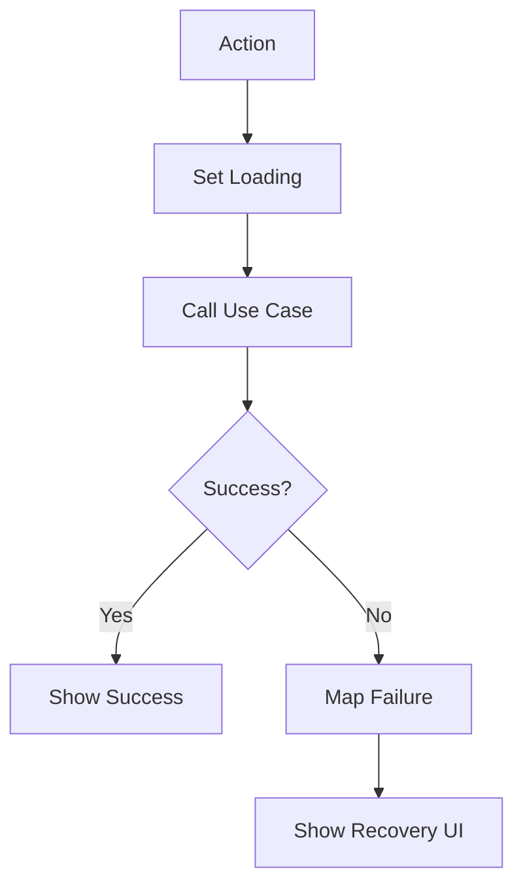

vs<!-- title: Flutter Error Handling -->
<!-- status: Active -->
<!-- system: SCS-TIX EPOS Release 1 -->
<!-- last_updated: 2026-06-24 -->

# Flutter Error Handling

## Purpose

This file defines error handling and recovery rules for Release 1 Flutter POS.

## Principle

Errors must be predictable, safe, and recoverable.

Write actions requiring backend authority must not silently succeed while offline.

## Failure Types

| Error Type | Example | Required UI |
|---|---|---|
| NetworkFailure | Internet unavailable | Offline banner and retry |
| AuthFailure | Expired session | Session-expired/sign-in |
| PermissionFailure | Refund denied | Permission denied state |
| ValidationFailure | Missing till amount | Inline validation |
| HardwareFailure | Printer disconnected | Retry/reprint/manual instruction |
| PaymentFailure | Card declined/timeout | Retry/cancel/change method |
| BackendValidationFailure | Stock/price/till mismatch | Safe backend message |
| DatabaseFailure | Cache write failed | Continue if non-critical |

## Sale and Payment Rule

Payment button must prevent duplicate submit.

Sale completion must use loading/locked state during payment and backend
submission.

App crash or restart must not create duplicate payments or duplicate sales.

## Checkout API Error Mapping

Flutter checkout must distinguish backend HTTP responses from network failures.

| Case | UI / Failure Rule |
|---|---|
| HTTP 400 | Show backend validation/business message and stay on current checkout screen. |
| HTTP 401 | Treat as unauthenticated/session expired, not network failure. |
| HTTP 403 | Show permission denied message, not network failure. |
| HTTP 404 | Show not-found/validation message, not network failure. |
| HTTP 409 | Show conflict message and guide cashier to refresh or recalculate cart. |
| HTTP 500 | Show safe server error message. Do not use network fallback when a backend response exists. |
| Timeout / connection refused / no response | Treat as backend/network unavailable. |

`NETWORK_ERROR` or checkout network fallback is only for requests without a
backend HTTP response.

## Receipt Failure Rule

Receipt print failure must not cancel a completed backend sale.

Show receipt reprint or manual instruction.

## Offline Rule

If network is unavailable before final sale submission, block sale completion.

Cached data may support lookup only where safe.

## Error Flow

## UI State Components

Use consistent loading view, empty state, error state, permission denied view,
feature not enabled view, offline banner, and retry button.

## Security Rules

Do not display stack traces, raw tokens, card data, provider secrets, SQL
errors, or internal backend details.

## Related Files

- [[Flutter_API_Network]]
- [[Flutter_Testing]]
