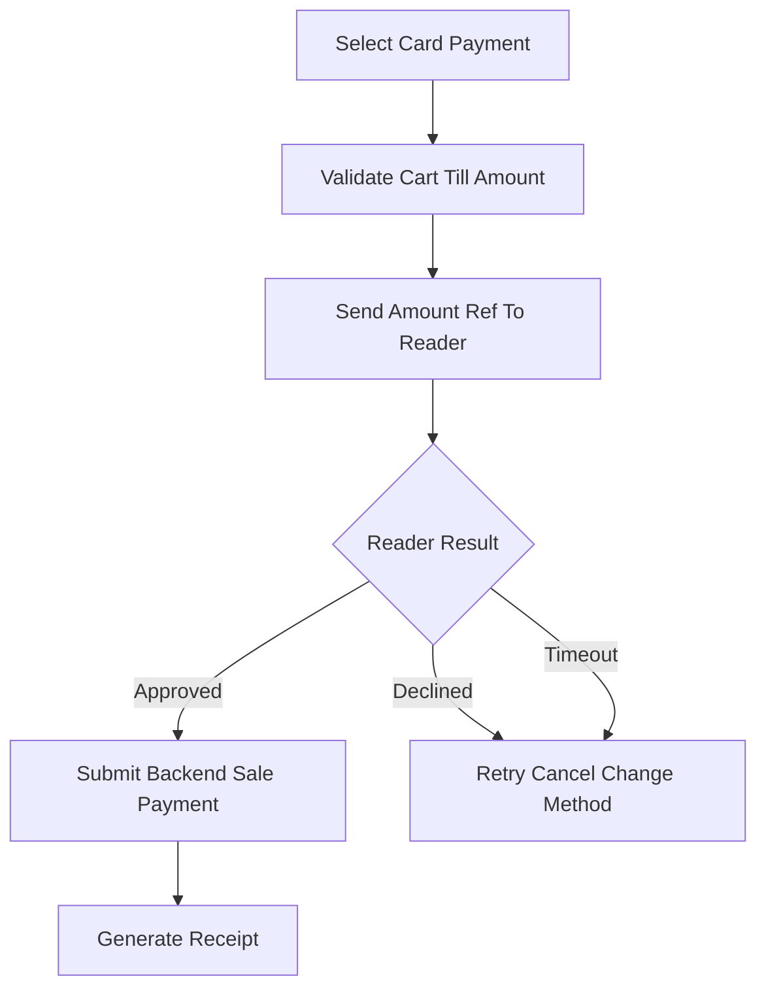

<!-- title: Flutter Hardware Payment Receipt -->
<!-- status: Active -->
<!-- system: SCS-TIX EPOS Release 1 -->
<!-- last_updated: 2026-06-08 -->

# Flutter Hardware Payment Receipt

## Purpose

This file defines Release 1 Flutter rules for hardware, payment handoff, and
receipt handling.

## Hardware Scope

| Hardware            | Rule                                                     |
| ------------------- | -------------------------------------------------------- |
| Barcode scanner     | Keyboard wedge/scanner input                             |
| Receipt printer     | USB/Bluetooth/network service by supported profile       |
| Cash drawer         | Trigger through printer command or permitted manual open |
| Card reader         | Supported reader handoff only                            |
| Device registration | Backend-recognized device where required                 |

## Failure Handling

| Failure | UI Response |
|---|---|
| Barcode unknown | Product not found |
| Duplicate scan | Debounce duplicate scans |
| Printer disconnected | Retry/reprint/manual instruction |
| Drawer failed | Log failure and show manual instruction |
| Card reader timeout | Retry/cancel/change payment |
| Device untrusted | Block POS operation where policy requires |

## Card Reader Rule

Release 1 card payment means POS-to-card-reader handoff where supported.

The Flutter app must not store full card number, CVV, or sensitive cardholder
data.

Only safe references may be stored if returned.

## Payment Flow

## Receipt Rule

Receipt generation must use tenant/outlet receipt template settings.

Receipt print failure must not cancel a completed backend sale.

## Receipt Types

- Original sale receipt.
- Reprint receipt.
- Refund receipt.
- Exchange receipt.

## Related Files

- [[Flutter_Error_Handling]]
- [[Flutter_API_Network]]
- [[../04_MODULE_KNOWLEDGE/Payment/01_Module_Overview]]
