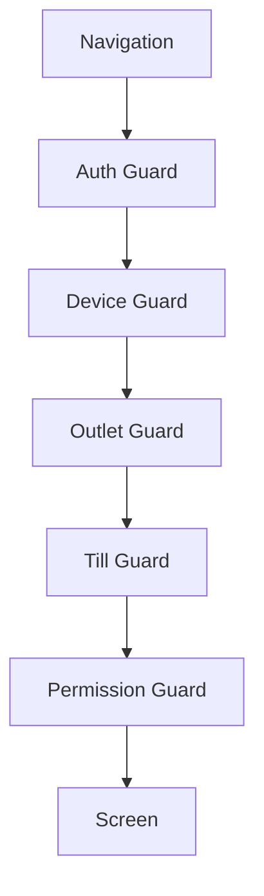

<!-- title: Flutter Routing Guards -->
<!-- status: Active -->
<!-- system: SCS-TIX EPOS Release 1 -->
<!-- last_updated: 2026-06-23 -->


# Flutter Routing Guards

## Purpose

This file defines GoRouter routing and guard rules for Release 1 Flutter.

## Decision

Use GoRouter with redirect guards.

Guards protect auth, device, outlet, till, permission, feature, and session
states.

## POS Routes

### Release 1 target routes

| Route | Purpose |
|---|---|
| `/splash` | Startup/session restore |
| `/sign-in` | Staff sign-in |
| `/device-activation` | Device activation |
| `/outlet-selection` | Select assigned outlet |
| `/till-selection` | Select assigned till |
| `/till-open` | Open till |
| `/pos-home` | POS home (target naming) |
| `/checkout` | Checkout |
| `/payment/cash` | Cash payment |
| `/payment/card` | Card reader handoff |
| `/receipt/preview` | Receipt |
| `/held-sales` | Park/recall |
| `/refund/search` | Return/refund |
| `/exchange/search` | Exchange |
| `/till/cash-movement` | Cash in/out |
| `/till/close` | Close till |
| `/hardware/settings` | Hardware settings |
| `/permission-denied` | Access denied |
| `/session-expired` | Session expired |

### Implemented cashier routes (current code)

| Route | Purpose |
|---|---|
| `/tenant-login` | Staff sign-in (auth entry) |
| `/pos/boot` | POS session bootstrap |
| `/device-activation`, `/open-till` | Device/till setup |
| `/pos/home` | POS home dashboard |
| `/pos/new-sale` | New Sale catalog + local cart |
| `/pos/new-sale/payment` | Payment method selection (`sales.checkout`) |
| `/pos/new-sale/payment/cash` | Cash payment (`sales.checkout` + `payments.cash.accept`) |
| `/pos/new-sale/payment/cash/success` | Payment success (`sales.view` or `receipts.view`) |
| `/pos/new-sale/payment/cash/success/print-receipt` | Print receipt (`receipts.print`) |
| `/pos/new-sale/payment/cash/success/email-receipt` | Email receipt preview (`receipts.view`) |
| `/pos/customers` | Placeholder |
| `/pos/returns-refunds` | Placeholder |
| `/pos/parked-sales` | Placeholder guarded by parked-sale permissions |
| `/pos/cash-drawer` | Placeholder guarded by cash-drawer permissions |

For implemented behavior and conflicts with target routes, see
[[Flutter_Cashier_New_Sale_Implementation]].

## Tenant Admin Routes

```text
/tenant-admin/dashboard
/tenant-admin/outlets
/tenant-admin/tills
/tenant-admin/users
/tenant-admin/roles-permissions
/tenant-admin/roles-permissions/:roleId
/tenant-admin/roles              → redirect to roles-permissions
/tenant-admin/roles-access       → redirect to roles-permissions
/tenant-admin/products
/tenant-admin/inventory
/tenant-admin/discounts
/tenant-admin/loyalty
/tenant-admin/reports
```

Tenant Admin routes appear only when backend context allows them.

Roles & Access loads the entitlement-filtered permission catalog from
`GET /api/v1/tenant-admin/permission-catalog`. Role list currently uses
`roles[]` from `GET /api/v1/tenant-admin/context`. Access codes in
`tenant_admin_access_codes.dart` are typed constants only, not catalog data.

See [[../../02_ACCESS_CONTROL/Backend_Driven_Permission_Catalog]].

## Verification Note 2026-06-23

Final Roles & Access verification used real backend APIs with
`USE_DEV_API_FALLBACK` disabled. Visual browser/remote-debug click-through was
not completed, but the backend-driven flow was verified through API calls and
Flutter tests:

- `/tenant-admin/roles-permissions` is the active route.
- Role picker uses `roles[]` from tenant-admin context.
- Backend catalog returned 5 modules and 99 permissions.
- `tenant_admin_dev` returned 84 assigned permissions.
- `activity.view` was toggled off and back on through the real role-permission PUT endpoint.
- `.\flutter\bin\dart.bat analyze lib` passed.
- `.\flutter\bin\flutter.bat test --no-pub` passed 90/90.

## Redirect Rules

### Target Release 1 rules

| Condition | Redirect |
|---|---|
| No session | `/sign-in` |
| Session expired | `/session-expired` |
| Device not activated | `/device-activation` |
| No outlet for POS | `/outlet-selection` |
| No till for POS | `/till-selection` |
| Till not opened for checkout | `/till-open` |
| Missing permission | `/permission-denied` |

### Implemented redirect behavior (current code)

| Condition | Redirect |
|---|---|
| No session on protected routes | `/tenant-login` (not `/sign-in`) |
| Bootstrap not ready | `/pos/boot` |
| Bootstrap ready on boot route | `postLoginRouteProvider.path` |
| Wrong POS route for user context | Locked to post-login route |

Full guard table: [[Flutter_Cashier_New_Sale_Implementation#Router Guards (Implemented)]].

## Guard Flow



## Rules

- Do not hardcode role names.
- Use backend permission and feature context.
- Backend remains final authority.
- POS checkout requires open till.
- Tenant Admin setup does not require open till unless performing POS work.

## Related Files

- [[Flutter_Permission_Based_UI_Rendering]]
- [[Flutter_Tenant_Admin_Layout]]
