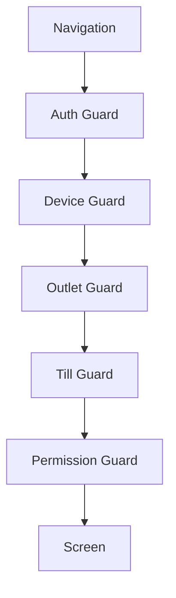

<!-- title: Flutter Routing Guards -->
<!-- status: Active -->
<!-- system: SCS-TIX EPOS Release 1 -->
<!-- last_updated: 2026-06-08 -->


# Flutter Routing Guards

## Purpose

This file defines GoRouter routing and guard rules for Release 1 Flutter.

## Decision

Use GoRouter with redirect guards.

Guards protect auth, device, outlet, till, permission, feature, and session
states.

## POS Routes

| Route | Purpose |
|---|---|
| `/splash` | Startup/session restore |
| `/sign-in` | Staff sign-in |
| `/device-activation` | Device activation |
| `/outlet-selection` | Select assigned outlet |
| `/till-selection` | Select assigned till |
| `/till-open` | Open till |
| `/pos-home` | POS home |
| `/checkout` | Checkout |
| `/payment/cash` | Cash payment |
| `/payment/card` | Card reader handoff |
| `/receipt/preview` | Receipt |
| `/held-sales` | Park/recall |
| `/refund/search` | Return/refund |
| `/exchange/search` | Exchange |
| `/till/cash-movement` | Cash in/out |
| `/till/close` | Close till |
| `/hardware/settings` | Hardware settings |
| `/permission-denied` | Access denied |
| `/session-expired` | Session expired |

## Tenant Admin Routes

```text
/tenant-admin/dashboard
/tenant-admin/outlets
/tenant-admin/tills
/tenant-admin/users
/tenant-admin/roles-permissions
/tenant-admin/products
/tenant-admin/inventory
/tenant-admin/discounts
/tenant-admin/loyalty
/tenant-admin/reports
```

Tenant Admin routes appear only when backend context allows them.

## Redirect Rules

| Condition | Redirect |
|---|---|
| No session | `/sign-in` |
| Session expired | `/session-expired` |
| Device not activated | `/device-activation` |
| No outlet for POS | `/outlet-selection` |
| No till for POS | `/till-selection` |
| Till not opened for checkout | `/till-open` |
| Missing permission | `/permission-denied` |

## Guard Flow



## Rules

- Do not hardcode role names.
- Use backend permission and feature context.
- Backend remains final authority.
- POS checkout requires open till.
- Tenant Admin setup does not require open till unless performing POS work.

## Related Files

- [[Flutter_Permission_Based_UI_Rendering]]
- [[Flutter_Tenant_Admin_Layout]]
