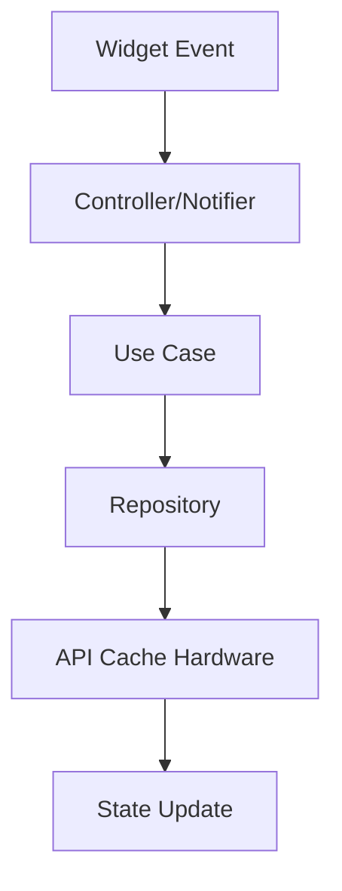

<!-- title: Flutter State Management Riverpod -->
<!-- status: Active -->
<!-- system: SCS-TIX EPOS Release 1 -->
<!-- last_updated: 2026-06-18 -->

# Flutter State Management Riverpod

## Purpose

This file defines Riverpod state management rules for the Release 1 Flutter POS
app.

## Decision

Use Riverpod providers, notifiers, and controllers.

State must be split by feature.

Do not create one global POS state object.

## Provider Map

| Provider / Notifier | State |
|---|---|
| `authProvider` | User, token state, session status |
| `deviceActivationProvider` | Device ID and trust status |
| `tenantConfigProvider` | Tenant features and receipt rules |
| `permissionProvider` | Permission codes and feature visibility |
| `outletProvider` | Assigned outlets and selected outlet |
| `tillProvider` | Selected till, open/close state |
| `productLookupProvider` | Query, barcode result, product list |
| `cartProvider` | Items, discounts, tax, totals (target; not implemented) |
| `posNewSaleCartProvider` | New Sale local cart (implemented) |
| `posNewSaleCatalogProvider` | New Sale product catalog load |
| `posHomeDashboardProvider` | POS home dashboard API state |
| `posSessionBootstrapProvider` | Device/till hydration gate |
| `customerProvider` | Customer and loyalty eligibility |
| `checkoutProvider` | Checkout validation and completion |
| `paymentProvider` | Method, status, card reader result |
| `hardwareProvider` | Printer, scanner, drawer, reader status |
| `connectivityProvider` | Online/offline warning state |

## Tenant Admin State

Tenant Admin state must be separate from cashier POS state.

It may include dashboard counters, outlets, tills, users, roles, products,
inventory visibility, discounts, loyalty, and report filters.

## State Flow

## Reset Rules

Reset sensitive state when user logs out, session expires, device activation
changes, outlet changes, till closes, permissions reload, or backend rejects
context.

## Loading Rules

Use specific loading state for page load, button submit, payment lock, till
open/close, and hardware test.

## Anti-Patterns

- Do not keep stale sale/payment state after failure.
- Do not keep outlet/till state after logout.
- Do not use cache as transaction authority.
- Do not store tokens in non-secure state.
- Do not mutate unrelated feature state from another feature.

## Related Files

- [[Flutter_Error_Handling]]
- [[Flutter_Local_Storage_Cache]]
- [[Flutter_Permission_Based_UI_Rendering]]
