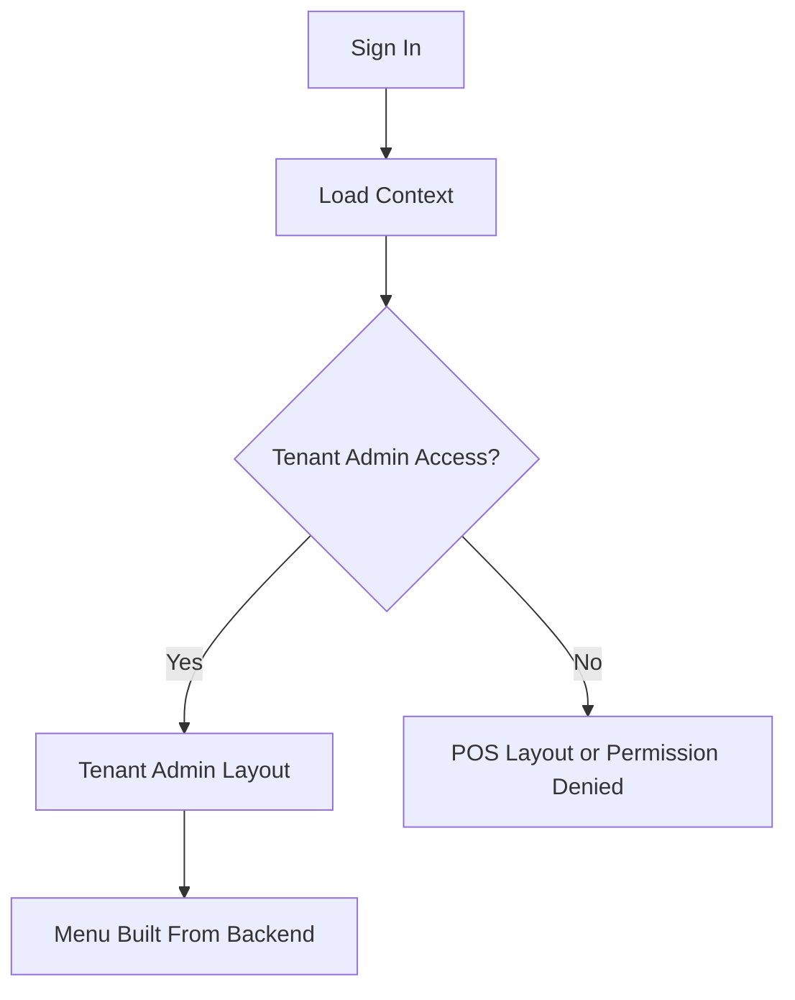

<!-- title: Flutter Tenant Admin Layout -->
<!-- status: Active -->
<!-- system: SCS-TIX EPOS Release 1 -->
<!-- last_updated: 2026-06-08 -->


# Flutter Tenant Admin Layout

## Purpose

This file defines Tenant Admin layout rules inside the same Flutter POS app.

## Decision

Tenant Admin is not a separate app.

It is a separate operational layout inside the Flutter POS app.

It is controlled by backend context, feature entitlement, and permission.

## Folder Structure

```text
lib/features/tenant_admin/
  tenant_admin_router.dart
  presentation/
    layout/
    screens/
    widgets/
    controllers/
    providers/
  application/
    usecases/
    state/
    services/
  domain/
    entities/
    repositories/
  data/
    models/
    datasources/
    repositories/
```

## Tenant Admin Menu

Release 1 Tenant Admin menu may include dashboard, outlet, users, roles and
permission, till, inventory, products/product onboarding where enabled,
discounts where enabled, loyalty where enabled, and reports where enabled.

## Layout Rules

| Rule | Decision |
|---|---|
| Separate layout | Required |
| Shared login | Required |
| Backend menu/context | Required |
| Hardcoded role menu | Not allowed |
| Hardcoded button access | Not allowed |
| Backend final authority | Required |

## Difference From Cashier POS

| Area | Tenant Admin | Cashier POS |
|---|---|---|
| Purpose | Operational setup | Fast checkout |
| Till open required | No, unless POS action | Yes for billing |
| UI layout | Admin/sidebar style | POS sale layout |
| Main context | Tenant feature/permission | Outlet/device/till/session |
| Product work | Setup/onboarding if enabled | Search/select/sell |

## Flow



## Related Files

- [[Flutter_Folder_Structure]]
- [[Flutter_Permission_Based_UI_Rendering]]
- [[../03_USER_JOURNEYS/Tenant_Admin]]
