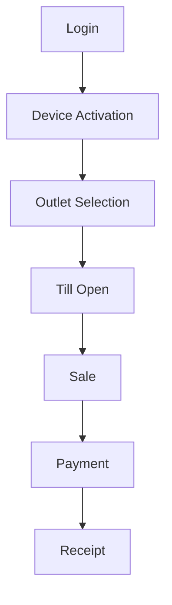

<!-- title: Flutter Testing -->
<!-- status: Active -->
<!-- system: SCS-TIX EPOS Release 1 -->
<!-- last_updated: 2026-06-18 -->

# Flutter Testing

## Purpose

This file defines Release 1 Flutter testing rules.

## Principle

Tests must prove POS flows are safe, permission-aware, tenant-aware,
device-aware, and till-session-aware.

## Test Types

| Test Type | Coverage |
|---|---|
| Unit tests | Use cases, validators, permissions, payment state |
| Widget tests | Login, cart, payment, receipt, permission denied |
| Integration tests | Login to sale/payment/receipt flow |
| Hardware mock tests | Scanner, printer, card reader outcomes |
| Regression tests | Refund, exchange, park/recall, cash movement |

## Unit Test Targets

- Sign-in validation.
- Device activation state.
- Outlet/till selection.
- Till open/close.
- Product lookup.
- Cart totals.
- Discount rules.
- Loyalty eligibility display.
- Payment state machine.
- Return/refund rules.
- Exchange difference calculation.
- Permission checks.

## Widget Test Targets

- Sign-in form.
- Device activation screen.
- Outlet selection screen.
- Till open form.
- POS home.
- Cart panel.
- Payment screen.
- Receipt preview.
- Permission denied view.
- Offline banner.
- Tenant Admin menu rendering.

## Integration Flow

## Hardware Mock Tests

Mock scanner input, printer success/failure, cash drawer command, card reader
approved, declined, and timeout states.

## Safety Tests

- Payment button prevents double submit.
- Sale completion locks during backend submission.
- Receipt failure does not cancel completed sale.
- Session expiry clears sensitive state.
- Logout clears tokens and selected outlet/till.
- Missing permission shows denied state.
- Missing till blocks billing.

## Implemented Cashier Tests (2026-06-18)

| Area | File | Coverage |
|---|---|---|
| POS home | `test/widget_test.dart` | Hero, cards, loading/error, disabled start sale |
| Sidebar | `test/widget_test.dart` | Permissions, scroll, destinations |
| New Sale | `test/widget_test.dart` | Route, search, categories, cart, scroll bounds |
| Shell top bar | `test/widget_test.dart` | Hidden on phone home; shown on New Sale |
| Post-login | `test/features/auth/post_login_navigation_test.dart` | Bootstrap, navigation resolver |
| Device activation | `test/features/device_activation/*` | Form + use case |
| Till open | `test/features/till/*` | Form + use case + screen |

Map: [[Flutter_Cashier_New_Sale_Implementation]].

## Related Files

- [[Flutter_Error_Handling]]
- [[Flutter_State_Management_Riverpod]]
